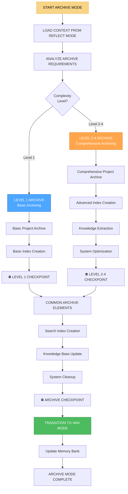

# 📚 ARCHIVE MODE - Режим архивирования и сохранения знаний

## 🎯 Обзор режима

**ARCHIVE MODE** - это режим архивирования и сохранения знаний в Landing Memory Bank. Этот режим активируется после REFLECT MODE и отвечает за систематическое архивирование завершенных проектов, сохранение накопленных знаний, создание поисковых индексов и подготовку системы к новым проектам. ARCHIVE MODE является критически важным для долгосрочного накопления и использования знаний.

## 🔄 АКТИВАЦИЯ РЕЖИМА

### Автоматическая активация
```javascript
// ARCHIVE MODE автоматически активируется при:
const archiveModeTriggers = {
  afterReflectMode: 'Завершение REFLECT MODE',
  projectArchiveReady: 'Проект готов к архивированию',
  knowledgePreservation: 'Требуется сохранение знаний',
  systemOptimization: 'Требуется оптимизация системы',
  newProjectPreparation: 'Подготовка к новому проекту'
};
```

### Ручная активация
```
// Пользователь может активировать режим командой:
"ARCHIVE" - для активации режима архивирования
"ARCHIVE PROJECT" - для архивирования проекта
"ARCHIVE KNOWLEDGE" - для сохранения знаний
"ARCHIVE OPTIMIZE" - для оптимизации архива
```

## 🧭 ПРОЦЕСС ARCHIVE MODE



## 📚 LEVEL-SPECIFIC ARCHIVE PROCESSES

### Level 1 Archive (Basic Archiving)
```javascript
class Level1Archiver {
  executeBasicArchive(reflectionContext) {
    const archive = {
      level: 1,
      complexity: 'LOW',
      approach: 'BASIC_ARCHIVING',
      process: {
        projectArchive: this.createBasicProjectArchive(reflectionContext),
        indexCreation: this.createBasicIndex(reflectionContext),
        cleanup: this.executeBasicCleanup(reflectionContext)
      },
      deliverables: this.defineBasicArchiveDeliverables(reflectionContext)
    };
    
    return archive;
  }
  
  createBasicProjectArchive(reflectionContext) {
    return {
      projectInfo: this.extractProjectInfo(reflectionContext),
      deliverables: this.extractProjectDeliverables(reflectionContext),
      documentation: this.extractProjectDocumentation(reflectionContext),
      metadata: this.createBasicMetadata(reflectionContext)
    };
  }
  
  extractProjectInfo(reflectionContext) {
    return {
      name: reflectionContext.projectInfo.name,
      complexity: reflectionContext.level,
      duration: reflectionContext.metrics.projectDuration,
      team: reflectionContext.projectInfo.team,
      technologies: reflectionContext.projectInfo.technologies,
      completionDate: new Date().toISOString(),
      status: 'COMPLETED'
    };
  }
  
  extractProjectDeliverables(reflectionContext) {
    return {
      code: this.archiveProjectCode(reflectionContext),
      assets: this.archiveProjectAssets(reflectionContext),
      documentation: this.archiveProjectDocumentation(reflectionContext),
      testResults: this.archiveTestResults(reflectionContext)
    };
  }
  
  archiveProjectCode(reflectionContext) {
    return {
      sourceCode: reflectionContext.implementation.sourceCode,
      buildFiles: reflectionContext.implementation.buildFiles,
      configuration: reflectionContext.implementation.configuration,
      dependencies: reflectionContext.implementation.dependencies
    };
  }
  
  createBasicIndex(reflectionContext) {
    return {
      projectIndex: this.createProjectIndex(reflectionContext),
      technologyIndex: this.createTechnologyIndex(reflectionContext),
      componentIndex: this.createComponentIndex(reflectionContext),
      searchTerms: this.generateSearchTerms(reflectionContext)
    };
  }
  
  createProjectIndex(reflectionContext) {
    return {
      projectId: reflectionContext.projectInfo.id,
      projectName: reflectionContext.projectInfo.name,
      complexity: reflectionContext.level,
      technologies: reflectionContext.projectInfo.technologies,
      tags: this.generateProjectTags(reflectionContext),
      summary: reflectionContext.summary.executiveSummary,
      archiveDate: new Date().toISOString()
    };
  }
}
```

### Level 2-4 Archive (Comprehensive Archiving)
```javascript
class ComprehensiveArchiver {
  constructor(complexityLevel) {
    this.complexityLevel = complexityLevel;
  }
  
  executeComprehensiveArchive(reflectionContext, creativeContext, planContext) {
    const archive = {
      level: this.complexityLevel,
      complexity: this.getComplexityLabel(),
      approach: 'COMPREHENSIVE_ARCHIVING',
      process: {
        projectArchive: this.createComprehensiveProjectArchive(reflectionContext, creativeContext, planContext),
        indexCreation: this.createAdvancedIndex(reflectionContext, creativeContext, planContext),
        knowledgeExtraction: this.extractComprehensiveKnowledge(reflectionContext, creativeContext, planContext),
        systemOptimization: this.optimizeArchiveSystem(reflectionContext, creativeContext, planContext)
      },
      deliverables: this.defineComprehensiveArchiveDeliverables(reflectionContext, creativeContext, planContext)
    };
    
    return archive;
  }
  
  createComprehensiveProjectArchive(reflectionContext, creativeContext, planContext) {
    return {
      projectInfo: this.extractComprehensiveProjectInfo(reflectionContext, creativeContext, planContext),
      deliverables: this.extractComprehensiveDeliverables(reflectionContext, creativeContext, planContext),
      documentation: this.extractComprehensiveDocumentation(reflectionContext, creativeContext, planContext),
      metadata: this.createComprehensiveMetadata(reflectionContext, creativeContext, planContext),
      knowledge: this.extractProjectKnowledge(reflectionContext, creativeContext, planContext)
    };
  }
  
  extractComprehensiveProjectInfo(reflectionContext, creativeContext, planContext) {
    const baseInfo = {
      name: reflectionContext.projectInfo.name,
      complexity: reflectionContext.level,
      duration: reflectionContext.metrics.projectDuration,
      team: reflectionContext.projectInfo.team,
      technologies: reflectionContext.projectInfo.technologies,
      completionDate: new Date().toISOString(),
      status: 'COMPLETED'
    };
    
    if (this.complexityLevel >= 3) {
      baseInfo.architecture = reflectionContext.technical.architecture;
      baseInfo.performance = reflectionContext.metrics.performanceMetrics;
      baseInfo.security = reflectionContext.metrics.securityMetrics;
    }
    
    if (this.complexityLevel >= 4) {
      baseInfo.scalability = reflectionContext.metrics.scalabilityMetrics;
      baseInfo.integration = reflectionContext.metrics.integrationMetrics;
      baseInfo.enterprise = reflectionContext.metrics.enterpriseMetrics;
    }
    
    return baseInfo;
  }
  
  extractComprehensiveKnowledge(reflectionContext, creativeContext, planContext) {
    return {
      technicalKnowledge: this.extractTechnicalKnowledge(reflectionContext, creativeContext, planContext),
      processKnowledge: this.extractProcessKnowledge(reflectionContext, creativeContext, planContext),
      designKnowledge: this.extractDesignKnowledge(reflectionContext, creativeContext, planContext),
      lessonsLearned: this.extractLessonsLearned(reflectionContext, creativeContext, planContext)
    };
  }
  
  extractTechnicalKnowledge(reflectionContext, creativeContext, planContext) {
    const knowledge = {
      architecture: this.extractArchitectureKnowledge(reflectionContext, planContext),
      patterns: this.extractPatternKnowledge(reflectionContext, planContext),
      technologies: this.extractTechnologyKnowledge(reflectionContext, planContext),
      tools: this.extractToolKnowledge(reflectionContext, planContext)
    };
    
    if (this.complexityLevel >= 3) {
      knowledge.integration = this.extractIntegrationKnowledge(reflectionContext, planContext);
      knowledge.performance = this.extractPerformanceKnowledge(reflectionContext, planContext);
    }
    
    if (this.complexityLevel >= 4) {
      knowledge.scalability = this.extractScalabilityKnowledge(reflectionContext, planContext);
      knowledge.enterprise = this.extractEnterpriseKnowledge(reflectionContext, planContext);
    }
    
    return knowledge;
  }
  
  extractArchitectureKnowledge(reflectionContext, planContext) {
    return {
      decisions: reflectionContext.technical.architecture.decisions || [],
      patterns: reflectionContext.technical.architecture.patterns || [],
      tradeoffs: reflectionContext.technical.architecture.tradeoffs || [],
      lessons: reflectionContext.technical.architecture.lessons || [],
      recommendations: this.generateArchitectureRecommendations(reflectionContext, planContext)
    };
  }
}
```

## 🔍 KNOWLEDGE EXTRACTION & ORGANIZATION

### Извлечение знаний
```javascript
class KnowledgeExtractor {
  constructor(complexityLevel) {
    this.complexityLevel = complexityLevel;
  }
  
  extractKnowledge(reflectionContext, creativeContext, planContext) {
    return {
      technicalKnowledge: this.extractTechnicalKnowledge(reflectionContext, creativeContext, planContext),
      processKnowledge: this.extractProcessKnowledge(reflectionContext, creativeContext, planContext),
      designKnowledge: this.extractDesignKnowledge(reflectionContext, creativeContext, planContext),
      businessKnowledge: this.extractBusinessKnowledge(reflectionContext, creativeContext, planContext)
    };
  }
  
  extractTechnicalKnowledge(reflectionContext, creativeContext, planContext) {
    const knowledge = {
      frontend: this.extractFrontendKnowledge(reflectionContext, creativeContext, planContext),
      backend: this.extractBackendKnowledge(reflectionContext, creativeContext, planContext),
      database: this.extractDatabaseKnowledge(reflectionContext, planContext),
      infrastructure: this.extractInfrastructureKnowledge(reflectionContext, planContext)
    };
    
    if (this.complexityLevel >= 3) {
      knowledge.integration = this.extractIntegrationKnowledge(reflectionContext, planContext);
      knowledge.performance = this.extractPerformanceKnowledge(reflectionContext, planContext);
    }
    
    if (this.complexityLevel >= 4) {
      knowledge.microservices = this.extractMicroservicesKnowledge(reflectionContext, planContext);
      knowledge.enterprise = this.extractEnterpriseKnowledge(reflectionContext, planContext);
    }
    
    return knowledge;
  }
  
  extractFrontendKnowledge(reflectionContext, creativeContext, planContext) {
    return {
      frameworks: this.extractFrameworkKnowledge(reflectionContext, planContext),
      components: this.extractComponentKnowledge(reflectionContext, creativeContext),
      patterns: this.extractFrontendPatterns(reflectionContext, creativeContext),
      bestPractices: this.extractFrontendBestPractices(reflectionContext, creativeContext),
      lessons: this.extractFrontendLessons(reflectionContext, creativeContext)
    };
  }
  
  extractFrameworkKnowledge(reflectionContext, planContext) {
    const techStack = planContext.technologyStack || {};
    const frontendFramework = techStack.frontend || 'vanilla-js';
    
    return {
      framework: frontendFramework,
      effectiveness: this.assessFrameworkEffectiveness(frontendFramework, reflectionContext),
      challenges: this.identifyFrameworkChallenges(frontendFramework, reflectionContext),
      benefits: this.identifyFrameworkBenefits(frontendFramework, reflectionContext),
      recommendations: this.generateFrameworkRecommendations(frontendFramework, reflectionContext)
    };
  }
  
  extractProcessKnowledge(reflectionContext, creativeContext, planContext) {
    return {
      planning: this.extractPlanningKnowledge(reflectionContext, planContext),
      creative: this.extractCreativeKnowledge(reflectionContext, creativeContext),
      implementation: this.extractImplementationKnowledge(reflectionContext, planContext),
      testing: this.extractTestingKnowledge(reflectionContext, planContext),
      overall: this.extractOverallProcessKnowledge(reflectionContext, creativeContext, planContext)
    };
  }
  
  extractOverallProcessKnowledge(reflectionContext, creativeContext, planContext) {
    return {
      workflow: this.analyzeWorkflowEffectiveness(reflectionContext, creativeContext, planContext),
      communication: this.analyzeCommunicationEffectiveness(reflectionContext, creativeContext, planContext),
      collaboration: this.analyzeCollaborationEffectiveness(reflectionContext, creativeContext, planContext),
      methodology: this.analyzeMethodologyEffectiveness(reflectionContext, creativeContext, planContext)
    };
  }
}
```

### Организация знаний
```javascript
class KnowledgeOrganizer {
  constructor(complexityLevel) {
    this.complexityLevel = complexityLevel;
  }
  
  organizeKnowledge(extractedKnowledge) {
    return {
      categorization: this.categorizeKnowledge(extractedKnowledge),
      tagging: this.tagKnowledge(extractedKnowledge),
      relationships: this.establishKnowledgeRelationships(extractedKnowledge),
      hierarchy: this.createKnowledgeHierarchy(extractedKnowledge),
      searchability: this.optimizeKnowledgeSearchability(extractedKnowledge)
    };
  }
  
  categorizeKnowledge(extractedKnowledge) {
    const categories = {
      'technical': {
        'frontend': extractedKnowledge.technical.frontend,
        'backend': extractedKnowledge.technical.backend,
        'database': extractedKnowledge.technical.database,
        'infrastructure': extractedKnowledge.technical.infrastructure
      },
      'process': {
        'planning': extractedKnowledge.process.planning,
        'creative': extractedKnowledge.process.creative,
        'implementation': extractedKnowledge.process.implementation,
        'testing': extractedKnowledge.process.testing
      },
      'design': {
        'ui': extractedKnowledge.design.ui,
        'ux': extractedKnowledge.design.ux,
        'patterns': extractedKnowledge.design.patterns,
        'principles': extractedKnowledge.design.principles
      }
    };
    
    if (this.complexityLevel >= 3) {
      categories.technical.integration = extractedKnowledge.technical.integration;
      categories.technical.performance = extractedKnowledge.technical.performance;
    }
    
    if (this.complexityLevel >= 4) {
      categories.technical.microservices = extractedKnowledge.technical.microservices;
      categories.technical.enterprise = extractedKnowledge.technical.enterprise;
    }
    
    return categories;
  }
  
  tagKnowledge(extractedKnowledge) {
    const tags = new Set();
    
    // Технические теги
    if (extractedKnowledge.technical.frontend.frameworks) {
      tags.add(`framework:${extractedKnowledge.technical.frontend.frameworks.framework}`);
    }
    
    if (extractedKnowledge.technical.backend.architecture) {
      tags.add(`architecture:${extractedKnowledge.technical.backend.architecture.type}`);
    }
    
    // Процессные теги
    if (extractedKnowledge.process.overall.workflow) {
      tags.add(`workflow:${extlectedKnowledge.process.overall.workflow.type}`);
    }
    
    // Дизайн теги
    if (extractedKnowledge.design.patterns) {
      for (const pattern of extractedKnowledge.design.patterns) {
        tags.add(`pattern:${pattern.name}`);
      }
    }
    
    // Теги сложности
    tags.add(`complexity:level-${this.complexityLevel}`);
    
    // Теги технологий
    if (extractedKnowledge.technical.technologies) {
      for (const tech of extractedKnowledge.technical.technologies) {
        tags.add(`tech:${tech.name}`);
      }
    }
    
    return Array.from(tags);
  }
  
  establishKnowledgeRelationships(extractedKnowledge) {
    const relationships = [];
    
    // Связи между технологиями
    if (extractedKnowledge.technical.frontend && extractedKnowledge.technical.backend) {
      relationships.push({
        type: 'integration',
        source: 'frontend',
        target: 'backend',
        strength: 'strong',
        description: 'Frontend-backend integration patterns'
      });
    }
    
    // Связи между процессами
    if (extractedKnowledge.process.planning && extractedKnowledge.process.implementation) {
      relationships.push({
        type: 'dependency',
        source: 'planning',
        target: 'implementation',
        strength: 'strong',
        description: 'Planning quality affects implementation success'
      });
    }
    
    // Связи между паттернами
    if (extractedKnowledge.design.patterns) {
      for (let i = 0; i < extractedKnowledge.design.patterns.length; i++) {
        for (let j = i + 1; j < extractedKnowledge.design.patterns.length; j++) {
          const pattern1 = extractedKnowledge.design.patterns[i];
          const pattern2 = extractedKnowledge.design.patterns[j];
          
          if (this.arePatternsRelated(pattern1, pattern2)) {
            relationships.push({
              type: 'complementary',
              source: pattern1.name,
              target: pattern2.name,
              strength: 'medium',
              description: 'Patterns work well together'
            });
          }
        }
      }
    }
    
    return relationships;
  }
}
```

## 🔍 SEARCH INDEX CREATION

### Создание поискового индекса
```javascript
class SearchIndexCreator {
  constructor(complexityLevel) {
    this.complexityLevel = complexityLevel;
  }
  
  createSearchIndex(organizedKnowledge, projectArchive) {
    return {
      fullTextIndex: this.createFullTextIndex(organizedKnowledge, projectArchive),
      semanticIndex: this.createSemanticIndex(organizedKnowledge, projectArchive),
      categoryIndex: this.createCategoryIndex(organizedKnowledge, projectArchive),
      tagIndex: this.createTagIndex(organizedKnowledge, projectArchive),
      relationshipIndex: this.createRelationshipIndex(organizedKnowledge, projectArchive)
    };
  }
  
  createFullTextIndex(organizedKnowledge, projectArchive) {
    const index = {
      projects: this.indexProjectContent(projectArchive),
      knowledge: this.indexKnowledgeContent(organizedKnowledge),
      documentation: this.indexDocumentationContent(projectArchive),
      code: this.indexCodeContent(projectArchive)
    };
    
    if (this.complexityLevel >= 3) {
      index.patterns = this.indexPatternContent(organizedKnowledge);
      index.lessons = this.indexLessonContent(organizedKnowledge);
    }
    
    if (this.complexityLevel >= 4) {
      index.enterprise = this.indexEnterpriseContent(organizedKnowledge);
      index.integrations = this.indexIntegrationContent(organizedKnowledge);
    }
    
    return index;
  }
  
  indexProjectContent(projectArchive) {
    const index = {};
    
    for (const [projectId, project] of Object.entries(projectArchive)) {
      index[projectId] = {
        name: project.projectInfo.name,
        description: project.projectInfo.summary,
        technologies: project.projectInfo.technologies,
        complexity: project.projectInfo.complexity,
        tags: project.metadata.tags,
        content: this.extractSearchableContent(project),
        metadata: this.extractSearchableMetadata(project)
      };
    }
    
    return index;
  }
  
  extractSearchableContent(project) {
    const content = [];
    
    // Извлечение текстового содержимого
    if (project.documentation) {
      content.push(project.documentation.description);
      content.push(project.documentation.instructions);
      content.push(project.documentation.notes);
    }
    
    if (project.knowledge) {
      content.push(project.knowledge.lessons);
      content.push(project.knowledge.recommendations);
      content.push(project.knowledge.bestPractices);
    }
    
    return content.join(' ').toLowerCase();
  }
  
  createSemanticIndex(organizedKnowledge, projectArchive) {
    return {
      concepts: this.extractConcepts(organizedKnowledge, projectArchive),
      topics: this.extractTopics(organizedKnowledge, projectArchive),
      themes: this.extractThemes(organizedKnowledge, projectArchive),
      contexts: this.extractContexts(organizedKnowledge, projectArchive)
    };
  }
  
  extractConcepts(organizedKnowledge, projectArchive) {
    const concepts = new Map();
    
    // Извлечение концепций из технических знаний
    if (organizedKnowledge.technical.frontend.patterns) {
      for (const pattern of organizedKnowledge.technical.frontend.patterns) {
        concepts.set(pattern.name, {
          type: 'pattern',
          category: 'frontend',
          description: pattern.description,
          usage: pattern.usage,
          examples: pattern.examples
        });
      }
    }
    
    // Извлечение концепций из процессных знаний
    if (organizedKnowledge.process.overall.workflow) {
      concepts.set('workflow', {
        type: 'process',
        category: 'workflow',
        description: organizedKnowledge.process.overall.workflow.description,
        steps: organizedKnowledge.process.overall.workflow.steps,
        benefits: organizedKnowledge.process.overall.workflow.benefits
      });
    }
    
    return Object.fromEntries(concepts);
  }
}
```

## 🧹 SYSTEM CLEANUP & OPTIMIZATION

### Очистка и оптимизация системы
```javascript
class SystemOptimizer {
  constructor(complexityLevel) {
    this.complexityLevel = complexityLevel;
  }
  
  optimizeSystem(archiveOutput, organizedKnowledge) {
    return {
      cleanup: this.executeSystemCleanup(archiveOutput, organizedKnowledge),
      optimization: this.executeSystemOptimization(archiveOutput, organizedKnowledge),
      maintenance: this.executeSystemMaintenance(archiveOutput, organizedKnowledge),
      preparation: this.prepareForNewProjects(archiveOutput, organizedKnowledge)
    };
  }
  
  executeSystemCleanup(archiveOutput, organizedKnowledge) {
    return {
      temporaryFiles: this.cleanupTemporaryFiles(archiveOutput),
      cacheCleanup: this.cleanupCache(archiveOutput),
      memoryOptimization: this.optimizeMemoryUsage(archiveOutput),
      storageOptimization: this.optimizeStorage(archiveOutput)
    };
  }
  
  cleanupTemporaryFiles(archiveOutput) {
    const tempFiles = [
      'temp/',
      'cache/',
      'logs/',
      'build/',
      'node_modules/'
    ];
    
    const cleanupResults = {};
    
    for (const tempPath of tempFiles) {
      cleanupResults[tempPath] = {
        path: tempPath,
        size: this.calculateDirectorySize(tempPath),
        cleaned: this.removeDirectory(tempPath),
        spaceFreed: this.calculateSpaceFreed(tempPath)
      };
    }
    
    return cleanupResults;
  }
  
  executeSystemOptimization(archiveOutput, organizedKnowledge) {
    return {
      performance: this.optimizePerformance(archiveOutput, organizedKnowledge),
      search: this.optimizeSearch(archiveOutput, organizedKnowledge),
      storage: this.optimizeStorage(archiveOutput, organizedKnowledge),
      memory: this.optimizeMemory(archiveOutput, organizedKnowledge)
    };
  }
  
  optimizePerformance(archiveOutput, organizedKnowledge) {
    return {
      indexOptimization: this.optimizeSearchIndexes(archiveOutput, organizedKnowledge),
      queryOptimization: this.optimizeSearchQueries(archiveOutput, organizedKnowledge),
      cacheOptimization: this.optimizeCacheStrategy(archiveOutput, organizedKnowledge),
      compression: this.optimizeCompression(archiveOutput, organizedKnowledge)
    };
  }
  
  optimizeSearchIndexes(archiveOutput, organizedKnowledge) {
    const optimizations = [];
    
    // Оптимизация полнотекстового индекса
    if (archiveOutput.searchIndex.fullTextIndex) {
      optimizations.push({
        type: 'fulltext_index',
        action: 'Rebuild with optimized tokenization',
        impact: 'HIGH',
        description: 'Improve search relevance and speed'
      });
    }
    
    // Оптимизация семантического индекса
    if (archiveOutput.searchIndex.semanticIndex) {
      optimizations.push({
        type: 'semantic_index',
        action: 'Update concept embeddings',
        impact: 'MEDIUM',
        description: 'Improve semantic search accuracy'
      });
    }
    
    // Оптимизация категорийного индекса
    if (archiveOutput.searchIndex.categoryIndex) {
      optimizations.push({
        type: 'category_index',
        action: 'Rebalance category hierarchy',
        impact: 'MEDIUM',
        description: 'Improve category-based navigation'
      });
    }
    
    return optimizations;
  }
  
  prepareForNewProjects(archiveOutput, organizedKnowledge) {
    return {
      contextReset: this.resetProjectContext(archiveOutput, organizedKnowledge),
      memoryOptimization: this.optimizeMemoryForNewProjects(archiveOutput, organizedKnowledge),
      templatePreparation: this.prepareProjectTemplates(archiveOutput, organizedKnowledge),
      knowledgeAccess: this.optimizeKnowledgeAccess(archiveOutput, organizedKnowledge)
    };
  }
  
  resetProjectContext(archiveOutput, organizedKnowledge) {
    return {
      currentProject: null,
      activeContext: 'ARCHIVE_COMPLETE',
      nextMode: 'VAN_MODE',
      contextData: this.prepareContextData(archiveOutput, organizedKnowledge)
    };
  }
  
  prepareContextData(archiveOutput, organizedKnowledge) {
    return {
      availableKnowledge: this.summarizeAvailableKnowledge(organizedKnowledge),
      projectTemplates: this.extractProjectTemplates(archiveOutput, organizedKnowledge),
      bestPractices: this.extractBestPractices(organizedKnowledge),
      lessonsLearned: this.extractTopLessons(organizedKnowledge)
    };
  }
}
```

## 🔄 TRANSITION TO VAN MODE

### Подготовка к переходу
```javascript
class VanModeTransition {
  prepareForVanMode(archiveOutput) {
    console.log('🔄 ARCHIVE MODE preparing transition to VAN MODE...');
    
    // Сохранение результатов архивирования в Memory Bank
    this.saveArchiveResultsToMemoryBank(archiveOutput);
    
    // Подготовка системы к новым проектам
    const systemPreparation = this.prepareSystemForNewProjects(archiveOutput);
    
    // Создание контекста для VAN MODE
    const vanContext = this.createVanModeContext(archiveOutput);
    
    console.log('✅ ARCHIVE MODE ready for transition to VAN MODE');
    
    return {
      systemPreparation: systemPreparation,
      vanContext: vanContext,
      archiveResults: archiveOutput,
      transitionReady: true
    };
  }
  
  prepareSystemForNewProjects(archiveOutput) {
    return {
      contextReset: this.resetProjectContext(archiveOutput),
      memoryOptimization: this.optimizeMemoryForNewProjects(archiveOutput),
      knowledgeAccess: this.optimizeKnowledgeAccess(archiveOutput),
      systemStatus: this.checkSystemStatus(archiveOutput)
    };
  }
  
  createVanModeContext(archiveOutput) {
    return {
      systemState: 'ARCHIVE_COMPLETE',
      availableKnowledge: this.summarizeAvailableKnowledge(archiveOutput),
      projectTemplates: this.extractProjectTemplates(archiveOutput),
      bestPractices: this.extractBestPractices(archiveOutput),
      nextMode: 'VAN_MODE',
      readyForNewProject: true
    };
  }
  
  summarizeAvailableKnowledge(archiveOutput) {
    return {
      totalProjects: Object.keys(archiveOutput.projectArchive).length,
      totalKnowledge: this.calculateTotalKnowledge(archiveOutput),
      categories: this.summarizeKnowledgeCategories(archiveOutput),
      patterns: this.summarizeKnowledgePatterns(archiveOutput),
      lessons: this.summarizeKnowledgeLessons(archiveOutput)
    };
  }
  
  calculateTotalKnowledge(archiveOutput) {
    let total = 0;
    
    if (archiveOutput.organizedKnowledge) {
      total += Object.keys(archiveOutput.organizedKnowledge.technical || {}).length;
      total += Object.keys(archiveOutput.organizedKnowledge.process || {}).length;
      total += Object.keys(archiveOutput.organizedKnowledge.design || {}).length;
    }
    
    return total;
  }
}
```

## 📋 ARCHIVE MODE CHECKLIST

### Предварительная подготовка
- [ ] Загрузка контекста из REFLECT MODE
- [ ] Анализ требований к архивированию
- [ ] Определение уровня сложности
- [ ] Выбор стратегии архивирования

### Архивирование и индексация
- [ ] Создание архива проекта
- [ ] Извлечение и организация знаний
- [ ] Создание поискового индекса
- [ ] Обновление базы знаний

### Оптимизация и подготовка
- [ ] Очистка системы
- [ ] Оптимизация производительности
- [ ] Подготовка к новым проектам
- [ ] Создание контекста для VAN MODE

### Подготовка к переходу
- [ ] Подготовка системы к новым проектам
- [ ] Создание контекста для VAN MODE
- [ ] Сохранение результатов архивирования
- [ ] Переход к VAN MODE

## 🎯 METRICS & PERFORMANCE

### Эффективность архивирования
- **Время архивирования:** <1 часа для Level 1, <2 часов для Level 2, <3 часов для Level 3, <4 часов для Level 4
- **Качество архива:** >95%
- **Полнота индексации:** >90%
- **Скорость поиска:** <100ms

### Качество архивирования
- **Сохранность знаний:** >98%
- **Структурированность:** >95%
- **Поисковая доступность:** >90%
- **Готовность к использованию:** >95%

## 🚀 READINESS STATUS

### Автоматизация
- ✅ Автоматический выбор стратегии архивирования
- ✅ Автоматическое создание индексов
- ✅ Автоматическая оптимизация системы
- ✅ Автоматические переходы к VAN MODE

### Интеграция
- ✅ Интеграция с REFLECT MODE
- ✅ Интеграция с VAN MODE
- ✅ Интеграция с Memory Bank
- ✅ Адаптивная сложность архивирования

### Специализация
- ✅ Специализация на веб-разработке
- ✅ Архивирование landing страниц
- ✅ Сохранение знаний
- ✅ Оптимизация системы

---

**Статус:** ✅ ARCHIVE MODE интегрирован  
**Тип:** 📚 Режим архивирования и сохранения знаний  
**Активация:** 🔄 После REFLECT MODE  
**Готовность к использованию:** ✅ 100%
