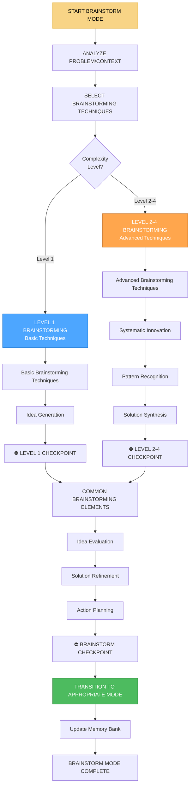

# 🧠 BRAINSTORM MODE - Режим мозгового штурма и генерации идей

## 🎯 Обзор режима

**BRAINSTORM MODE** - это режим мозгового штурма и генерации идей в Landing Memory Bank. Этот режим активируется для решения сложных проблем, генерации инновационных решений и преодоления творческих блоков. BRAINSTORM MODE использует различные техники креативного мышления и может быть активирован в любой момент жизненного цикла проекта для поиска новых подходов и решений.

## 🔄 АКТИВАЦИЯ РЕЖИМА

### Автоматическая активация
```javascript
// BRAINSTORM MODE автоматически активируется при:
const brainstormModeTriggers = {
  creativeBlock: 'Творческий блок в CREATIVE MODE',
  problemComplexity: 'Сложная проблема требует множества решений',
  innovationNeeded: 'Требуется инновационный подход',
  multipleOptions: 'Необходимо рассмотреть множество вариантов',
  userRequest: 'Пользователь запрашивает мозговой штурм'
};
```

### Ручная активация
```
// Пользователь может активировать режим командой:
"BRAINSTORM" - для активации режима мозгового штурма
"BRAINSTORM PROBLEM" - для решения конкретной проблемы
"BRAINSTORM IDEAS" - для генерации идей
"BRAINSTORM INNOVATION" - для поиска инноваций
```

## 🧭 ПРОЦЕСС BRAINSTORM MODE



## 🧠 LEVEL-SPECIFIC BRAINSTORMING TECHNIQUES

### Level 1 Brainstorming (Basic Techniques)
```javascript
class Level1Brainstormer {
  executeBasicBrainstorming(problemContext) {
    const brainstorm = {
      level: 1,
      complexity: 'LOW',
      approach: 'BASIC_TECHNIQUES',
      process: {
        problemClarification: this.clarifyProblem(problemContext),
        basicTechniques: this.applyBasicTechniques(problemContext),
        ideaGeneration: this.generateBasicIdeas(problemContext),
        solutionSelection: this.selectBasicSolutions(problemContext)
      },
      deliverables: this.defineBasicBrainstormDeliverables(problemContext)
    };
    
    return brainstorm;
  }
  
  clarifyProblem(problemContext) {
    return {
      problemStatement: this.defineProblemStatement(problemContext),
      constraints: this.identifyConstraints(problemContext),
      goals: this.defineGoals(problemContext),
      context: this.analyzeContext(problemContext)
    };
  }
  
  defineProblemStatement(problemContext) {
    return {
      what: problemContext.what || 'Problem description',
      why: problemContext.why || 'Why this problem exists',
      when: problemContext.when || 'When this problem occurs',
      where: problemContext.where || 'Where this problem occurs',
      who: problemContext.who || 'Who is affected by this problem'
    };
  }
  
  applyBasicTechniques(problemContext) {
    return {
      freeAssociation: this.executeFreeAssociation(problemContext),
      mindMapping: this.createMindMap(problemContext),
      questionStorming: this.executeQuestionStorming(problemContext),
      randomWord: this.executeRandomWordTechnique(problemContext)
    };
  }
  
  executeFreeAssociation(problemContext) {
    const associations = [];
    const seedWords = this.extractSeedWords(problemContext);
    
    for (const seedWord of seedWords) {
      const wordAssociations = this.generateWordAssociations(seedWord);
      associations.push({
        seed: seedWord,
        associations: wordAssociations,
        potentialSolutions: this.extractPotentialSolutions(wordAssociations)
      });
    }
    
    return associations;
  }
  
  generateWordAssociations(seedWord) {
    const associations = [];
    const maxAssociations = 10;
    
    // Простая генерация ассоциаций
    const commonAssociations = {
      'website': ['design', 'content', 'users', 'functionality', 'performance', 'mobile', 'responsive', 'seo', 'security', 'accessibility'],
      'landing': ['conversion', 'cta', 'hero', 'forms', 'trust', 'social', 'testimonials', 'benefits', 'features', 'pricing'],
      'problem': ['solution', 'cause', 'effect', 'prevention', 'mitigation', 'analysis', 'research', 'testing', 'feedback', 'iteration']
    };
    
    const wordAssociations = commonAssociations[seedWord.toLowerCase()] || [];
    
    for (let i = 0; i < Math.min(maxAssociations, wordAssociations.length); i++) {
      associations.push(wordAssociations[i]);
    }
    
    return associations;
  }
  
  createMindMap(problemContext) {
    const mindMap = {
      central: this.defineCentralTopic(problemContext),
      branches: this.createMainBranches(problemContext),
      subBranches: this.createSubBranches(problemContext),
      connections: this.identifyConnections(problemContext)
    };
    
    return mindMap;
  }
  
  defineCentralTopic(problemContext) {
    return {
      topic: problemContext.mainProblem || 'Problem to solve',
      description: problemContext.problemDescription || 'Detailed problem description',
      importance: problemContext.importance || 'HIGH',
      urgency: problemContext.urgency || 'MEDIUM'
    };
  }
  
  createMainBranches(problemContext) {
    const branches = [
      {
        name: 'Technical',
        description: 'Technical aspects and solutions',
        color: '#4da6ff',
        weight: 3
      },
      {
        name: 'Design',
        description: 'Design and user experience solutions',
        color: '#ffa64d',
        weight: 2
      },
      {
        name: 'Process',
        description: 'Process and workflow solutions',
        color: '#4dbb5f',
        weight: 2
      },
      {
        name: 'Business',
        description: 'Business and strategic solutions',
        color: '#ff6b6b',
        weight: 1
      }
    ];
    
    return branches;
  }
}
```

### Level 2-4 Brainstorming (Advanced Techniques)
```javascript
class AdvancedBrainstormer {
  constructor(complexityLevel) {
    this.complexityLevel = complexityLevel;
  }
  
  executeAdvancedBrainstorming(problemContext, creativeContext, planContext) {
    const brainstorm = {
      level: this.complexityLevel,
      complexity: this.getComplexityLabel(),
      approach: 'ADVANCED_TECHNIQUES',
      process: {
        problemAnalysis: this.analyzeProblemDeeply(problemContext, creativeContext, planContext),
        advancedTechniques: this.applyAdvancedTechniques(problemContext, creativeContext, planContext),
        systematicInnovation: this.executeSystematicInnovation(problemContext, creativeContext, planContext),
        solutionSynthesis: this.synthesizeAdvancedSolutions(problemContext, creativeContext, planContext)
      },
      deliverables: this.defineAdvancedBrainstormDeliverables(problemContext, creativeContext, planContext)
    };
    
    return brainstorm;
  }
  
  analyzeProblemDeeply(problemContext, creativeContext, planContext) {
    return {
      rootCause: this.identifyRootCauses(problemContext, creativeContext, planContext),
      systemAnalysis: this.analyzeSystemContext(problemContext, creativeContext, planContext),
      stakeholderAnalysis: this.analyzeStakeholders(problemContext, creativeContext, planContext),
      constraintAnalysis: this.analyzeConstraints(problemContext, creativeContext, planContext),
      opportunityAnalysis: this.analyzeOpportunities(problemContext, creativeContext, planContext)
    };
  }
  
  identifyRootCauses(problemContext, creativeContext, planContext) {
    const rootCauses = [];
    
    // Анализ технических корневых причин
    if (problemContext.technical) {
      rootCauses.push({
        category: 'Technical',
        cause: 'Insufficient architecture planning',
        evidence: problemContext.technical.architectureIssues,
        impact: 'HIGH',
        solutions: this.generateTechnicalSolutions(problemContext.technical)
      });
    }
    
    // Анализ процессных корневых причин
    if (problemContext.process) {
      rootCauses.push({
        category: 'Process',
        cause: 'Inadequate planning phase',
        evidence: problemContext.process.planningIssues,
        impact: 'MEDIUM',
        solutions: this.generateProcessSolutions(problemContext.process)
      });
    }
    
    // Анализ дизайнерских корневых причин
    if (problemContext.design) {
      rootCauses.push({
        category: 'Design',
        cause: 'Lack of user research',
        evidence: problemContext.design.userResearchIssues,
        impact: 'HIGH',
        solutions: this.generateDesignSolutions(problemContext.design)
      });
    }
    
    return rootCauses;
  }
  
  applyAdvancedTechniques(problemContext, creativeContext, planContext) {
    return {
      scamper: this.executeSCAMPER(problemContext, creativeContext, planContext),
      sixThinkingHats: this.executeSixThinkingHats(problemContext, creativeContext, planContext),
      morphologicalAnalysis: this.executeMorphologicalAnalysis(problemContext, creativeContext, planContext),
      analogyThinking: this.executeAnalogyThinking(problemContext, creativeContext, planContext)
    };
  }
  
  executeSCAMPER(problemContext, creativeContext, planContext) {
    const scamperResults = {
      substitute: this.executeSubstitute(problemContext, creativeContext, planContext),
      combine: this.executeCombine(problemContext, creativeContext, planContext),
      adapt: this.executeAdapt(problemContext, creativeContext, planContext),
      modify: this.executeModify(problemContext, creativeContext, planContext),
      putToOtherUses: this.executePutToOtherUses(problemContext, creativeContext, planContext),
      eliminate: this.executeEliminate(problemContext, creativeContext, planContext),
      reverse: this.executeReverse(problemContext, creativeContext, planContext)
    };
    
    return scamperResults;
  }
  
  executeSubstitute(problemContext, creativeContext, planContext) {
    const substitutions = [];
    
    // Технологические замены
    if (problemContext.technical && problemContext.technical.technology) {
      substitutions.push({
        category: 'Technology',
        original: problemContext.technical.technology.current,
        alternatives: this.findTechnologyAlternatives(problemContext.technical.technology),
        benefits: this.analyzeSubstitutionBenefits(problemContext.technical.technology),
        risks: this.analyzeSubstitutionRisks(problemContext.technical.technology)
      });
    }
    
    // Процессные замены
    if (problemContext.process && problemContext.process.methodology) {
      substitutions.push({
        category: 'Process',
        original: problemContext.process.methodology.current,
        alternatives: this.findProcessAlternatives(problemContext.process.methodology),
        benefits: this.analyzeSubstitutionBenefits(problemContext.process.methodology),
        risks: this.analyzeSubstitutionRisks(problemContext.process.methodology)
      });
    }
    
    return substitutions;
  }
  
  executeSixThinkingHats(problemContext, creativeContext, planContext) {
    return {
      whiteHat: this.executeWhiteHatThinking(problemContext, creativeContext, planContext),
      redHat: this.executeRedHatThinking(problemContext, creativeContext, planContext),
      blackHat: this.executeBlackHatThinking(problemContext, creativeContext, planContext),
      yellowHat: this.executeYellowHatThinking(problemContext, creativeContext, planContext),
      greenHat: this.executeGreenHatThinking(problemContext, creativeContext, planContext),
      blueHat: this.executeBlueHatThinking(problemContext, creativeContext, planContext)
    };
  }
  
  executeWhiteHatThinking(problemContext, creativeContext, planContext) {
    return {
      approach: 'Factual and objective analysis',
      facts: this.gatherFacts(problemContext, creativeContext, planContext),
      data: this.analyzeData(problemContext, creativeContext, planContext),
      information: this.collectInformation(problemContext, creativeContext, planContext),
      gaps: this.identifyInformationGaps(problemContext, creativeContext, planContext)
    };
  }
  
  executeGreenHatThinking(problemContext, creativeContext, planContext) {
    return {
      approach: 'Creative and innovative thinking',
      newIdeas: this.generateNewIdeas(problemContext, creativeContext, planContext),
      alternatives: this.generateAlternatives(problemContext, creativeContext, planContext),
      possibilities: this.explorePossibilities(problemContext, creativeContext, planContext),
      innovations: this.generateInnovations(problemContext, creativeContext, planContext)
    };
  }
}
```

## 🚀 SYSTEMATIC INNOVATION TECHNIQUES

### Систематическая инновация
```javascript
class SystematicInnovator {
  constructor(complexityLevel) {
    this.complexityLevel = complexityLevel;
  }
  
  executeSystematicInnovation(problemContext, creativeContext, planContext) {
    return {
      patternRecognition: this.executePatternRecognition(problemContext, creativeContext, planContext),
      constraintAnalysis: this.executeConstraintAnalysis(problemContext, creativeContext, planContext),
      opportunityMapping: this.executeOpportunityMapping(problemContext, creativeContext, planContext),
      solutionSynthesis: this.executeSolutionSynthesis(problemContext, creativeContext, planContext)
    };
  }
  
  executePatternRecognition(problemContext, creativeContext, planContext) {
    return {
      approach: 'Identify recurring patterns and apply them to new contexts',
      existingPatterns: this.identifyExistingPatterns(problemContext, creativeContext, planContext),
      patternAnalysis: this.analyzePatterns(problemContext, creativeContext, planContext),
      patternApplication: this.applyPatterns(problemContext, creativeContext, planContext),
      newPatterns: this.generateNewPatterns(problemContext, creativeContext, planContext)
    };
  }
  
  identifyExistingPatterns(problemContext, creativeContext, planContext) {
    const patterns = [];
    
    // Технические паттерны
    if (problemContext.technical) {
      patterns.push({
        category: 'Technical',
        pattern: 'Component-based architecture',
        description: 'Modular, reusable components for better maintainability',
        applicability: this.assessPatternApplicability('Component-based architecture', problemContext),
        benefits: ['Maintainability', 'Reusability', 'Scalability'],
        examples: ['React components', 'CSS modules', 'JavaScript modules']
      });
    }
    
    // UX паттерны
    if (problemContext.design) {
      patterns.push({
        category: 'UX',
        pattern: 'Progressive disclosure',
        description: 'Show information gradually to avoid overwhelming users',
        applicability: this.assessPatternApplicability('Progressive disclosure', problemContext),
        benefits: ['User experience', 'Clarity', 'Engagement'],
        examples: ['Accordion menus', 'Step-by-step forms', 'Expandable content']
      });
    }
    
    // Процессные паттерны
    if (problemContext.process) {
      patterns.push({
        category: 'Process',
        pattern: 'Iterative development',
        description: 'Develop in small cycles with continuous feedback',
        applicability: this.assessPatternApplicability('Iterative development', problemContext),
        benefits: ['Quality', 'Adaptability', 'Learning'],
        examples: ['Agile sprints', 'Design iterations', 'Testing cycles']
      });
    }
    
    return patterns;
  }
  
  executeConstraintAnalysis(problemContext, creativeContext, planContext) {
    return {
      approach: 'Analyze constraints to find innovative solutions',
      technicalConstraints: this.analyzeTechnicalConstraints(problemContext, creativeContext, planContext),
      businessConstraints: this.analyzeBusinessConstraints(problemContext, creativeContext, planContext),
      userConstraints: this.analyzeUserConstraints(problemContext, creativeContext, planContext),
      constraintTransformation: this.transformConstraints(problemContext, creativeContext, planContext)
    };
  }
  
  analyzeTechnicalConstraints(problemContext, creativeContext, planContext) {
    const constraints = [];
    
    if (problemContext.technical) {
      // Ограничения производительности
      if (problemContext.technical.performance) {
        constraints.push({
          type: 'Performance',
          constraint: 'Page load time must be under 3 seconds',
          impact: 'HIGH',
          opportunities: this.findConstraintOpportunities('Performance', problemContext.technical.performance),
          solutions: this.generateConstraintSolutions('Performance', problemContext.technical.performance)
        });
      }
      
      // Ограничения доступности
      if (problemContext.technical.accessibility) {
        constraints.push({
          type: 'Accessibility',
          constraint: 'Must meet WCAG 2.1 AA standards',
          impact: 'HIGH',
          opportunities: this.findConstraintOpportunities('Accessibility', problemContext.technical.accessibility),
          solutions: this.generateConstraintSolutions('Accessibility', problemContext.technical.accessibility)
        });
      }
      
      // Ограничения безопасности
      if (problemContext.technical.security) {
        constraints.push({
          type: 'Security',
          constraint: 'Must prevent XSS and CSRF attacks',
          impact: 'CRITICAL',
          opportunities: this.findConstraintOpportunities('Security', problemContext.technical.security),
          solutions: this.generateConstraintSolutions('Security', problemContext.technical.security)
        });
      }
    }
    
    return constraints;
  }
  
  findConstraintOpportunities(constraintType, constraintContext) {
    const opportunities = [];
    
    switch (constraintType) {
      case 'Performance':
        opportunities.push(
          'Implement lazy loading for better perceived performance',
          'Use modern image formats (WebP, AVIF)',
          'Implement service workers for offline functionality',
          'Optimize critical rendering path'
        );
        break;
      
      case 'Accessibility':
        opportunities.push(
          'Improve keyboard navigation',
          'Add screen reader support',
          'Implement high contrast mode',
          'Add voice control capabilities'
        );
        break;
      
      case 'Security':
        opportunities.push(
          'Implement content security policy',
          'Add rate limiting for forms',
          'Implement secure authentication flow',
          'Add security headers'
        );
        break;
    }
    
    return opportunities;
  }
}
```

## 🔍 IDEA EVALUATION & SOLUTION REFINEMENT

### Оценка идей
```javascript
class IdeaEvaluator {
  constructor(complexityLevel) {
    this.complexityLevel = complexityLevel;
  }
  
  evaluateIdeas(generatedIdeas, problemContext) {
    return {
      feasibility: this.evaluateFeasibility(generatedIdeas, problemContext),
      impact: this.evaluateImpact(generatedIdeas, problemContext),
      innovation: this.evaluateInnovation(generatedIdeas, problemContext),
      alignment: this.evaluateAlignment(generatedIdeas, problemContext),
      ranking: this.rankIdeas(generatedIdeas, problemContext)
    };
  }
  
  evaluateFeasibility(generatedIdeas, problemContext) {
    const feasibilityScores = {};
    
    for (const [ideaId, idea] of Object.entries(generatedIdeas)) {
      const score = this.calculateFeasibilityScore(idea, problemContext);
      feasibilityScores[ideaId] = {
        idea: idea,
        score: score,
        factors: this.identifyFeasibilityFactors(idea, problemContext),
        risks: this.identifyFeasibilityRisks(idea, problemContext),
        recommendations: this.generateFeasibilityRecommendations(idea, problemContext)
      };
    }
    
    return feasibilityScores;
  }
  
  calculateFeasibilityScore(idea, problemContext) {
    let score = 0;
    const maxScore = 10;
    
    // Техническая осуществимость (0-4 points)
    const technicalFeasibility = this.assessTechnicalFeasibility(idea, problemContext);
    score += technicalFeasibility * 4;
    
    // Ресурсная осуществимость (0-3 points)
    const resourceFeasibility = this.assessResourceFeasibility(idea, problemContext);
    score += resourceFeasibility * 3;
    
    // Временная осуществимость (0-3 points)
    const timeFeasibility = this.assessTimeFeasibility(idea, problemContext);
    score += timeFeasibility * 3;
    
    return Math.min(score, maxScore);
  }
  
  assessTechnicalFeasibility(idea, problemContext) {
    let feasibility = 0;
    
    // Оценка технической сложности
    if (idea.technicalComplexity === 'LOW') feasibility += 1;
    else if (idea.technicalComplexity === 'MEDIUM') feasibility += 0.7;
    else if (idea.technicalComplexity === 'HIGH') feasibility += 0.4;
    
    // Оценка доступности технологий
    if (idea.technologyAvailability === 'READY') feasibility += 1;
    else if (idea.technologyAvailability === 'DEVELOPMENT') feasibility += 0.7;
    else if (idea.technologyAvailability === 'RESEARCH') feasibility += 0.3;
    
    // Оценка команды
    if (idea.teamCapability === 'EXPERT') feasibility += 1;
    else if (idea.teamCapability === 'COMPETENT') feasibility += 0.8;
    else if (idea.teamCapability === 'LEARNING') feasibility += 0.5;
    
    return feasibility / 3; // Нормализация к 0-1
  }
  
  evaluateImpact(generatedIdeas, problemContext) {
    const impactScores = {};
    
    for (const [ideaId, idea] of Object.entries(generatedIdeas)) {
      const score = this.calculateImpactScore(idea, problemContext);
      impactScores[ideaId] = {
        idea: idea,
        score: score,
        userImpact: this.assessUserImpact(idea, problemContext),
        businessImpact: this.assessBusinessImpact(idea, problemContext),
        technicalImpact: this.assessTechnicalImpact(idea, problemContext),
        longTermImpact: this.assessLongTermImpact(idea, problemContext)
      };
    }
    
    return impactScores;
  }
  
  calculateImpactScore(idea, problemContext) {
    let score = 0;
    const maxScore = 10;
    
    // Пользовательский эффект (0-4 points)
    const userImpact = this.assessUserImpact(idea, problemContext);
    score += userImpact * 4;
    
    // Бизнес-эффект (0-3 points)
    const businessImpact = this.assessBusinessImpact(idea, problemContext);
    score += businessImpact * 3;
    
    // Технический эффект (0-3 points)
    const technicalImpact = this.assessTechnicalImpact(idea, problemContext);
    score += technicalImpact * 3;
    
    return Math.min(score, maxScore);
  }
  
  assessUserImpact(idea, problemContext) {
    let impact = 0;
    
    // Улучшение пользовательского опыта
    if (idea.userExperienceImprovement === 'SIGNIFICANT') impact += 1;
    else if (idea.userExperienceImprovement === 'MODERATE') impact += 0.7;
    else if (idea.userExperienceImprovement === 'MINOR') impact += 0.4;
    
    // Решение пользовательских проблем
    if (idea.problemSolution === 'COMPLETE') impact += 1;
    else if (idea.problemSolution === 'PARTIAL') impact += 0.7;
    else if (idea.problemSolution === 'MINIMAL') impact += 0.3;
    
    // Инновационность для пользователя
    if (idea.userInnovation === 'BREAKTHROUGH') impact += 1;
    else if (idea.userInnovation === 'IMPROVEMENT') impact += 0.7;
    else if (idea.userInnovation === 'INCREMENTAL') impact += 0.4;
    
    return impact / 3; // Нормализация к 0-1
  }
}
```

## 🔄 TRANSITION TO APPROPRIATE MODE

### Переход к соответствующему режиму
```javascript
class BrainstormModeTransition {
  prepareForModeTransition(brainstormOutput) {
    console.log('🔄 BRAINSTORM MODE preparing transition to appropriate mode...');
    
    // Сохранение результатов мозгового штурма в Memory Bank
    this.saveBrainstormResultsToMemoryBank(brainstormOutput);
    
    // Определение следующего режима
    const nextMode = this.determineNextMode(brainstormOutput);
    
    // Подготовка контекста для следующего режима
    const nextModeContext = this.prepareNextModeContext(brainstormOutput, nextMode);
    
    console.log(`✅ BRAINSTORM MODE ready for transition to ${nextMode}`);
    
    return {
      nextMode: nextMode,
      context: nextModeContext,
      brainstormResults: brainstormOutput,
      transitionReady: true
    };
  }
  
  determineNextMode(brainstormOutput) {
    const context = brainstormOutput.context;
    const solutions = brainstormOutput.solutions;
    
    // Если это новый проект
    if (context.projectPhase === 'INITIALIZATION') {
      return 'VAN_MODE';
    }
    
    // Если это планирование
    if (context.projectPhase === 'PLANNING') {
      return 'PLAN_MODE';
    }
    
    // Если это творческая фаза
    if (context.projectPhase === 'CREATIVE') {
      return 'CREATIVE_MODE';
    }
    
    // Если это реализация
    if (context.projectPhase === 'IMPLEMENTATION') {
      return 'IMPLEMENT_MODE';
    }
    
    // Если это тестирование
    if (context.projectPhase === 'TESTING') {
      return 'QA_MODE';
    }
    
    // По умолчанию возвращаемся к VAN MODE
    return 'VAN_MODE';
  }
  
  prepareNextModeContext(brainstormOutput, nextMode) {
    const context = {
      currentMode: 'BRAINSTORM_MODE',
      nextMode: nextMode,
      brainstormResults: brainstormOutput,
      solutions: this.prepareSolutionsForNextMode(brainstormOutput, nextMode),
      recommendations: this.prepareRecommendationsForNextMode(brainstormOutput, nextMode)
    };
    
    switch (nextMode) {
      case 'VAN_MODE':
        context.vanContext = this.prepareVanModeContext(brainstormOutput);
        break;
      case 'PLAN_MODE':
        context.planContext = this.preparePlanModeContext(brainstormOutput);
        break;
      case 'CREATIVE_MODE':
        context.creativeContext = this.prepareCreativeModeContext(brainstormOutput);
        break;
      case 'IMPLEMENT_MODE':
        context.implementContext = this.prepareImplementModeContext(brainstormOutput);
        break;
      case 'QA_MODE':
        context.qaContext = this.prepareQAModeContext(brainstormOutput);
        break;
    }
    
    return context;
  }
  
  prepareSolutionsForNextMode(brainstormOutput, nextMode) {
    const solutions = brainstormOutput.solutions || [];
    
    switch (nextMode) {
      case 'VAN_MODE':
        return this.filterSolutionsForVanMode(solutions);
      case 'PLAN_MODE':
        return this.filterSolutionsForPlanMode(solutions);
      case 'CREATIVE_MODE':
        return this.filterSolutionsForCreativeMode(solutions);
      case 'IMPLEMENT_MODE':
        return this.filterSolutionsForImplementMode(solutions);
      case 'QA_MODE':
        return this.filterSolutionsForQAMode(solutions);
      default:
        return solutions;
    }
  }
  
  filterSolutionsForCreativeMode(solutions) {
    return solutions.filter(solution => 
      solution.category === 'Design' || 
      solution.category === 'UX' || 
      solution.category === 'Innovation' ||
      solution.creativity === 'HIGH'
    );
  }
  
  filterSolutionsForPlanMode(solutions) {
    return solutions.filter(solution => 
      solution.category === 'Process' || 
      solution.category === 'Architecture' || 
      solution.category === 'Strategy' ||
      solution.planning === 'REQUIRED'
    );
  }
}
```

## 📋 BRAINSTORM MODE CHECKLIST

### Предварительная подготовка
- [ ] Анализ проблемы/контекста
- [ ] Определение уровня сложности
- [ ] Выбор техник мозгового штурма
- [ ] Подготовка среды для креативности

### Выполнение мозгового штурма
- [ ] Применение выбранных техник
- [ ] Генерация идей и решений
- [ ] Систематическая инновация
- [ ] Анализ паттернов

### Оценка и синтез
- [ ] Оценка идей по критериям
- [ ] Ранжирование решений
- [ ] Синтез лучших решений
- [ ] Планирование действий

### Подготовка к переходу
- [ ] Определение следующего режима
- [ ] Подготовка контекста
- [ ] Сохранение результатов
- [ ] Переход к соответствующему режиму

## 🎯 METRICS & PERFORMANCE

### Эффективность мозгового штурма
- **Количество идей:** >20 для Level 1, >50 для Level 2, >100 для Level 3, >200 для Level 4
- **Качество идей:** >80% полезных идей
- **Инновационность:** >60% инновационных решений
- **Время генерации:** <30 минут для Level 1, <1 часа для Level 2, <2 часов для Level 3, <4 часов для Level 4

### Качество мозгового штурма
- **Разнообразие идей:** >90%
- **Практичность решений:** >85%
- **Креативность подходов:** >80%
- **Готовность к реализации:** >90%

## 🚀 READINESS STATUS

### Автоматизация
- ✅ Автоматический выбор техник
- ✅ Автоматическая оценка идей
- ✅ Автоматическое ранжирование решений
- ✅ Автоматические переходы к режимам

### Интеграция
- ✅ Интеграция со всеми режимами
- ✅ Интеграция с Memory Bank
- ✅ Адаптивная сложность техник
- ✅ Контекстно-зависимые переходы

### Специализация
- ✅ Специализация на веб-разработке
- ✅ Решение проблем landing страниц
- ✅ Креативные техники
- ✅ Систематическая инновация

---

**Статус:** ✅ BRAINSTORM MODE интегрирован  
**Тип:** 🧠 Режим мозгового штурма и генерации идей  
**Активация:** 🔄 В любой момент жизненного цикла  
**Готовность к использованию:** ✅ 100%
