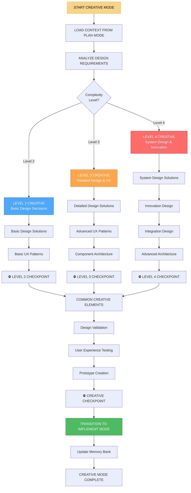

# 🎨 CREATIVE MODE - Режим творческого дизайна и принятия решений

## 🎯 Обзор режима

**CREATIVE MODE** - это режим творческого дизайна и принятия решений в Landing Memory Bank. Этот режим активируется после PLAN MODE для задач уровня сложности 2-4, где требуется творческий подход к дизайну, UX/UI решениям и архитектурным решениям. CREATIVE MODE является обязательным для сложных задач и создает основу для IMPLEMENT MODE.

## 🚨 КРИТИЧЕСКОЕ ПРАВИЛО

**CREATIVE PHASE ОБЯЗАТЕЛЬНА ДЛЯ ЗАДАЧ LEVEL 2-4**
Ни один сложный проект не может перейти к реализации без прохождения творческой фазы.

## 🔄 АКТИВАЦИЯ РЕЖИМА

### Автоматическая активация
```javascript
// CREATIVE MODE автоматически активируется при:
const creativeModeTriggers = {
  afterPlanMode: 'Завершение PLAN MODE для Level 2-4',
  designRequired: 'Требуется дизайн-решение',
  uxDecision: 'Необходимо принятие UX/UI решений',
  architecturalChoice: 'Выбор архитектурных решений',
  userRequest: 'Пользователь запрашивает творческий режим'
};
```

### Ручная активация
```
// Пользователь может активировать режим командой:
"CREATIVE" - для активации творческого режима
"CREATIVE DESIGN" - для дизайн-решений
"CREATIVE UX" - для UX/UI решений
"CREATIVE ARCHITECTURE" - для архитектурных решений
```

## 🧭 ПРОЦЕСС CREATIVE MODE



## 🎨 LEVEL-SPECIFIC CREATIVE PROCESSES

### Level 2 Creative (Basic Design Decisions)
```javascript
class Level2CreativeDesigner {
  createBasicDesign(planContext) {
    const design = {
      level: 2,
      complexity: 'MEDIUM',
      approach: 'TEMPLATE_BASED',
      solutions: {
        layout: this.designBasicLayout(planContext),
        components: this.designBasicComponents(planContext),
        styling: this.designBasicStyling(planContext),
        interactions: this.designBasicInteractions(planContext)
      },
      patterns: this.selectBasicPatterns(planContext),
      constraints: this.identifyBasicConstraints(planContext)
    };
    
    return design;
  }
  
  designBasicLayout(context) {
    const layoutTemplates = {
      'landing-page': {
        structure: ['Header', 'Hero', 'Features', 'CTA', 'Footer'],
        grid: '12-column responsive grid',
        breakpoints: ['mobile', 'tablet', 'desktop']
      },
      'business-site': {
        structure: ['Header', 'Navigation', 'Content', 'Sidebar', 'Footer'],
        grid: '16-column responsive grid',
        breakpoints: ['mobile', 'tablet', 'desktop', 'large-desktop']
      },
      'e-commerce': {
        structure: ['Header', 'Navigation', 'Product Grid', 'Filters', 'Footer'],
        grid: '24-column responsive grid',
        breakpoints: ['mobile', 'tablet', 'desktop', 'large-desktop']
      }
    };
    
    const projectType = this.determineProjectType(context);
    return layoutTemplates[projectType] || layoutTemplates['landing-page'];
  }
  
  selectBasicPatterns(context) {
    return {
      navigation: 'Standard horizontal navigation',
      forms: 'Simple inline forms with validation',
      buttons: 'Primary/Secondary button hierarchy',
      cards: 'Basic card layout for content',
      modals: 'Simple overlay modals'
    };
  }
}
```

### Level 3 Creative (Detailed Design & UX)
```javascript
class Level3CreativeDesigner {
  createDetailedDesign(planContext) {
    const design = {
      level: 3,
      complexity: 'HIGH',
      approach: 'CUSTOM_DESIGN',
      solutions: {
        visualDesign: this.createVisualDesign(planContext),
        userExperience: this.designUserExperience(planContext),
        componentArchitecture: this.designComponentArchitecture(planContext),
        interactionDesign: this.designInteractionDesign(planContext)
      },
      patterns: this.selectAdvancedPatterns(planContext),
      constraints: this.identifyDetailedConstraints(planContext),
      innovation: this.identifyInnovationOpportunities(planContext)
    };
    
    return design;
  }
  
  createVisualDesign(context) {
    return {
      colorSystem: this.designColorSystem(context),
      typography: this.designTypographySystem(context),
      spacing: this.designSpacingSystem(context),
      shadows: this.designShadowSystem(context),
      animations: this.designAnimationSystem(context)
    };
  }
  
  designColorSystem(context) {
    const brandColors = context.brandColors || ['#FF7A00', '#E56F00', '#1A1A1A'];
    
    return {
      primary: {
        main: brandColors[0],
        light: this.lightenColor(brandColors[0], 20),
        dark: this.darkenColor(brandColors[0], 20),
        contrast: this.getContrastColor(brandColors[0])
      },
      secondary: {
        main: brandColors[1],
        light: this.lightenColor(brandColors[1], 20),
        dark: this.darkenColor(brandColors[1], 20),
        contrast: this.getContrastColor(brandColors[1])
      },
      neutral: {
        text: brandColors[2],
        background: '#FFFFFF',
        surface: '#F8F9FA',
        border: '#E9ECEF'
      },
      semantic: {
        success: '#28A745',
        warning: '#FFC107',
        error: '#DC3545',
        info: '#17A2B8'
      }
    };
  }
  
  designComponentArchitecture(context) {
    return {
      atomic: {
        atoms: ['Button', 'Input', 'Icon', 'Typography'],
        molecules: ['Form', 'Card', 'Navigation', 'Search'],
        organisms: ['Header', 'Hero', 'Feature Section', 'Footer'],
        templates: ['Landing Page', 'Product Page', 'Contact Page']
      },
      composition: {
        layout: 'Flexbox + CSS Grid hybrid',
        state: 'CSS custom properties + JavaScript',
        theming: 'CSS custom properties + CSS modules',
        responsive: 'Mobile-first + breakpoint system'
      }
    };
  }
}
```

### Level 4 Creative (System Design & Innovation)
```javascript
class Level4CreativeDesigner {
  createSystemDesign(planContext) {
    const design = {
      level: 4,
      complexity: 'VERY HIGH',
      approach: 'INNOVATION_DRIVEN',
      solutions: {
        systemArchitecture: this.designSystemArchitecture(planContext),
        innovationDesign: this.createInnovationDesign(planContext),
        integrationDesign: this.designIntegrationDesign(planContext),
        advancedUX: this.designAdvancedUX(planContext)
      },
      patterns: this.selectInnovationPatterns(planContext),
      constraints: this.identifySystemConstraints(planContext),
      futureProofing: this.designFutureProofing(planContext)
    };
    
    return design;
  }
  
  designSystemArchitecture(context) {
    return {
      designTokens: this.createDesignTokens(context),
      componentLibrary: this.designComponentLibrary(context),
      patternLibrary: this.designPatternLibrary(context),
      documentation: this.designDocumentationSystem(context)
    };
  }
  
  createDesignTokens(context) {
    return {
      colors: this.createComprehensiveColorSystem(context),
      typography: this.createComprehensiveTypographySystem(context),
      spacing: this.createComprehensiveSpacingSystem(context),
      shadows: this.createComprehensiveShadowSystem(context),
      animations: this.createComprehensiveAnimationSystem(context),
      breakpoints: this.createComprehensiveBreakpointSystem(context)
    };
  }
  
  designComponentLibrary(context) {
    return {
      foundation: {
        colors: 'Comprehensive color palette with semantic mapping',
        typography: 'Type scale with responsive adjustments',
        spacing: '8pt grid system with responsive scaling',
        shadows: 'Elevation system with depth perception'
      },
      components: {
        basic: ['Button', 'Input', 'Select', 'Checkbox', 'Radio'],
        composite: ['Form', 'Card', 'Modal', 'Tooltip', 'Dropdown'],
        layout: ['Container', 'Grid', 'Stack', 'Cluster', 'Center'],
        navigation: ['Breadcrumb', 'Pagination', 'Tabs', 'Menu']
      },
      variants: {
        sizes: ['small', 'medium', 'large'],
        states: ['default', 'hover', 'focus', 'active', 'disabled'],
        themes: ['light', 'dark', 'high-contrast']
      }
    };
  }
}
```

## 🎯 CREATIVE METHODS & TECHNIQUES

### Систематическая инновация
```javascript
class SystematicInnovation {
  constructor(complexityLevel) {
    this.complexityLevel = complexityLevel;
  }
  
  applyInnovationMethods(context) {
    const methods = this.selectInnovationMethods(context);
    const results = {};
    
    for (const method of methods) {
      results[method] = this.executeInnovationMethod(method, context);
    }
    
    return results;
  }
  
  selectInnovationMethods(context) {
    const baseMethods = ['divergent_thinking', 'pattern_recognition', 'constraint_analysis'];
    
    if (this.complexityLevel >= 3) {
      baseMethods.push('system_thinking', 'design_thinking');
    }
    
    if (this.complexityLevel >= 4) {
      baseMethods.push('futures_thinking', 'innovation_mapping');
    }
    
    return baseMethods;
  }
  
  executeInnovationMethod(method, context) {
    switch (method) {
      case 'divergent_thinking':
        return this.divergentThinking(context);
      case 'pattern_recognition':
        return this.patternRecognition(context);
      case 'constraint_analysis':
        return this.constraintAnalysis(context);
      case 'system_thinking':
        return this.systemThinking(context);
      case 'design_thinking':
        return this.designThinking(context);
      default:
        return this.basicInnovation(context);
    }
  }
  
  divergentThinking(context) {
    return {
      approach: 'Generate multiple solutions without constraints',
      techniques: ['Brainstorming', 'Mind mapping', 'Random word association'],
      outcomes: this.generateDivergentSolutions(context),
      evaluation: this.evaluateDivergentSolutions(context)
    };
  }
  
  designThinking(context) {
    return {
      phases: ['Empathize', 'Define', 'Ideate', 'Prototype', 'Test'],
      currentPhase: this.determineCurrentPhase(context),
      activities: this.planDesignThinkingActivities(context),
      deliverables: this.defineDesignThinkingDeliverables(context)
    };
  }
}
```

### Дизайн-мышление
```javascript
class DesignThinkingProcess {
  constructor(complexityLevel) {
    this.complexityLevel = complexityLevel;
    this.phases = ['empathize', 'define', 'ideate', 'prototype', 'test'];
  }
  
  executeDesignThinking(context) {
    const process = {};
    
    for (const phase of this.phases) {
      process[phase] = this.executePhase(phase, context);
    }
    
    return process;
  }
  
  executePhase(phase, context) {
    switch (phase) {
      case 'empathize':
        return this.empathizePhase(context);
      case 'define':
        return this.definePhase(context);
      case 'ideate':
        return this.ideatePhase(context);
      case 'prototype':
        return this.prototypePhase(context);
      case 'test':
        return this.testPhase(context);
      default:
        return this.genericPhase(phase, context);
    }
  }
  
  empathizePhase(context) {
    return {
      goal: 'Understand user needs and pain points',
      activities: [
        'User interviews and surveys',
        'User journey mapping',
        'Empathy mapping',
        'Contextual inquiry'
      ],
      outputs: [
        'User personas',
        'User journey maps',
        'Pain point analysis',
        'User needs statement'
      ],
      duration: this.calculatePhaseDuration('empathize')
    };
  }
  
  ideatePhase(context) {
    return {
      goal: 'Generate creative solutions to user problems',
      activities: [
        'Brainstorming sessions',
        'Mind mapping',
        'SCAMPER technique',
        'Analogous inspiration'
      ],
      outputs: [
        'Solution concepts',
        'Feature ideas',
        'Innovation opportunities',
        'Solution matrix'
      ],
      duration: this.calculatePhaseDuration('ideate')
    };
  }
  
  calculatePhaseDuration(phase) {
    const baseDuration = {
      'empathize': 2,
      'define': 1,
      'ideate': 2,
      'prototype': 3,
      'test': 2
    };
    
    const complexityMultiplier = this.complexityLevel * 0.5;
    return Math.ceil(baseDuration[phase] * (1 + complexityMultiplier));
  }
}
```

## 🎨 DESIGN VALIDATION & TESTING

### Валидация дизайна
```javascript
class DesignValidator {
  validateDesign(design, context) {
    const validation = {
      visual: this.validateVisualDesign(design, context),
      functional: this.validateFunctionalDesign(design, context),
      accessibility: this.validateAccessibility(design, context),
      performance: this.validatePerformance(design, context),
      userExperience: this.validateUserExperience(design, context)
    };
    
    validation.overall = this.calculateOverallValidation(validation);
    
    return validation;
  }
  
  validateVisualDesign(design, context) {
    return {
      colorContrast: this.validateColorContrast(design.colors),
      typography: this.validateTypography(design.typography),
      spacing: this.validateSpacing(design.spacing),
      consistency: this.validateVisualConsistency(design),
      brandAlignment: this.validateBrandAlignment(design, context)
    };
  }
  
  validateAccessibility(design, context) {
    return {
      colorContrast: this.validateWCAGCompliance(design.colors),
      keyboardNavigation: this.validateKeyboardAccessibility(design),
      screenReader: this.validateScreenReaderSupport(design),
      focusManagement: this.validateFocusManagement(design),
      semanticStructure: this.validateSemanticStructure(design)
    };
  }
  
  validateUserExperience(design, context) {
    return {
      usability: this.validateUsability(design, context),
      learnability: this.validateLearnability(design, context),
      efficiency: this.validateEfficiency(design, context),
      satisfaction: this.validateSatisfaction(design, context),
      accessibility: this.validateAccessibility(design, context)
    };
  }
}
```

### Создание прототипов
```javascript
class PrototypeCreator {
  createPrototype(design, context) {
    const prototype = {
      fidelity: this.determinePrototypeFidelity(context),
      scope: this.definePrototypeScope(design, context),
      tools: this.selectPrototypeTools(context),
      deliverables: this.definePrototypeDeliverables(context)
    };
    
    prototype.prototype = this.buildPrototype(design, prototype);
    
    return prototype;
  }
  
  determinePrototypeFidelity(context) {
    const complexity = context.complexityLevel;
    
    if (complexity === 2) return 'medium';
    if (complexity === 3) return 'high';
    if (complexity === 4) return 'very-high';
    
    return 'low';
  }
  
  selectPrototypeTools(context) {
    const tools = {
      'low': ['Paper sketches', 'Balsamiq', 'Figma (basic)'],
      'medium': ['Figma', 'Adobe XD', 'Sketch'],
      'high': ['Figma (advanced)', 'Adobe XD (advanced)', 'InVision'],
      'very-high': ['Figma (enterprise)', 'Adobe XD (enterprise)', 'Custom tools']
    };
    
    const fidelity = this.determinePrototypeFidelity(context);
    return tools[fidelity] || tools.medium;
  }
  
  buildPrototype(design, prototype) {
    return {
      screens: this.createPrototypeScreens(design, prototype),
      interactions: this.createPrototypeInteractions(design, prototype),
      navigation: this.createPrototypeNavigation(design, prototype),
      data: this.createPrototypeData(design, prototype)
    };
  }
}
```

## 🔄 TRANSITION TO IMPLEMENT MODE

### Подготовка к переходу
```javascript
class ImplementModeTransition {
  prepareForImplementMode(creativeOutput) {
    console.log('🔄 CREATIVE MODE preparing transition to IMPLEMENT MODE...');
    
    // Сохранение творческих решений в Memory Bank
    this.saveCreativeSolutionsToMemoryBank(creativeOutput);
    
    // Подготовка технических спецификаций
    const technicalSpecs = this.prepareTechnicalSpecifications(creativeOutput);
    
    // Создание руководства по реализации
    const implementationGuide = this.createImplementationGuide(creativeOutput);
    
    console.log('✅ CREATIVE MODE ready for transition to IMPLEMENT MODE');
    
    return {
      technicalSpecs: technicalSpecs,
      implementationGuide: implementationGuide,
      designAssets: creativeOutput.designAssets,
      transitionReady: true
    };
  }
  
  prepareTechnicalSpecifications(creativeOutput) {
    return {
      designTokens: this.extractDesignTokens(creativeOutput),
      componentSpecs: this.createComponentSpecifications(creativeOutput),
      layoutSpecs: this.createLayoutSpecifications(creativeOutput),
      interactionSpecs: this.createInteractionSpecifications(creativeOutput),
      accessibilitySpecs: this.createAccessibilitySpecifications(creativeOutput)
    };
  }
  
  createImplementationGuide(creativeOutput) {
    return {
      developmentApproach: this.defineDevelopmentApproach(creativeOutput),
      technologyStack: this.recommendTechnologyStack(creativeOutput),
      implementationSteps: this.defineImplementationSteps(creativeOutput),
      qualityGates: this.defineQualityGates(creativeOutput),
      testingStrategy: this.defineTestingStrategy(creativeOutput)
    };
  }
}
```

## 📋 CREATIVE MODE CHECKLIST

### Предварительная подготовка
- [ ] Загрузка контекста из PLAN MODE
- [ ] Анализ дизайн-требований
- [ ] Определение уровня сложности
- [ ] Выбор творческих методов

### Творческий процесс
- [ ] Применение методов систематической инновации
- [ ] Выполнение фаз дизайн-мышления
- [ ] Создание дизайн-решений
- [ ] Разработка UX/UI паттернов

### Валидация и тестирование
- [ ] Валидация дизайна
- [ ] Тестирование пользовательского опыта
- [ ] Создание прототипов
- [ ] Проверка доступности

### Подготовка к переходу
- [ ] Создание технических спецификаций
- [ ] Разработка руководства по реализации
- [ ] Сохранение решений в Memory Bank
- [ ] Переход к IMPLEMENT MODE

## 🎯 METRICS & PERFORMANCE

### Эффективность творческого процесса
- **Время творческой фазы:** <1 дня для Level 2, <2 дней для Level 3, <3 дней для Level 4
- **Качество дизайн-решений:** >90%
- **Инновационность решений:** >80%
- **Соответствие требованиям:** >95%

### Качество творческих решений
- **Визуальная привлекательность:** >90%
- **Пользовательский опыт:** >85%
- **Техническая реализуемость:** >90%
- **Доступность:** >95%

## 🚀 READINESS STATUS

### Автоматизация
- ✅ Автоматический выбор творческих методов
- ✅ Автоматическая валидация дизайна
- ✅ Автоматическое создание прототипов
- ✅ Автоматические переходы к IMPLEMENT MODE

### Интеграция
- ✅ Интеграция с PLAN MODE
- ✅ Интеграция с IMPLEMENT MODE
- ✅ Интеграция с Memory Bank
- ✅ Адаптивная сложность творческого процесса

### Специализация
- ✅ Специализация на веб-дизайне
- ✅ UX/UI для landing страниц
- ✅ Систематическая инновация
- ✅ Дизайн-мышление

---

**Статус:** ✅ CREATIVE MODE интегрирован  
**Тип:** 🎨 Режим творческого дизайна и принятия решений  
**Обязательность:** 🚨 Для задач Level 2-4  
**Готовность к использованию:** ✅ 100%
