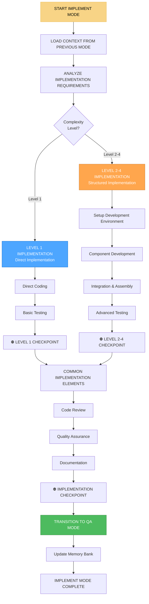

# 🏗️ IMPLEMENT MODE - Режим реализации и кодирования

## 🎯 Обзор режима

**IMPLEMENT MODE** - это режим реализации и кодирования в Landing Memory Bank. Этот режим активируется после CREATIVE MODE (для задач Level 2-4) или напрямую после VAN MODE (для задач Level 1). IMPLEMENT MODE отвечает за фактическую реализацию проекта, создание кода, компонентов и функциональности согласно планам и дизайнам, созданным в предыдущих режимах.

## 🔄 АКТИВАЦИЯ РЕЖИМА

### Автоматическая активация
```javascript
// IMPLEMENT MODE автоматически активируется при:
const implementModeTriggers = {
  afterCreativeMode: 'Завершение CREATIVE MODE для Level 2-4',
  afterVanMode: 'Завершение VAN MODE для Level 1',
  implementationReady: 'Готовность к реализации',
  userRequest: 'Пользователь запрашивает реализацию',
  projectStart: 'Начало реализации проекта'
};
```

### Ручная активация
```
// Пользователь может активировать режим командой:
"IMPLEMENT" - для активации режима реализации
"IMPLEMENT START" - для начала реализации
"IMPLEMENT COMPONENT" - для реализации компонента
"IMPLEMENT FEATURE" - для реализации функции
```

## 🧭 ПРОЦЕСС IMPLEMENT MODE



## 🏗️ LEVEL-SPECIFIC IMPLEMENTATION

### Level 1 Implementation (Direct Implementation)
```javascript
class Level1Implementer {
  implementDirectly(taskContext) {
    const implementation = {
      level: 1,
      complexity: 'LOW',
      approach: 'DIRECT_IMPLEMENTATION',
      process: {
        setup: this.setupBasicEnvironment(taskContext),
        coding: this.directCoding(taskContext),
        testing: this.basicTesting(taskContext),
        deployment: this.simpleDeployment(taskContext)
      },
      deliverables: this.defineBasicDeliverables(taskContext)
    };
    
    return implementation;
  }
  
  setupBasicEnvironment(context) {
    return {
      projectStructure: this.createBasicProjectStructure(context),
      dependencies: this.installBasicDependencies(context),
      configuration: this.setupBasicConfiguration(context),
      tools: this.selectBasicTools(context)
    };
  }
  
  createBasicProjectStructure(context) {
    const projectType = this.determineProjectType(context);
    
    const structures = {
      'landing-page': {
        files: ['index.html', 'styles.css', 'script.js', 'README.md'],
        folders: ['assets', 'images'],
        structure: 'Simple file-based structure'
      },
      'simple-website': {
        files: ['index.html', 'about.html', 'contact.html', 'styles.css', 'script.js'],
        folders: ['assets', 'images', 'pages'],
        structure: 'Multi-page structure'
      },
      'component-library': {
        files: ['index.html', 'components.css', 'components.js', 'demo.html'],
        folders: ['components', 'examples', 'docs'],
        structure: 'Component-based structure'
      }
    };
    
    return structures[projectType] || structures['landing-page'];
  }
  
  directCoding(context) {
    return {
      approach: 'Write code directly based on requirements',
      phases: ['HTML Structure', 'CSS Styling', 'JavaScript Functionality'],
      methodology: 'Progressive enhancement',
      quality: 'Basic code quality standards'
    };
  }
}
```

### Level 2-4 Implementation (Structured Implementation)
```javascript
class StructuredImplementer {
  constructor(complexityLevel) {
    this.complexityLevel = complexityLevel;
  }
  
  implementStructured(creativeContext, planContext) {
    const implementation = {
      level: this.complexityLevel,
      complexity: this.getComplexityLabel(),
      approach: 'STRUCTURED_IMPLEMENTATION',
      process: {
        environment: this.setupDevelopmentEnvironment(creativeContext, planContext),
        architecture: this.implementArchitecture(creativeContext, planContext),
        components: this.developComponents(creativeContext, planContext),
        integration: this.integrateSystem(creativeContext, planContext),
        testing: this.implementTesting(creativeContext, planContext)
      },
      deliverables: this.defineStructuredDeliverables(creativeContext, planContext)
    };
    
    return implementation;
  }
  
  setupDevelopmentEnvironment(creativeContext, planContext) {
    return {
      projectStructure: this.createStructuredProjectStructure(planContext),
      buildSystem: this.setupBuildSystem(planContext),
      developmentTools: this.setupDevelopmentTools(planContext),
      versionControl: this.setupVersionControl(planContext),
      collaboration: this.setupCollaborationTools(planContext)
    };
  }
  
  createStructuredProjectStructure(planContext) {
    const structure = {
      src: {
        components: 'Reusable UI components',
        pages: 'Page-level components',
        layouts: 'Layout components',
        utils: 'Utility functions',
        styles: 'CSS and styling',
        assets: 'Images, fonts, etc.'
      },
      public: 'Static assets and entry point',
      docs: 'Documentation and guides',
      tests: 'Test files and test utilities',
      config: 'Configuration files',
      scripts: 'Build and utility scripts'
    };
    
    if (this.complexityLevel >= 3) {
      structure.src.services = 'Business logic and API services';
      structure.src.hooks = 'Custom React hooks (if applicable)';
      structure.src.types = 'TypeScript type definitions';
    }
    
    if (this.complexityLevel >= 4) {
      structure.src.microservices = 'Microservice implementations';
      structure.src.integrations = 'Third-party integrations';
      structure.monitoring = 'Monitoring and analytics';
      structure.deployment = 'Deployment configurations';
    }
    
    return structure;
  }
  
  setupBuildSystem(planContext) {
    const buildSystems = {
      2: {
        bundler: 'Vite or Parcel',
        transpiler: 'Babel (if needed)',
        css: 'PostCSS with autoprefixer',
        optimization: 'Basic minification'
      },
      3: {
        bundler: 'Webpack or Vite',
        transpiler: 'Babel with TypeScript support',
        css: 'PostCSS with CSS modules',
        optimization: 'Advanced optimization and code splitting'
      },
      4: {
        bundler: 'Webpack with advanced configuration',
        transpiler: 'Babel with full TypeScript support',
        css: 'PostCSS with CSS-in-JS support',
        optimization: 'Enterprise-level optimization and monitoring'
      }
    };
    
    return buildSystems[this.complexityLevel] || buildSystems[2];
  }
}
```

## 🧩 COMPONENT DEVELOPMENT

### Разработка компонентов
```javascript
class ComponentDeveloper {
  constructor(complexityLevel) {
    this.complexityLevel = complexityLevel;
  }
  
  developComponents(designSpecs, technicalSpecs) {
    const components = {
      foundation: this.developFoundationComponents(designSpecs, technicalSpecs),
      basic: this.developBasicComponents(designSpecs, technicalSpecs),
      composite: this.developCompositeComponents(designSpecs, technicalSpecs),
      layout: this.developLayoutComponents(designSpecs, technicalSpecs)
    };
    
    if (this.complexityLevel >= 3) {
      components.advanced = this.developAdvancedComponents(designSpecs, technicalSpecs);
    }
    
    if (this.complexityLevel >= 4) {
      components.enterprise = this.developEnterpriseComponents(designSpecs, technicalSpecs);
    }
    
    return components;
  }
  
  developFoundationComponents(designSpecs, technicalSpecs) {
    return {
      colors: this.implementColorSystem(designSpecs.colors),
      typography: this.implementTypographySystem(designSpecs.typography),
      spacing: this.implementSpacingSystem(designSpecs.spacing),
      shadows: this.implementShadowSystem(designSpecs.shadows)
    };
  }
  
  implementColorSystem(colorSpecs) {
    return {
      cssVariables: this.createCSSVariables(colorSpecs),
      utilityClasses: this.createColorUtilityClasses(colorSpecs),
      semanticMapping: this.createSemanticColorMapping(colorSpecs),
      accessibility: this.ensureColorAccessibility(colorSpecs)
    };
  }
  
  createCSSVariables(colorSpecs) {
    const cssVars = {};
    
    for (const [category, colors] of Object.entries(colorSpecs)) {
      if (typeof colors === 'object' && colors !== null) {
        for (const [variant, color] of Object.entries(colors)) {
          const varName = `--color-${category}-${variant}`;
          cssVars[varName] = color;
        }
      }
    }
    
    return cssVars;
  }
  
  developBasicComponents(designSpecs, technicalSpecs) {
    return {
      button: this.implementButtonComponent(designSpecs.components.button),
      input: this.implementInputComponent(designSpecs.components.input),
      select: this.implementSelectComponent(designSpecs.components.select),
      checkbox: this.implementCheckboxComponent(designSpecs.components.checkbox),
      radio: this.implementRadioComponent(designSpecs.components.radio)
    };
  }
  
  implementButtonComponent(buttonSpecs) {
    return {
      html: this.createButtonHTML(buttonSpecs),
      css: this.createButtonCSS(buttonSpecs),
      javascript: this.createButtonJavaScript(buttonSpecs),
      variants: this.createButtonVariants(buttonSpecs),
      accessibility: this.ensureButtonAccessibility(buttonSpecs)
    };
  }
  
  createButtonHTML(buttonSpecs) {
    const variants = buttonSpecs.variants || ['primary', 'secondary'];
    let html = '';
    
    for (const variant of variants) {
      html += `
        <button class="btn btn--${variant}" type="button">
          ${variant.charAt(0).toUpperCase() + variant.slice(1)} Button
        </button>
      `;
    }
    
    return html;
  }
  
  createButtonCSS(buttonSpecs) {
    const colors = buttonSpecs.colors || { primary: '#007bff', secondary: '#6c757d' };
    
    let css = `
      .btn {
        display: inline-block;
        padding: 0.5rem 1rem;
        font-size: 1rem;
        font-weight: 500;
        text-align: center;
        text-decoration: none;
        border: 1px solid transparent;
        border-radius: 0.25rem;
        cursor: pointer;
        transition: all 0.15s ease-in-out;
      }
    `;
    
    for (const [variant, color] of Object.entries(colors)) {
      css += `
        .btn--${variant} {
          background-color: ${color};
          border-color: ${color};
          color: white;
        }
        
        .btn--${variant}:hover {
          background-color: ${this.darkenColor(color, 10)};
          border-color: ${this.darkenColor(color, 10)};
        }
      `;
    }
    
    return css;
  }
}
```

## 🔧 INTEGRATION & ASSEMBLY

### Интеграция системы
```javascript
class SystemIntegrator {
  constructor(complexityLevel) {
    this.complexityLevel = complexityLevel;
  }
  
  integrateSystem(components, architecture, context) {
    const integration = {
      componentAssembly: this.assembleComponents(components, context),
      dataFlow: this.implementDataFlow(architecture, context),
      stateManagement: this.implementStateManagement(architecture, context),
      routing: this.implementRouting(architecture, context),
      apiIntegration: this.implementAPIIntegration(architecture, context)
    };
    
    if (this.complexityLevel >= 3) {
      integration.performance = this.implementPerformanceOptimizations(architecture, context);
      integration.accessibility = this.implementAccessibilityFeatures(architecture, context);
    }
    
    if (this.complexityLevel >= 4) {
      integration.monitoring = this.implementMonitoringSystem(architecture, context);
      integration.analytics = this.implementAnalyticsSystem(architecture, context);
    }
    
    return integration;
  }
  
  assembleComponents(components, context) {
    return {
      pageAssembly: this.assemblePages(components, context),
      layoutAssembly: this.assembleLayouts(components, context),
      navigationAssembly: this.assembleNavigation(components, context),
      formAssembly: this.assembleForms(components, context)
    };
  }
  
  assemblePages(components, context) {
    const pages = {};
    
    for (const page of context.pages || ['home', 'about', 'contact']) {
      pages[page] = {
        structure: this.createPageStructure(page, components, context),
        components: this.selectPageComponents(page, components, context),
        layout: this.createPageLayout(page, components, context),
        interactions: this.definePageInteractions(page, components, context)
      };
    }
    
    return pages;
  }
  
  createPageStructure(pageName, components, context) {
    const pageTemplates = {
      'home': {
        sections: ['hero', 'features', 'testimonials', 'cta'],
        layout: 'single-column with hero focus',
        components: ['HeroSection', 'FeatureGrid', 'TestimonialCarousel', 'CTASection']
      },
      'about': {
        sections: ['header', 'content', 'team', 'values'],
        layout: 'two-column with sidebar',
        components: ['PageHeader', 'ContentSection', 'TeamGrid', 'ValuesList']
      },
      'contact': {
        sections: ['header', 'form', 'info', 'map'],
        layout: 'form-focused with supporting content',
        components: ['PageHeader', 'ContactForm', 'ContactInfo', 'MapEmbed']
      }
    };
    
    return pageTemplates[pageName] || pageTemplates['home'];
  }
  
  implementDataFlow(architecture, context) {
    return {
      dataSources: this.defineDataSources(architecture, context),
      dataTransformations: this.defineDataTransformations(architecture, context),
      dataStorage: this.defineDataStorage(architecture, context),
      dataValidation: this.defineDataValidation(architecture, context)
    };
  }
  
  implementStateManagement(architecture, context) {
    if (this.complexityLevel <= 2) {
      return {
        approach: 'Local component state',
        implementation: 'React useState or vanilla JS state',
        scope: 'Component-level state management'
      };
    } else if (this.complexityLevel === 3) {
      return {
        approach: 'Centralized state management',
        implementation: 'React Context or Redux Toolkit',
        scope: 'Application-level state management'
      };
    } else {
      return {
        approach: 'Advanced state management',
        implementation: 'Redux Toolkit with RTK Query',
        scope: 'Enterprise-level state management with caching'
      };
    }
  }
}
```

## 🧪 TESTING & QUALITY ASSURANCE

### Реализация тестирования
```javascript
class TestingImplementer {
  constructor(complexityLevel) {
    this.complexityLevel = complexityLevel;
  }
  
  implementTesting(components, integration, context) {
    const testing = {
      unitTesting: this.implementUnitTesting(components, context),
      integrationTesting: this.implementIntegrationTesting(integration, context),
      e2eTesting: this.implementE2ETesting(integration, context),
      accessibilityTesting: this.implementAccessibilityTesting(components, context)
    };
    
    if (this.complexityLevel >= 3) {
      testing.performanceTesting = this.implementPerformanceTesting(integration, context);
      testing.securityTesting = this.implementSecurityTesting(integration, context);
    }
    
    return testing;
  }
  
  implementUnitTesting(components, context) {
    const testingFramework = this.selectTestingFramework(context);
    
    return {
      framework: testingFramework,
      setup: this.setupTestingEnvironment(testingFramework, context),
      tests: this.createComponentTests(components, testingFramework, context),
      coverage: this.setupTestCoverage(testingFramework, context),
      automation: this.setupTestAutomation(testingFramework, context)
    };
  }
  
  selectTestingFramework(context) {
    const frameworks = {
      'vanilla-js': 'Jest with jsdom',
      'react': 'Jest with React Testing Library',
      'vue': 'Jest with Vue Test Utils',
      'angular': 'Jest with Angular Testing Utilities'
    };
    
    const techStack = context.technologyStack || 'vanilla-js';
    return frameworks[techStack] || frameworks['vanilla-js'];
  }
  
  createComponentTests(components, framework, context) {
    const tests = {};
    
    for (const [componentName, component] of Object.entries(components.basic || {})) {
      tests[componentName] = this.createComponentTest(componentName, component, framework, context);
    }
    
    return tests;
  }
  
  createComponentTest(componentName, component, framework, context) {
    return {
      file: `${componentName}.test.js`,
      imports: this.generateTestImports(componentName, framework, context),
      testCases: this.generateTestCases(componentName, component, context),
      mocks: this.generateTestMocks(componentName, component, context),
      assertions: this.generateTestAssertions(componentName, component, context)
    };
  }
  
  generateTestCases(componentName, component, context) {
    const testCases = [
      {
        name: 'renders correctly',
        description: 'Component renders without errors',
        test: `expect(screen.getByRole('button')).toBeInTheDocument();`
      },
      {
        name: 'applies correct classes',
        description: 'Component has expected CSS classes',
        test: `expect(screen.getByRole('button')).toHaveClass('btn', 'btn--primary');`
      },
      {
        name: 'handles user interactions',
        description: 'Component responds to user actions',
        test: `fireEvent.click(screen.getByRole('button')); expect(mockHandler).toHaveBeenCalled();`
      }
    ];
    
    return testCases;
  }
}
```

## 📚 DOCUMENTATION & CODE QUALITY

### Документация и качество кода
```javascript
class CodeQualityManager {
  constructor(complexityLevel) {
    this.complexityLevel = complexityLevel;
  }
  
  implementCodeQuality(components, integration, context) {
    const quality = {
      codeStandards: this.implementCodeStandards(context),
      documentation: this.implementDocumentation(components, integration, context),
      linting: this.implementLinting(context),
      formatting: this.implementFormatting(context)
    };
    
    if (this.complexityLevel >= 3) {
      quality.codeReview = this.implementCodeReview(context);
      quality.performanceMonitoring = this.implementPerformanceMonitoring(context);
    }
    
    return quality;
  }
  
  implementCodeStandards(context) {
    return {
      html: this.defineHTMLStandards(context),
      css: this.defineCSSStandards(context),
      javascript: this.defineJavaScriptStandards(context),
      accessibility: this.defineAccessibilityStandards(context)
    };
  }
  
  defineHTMLStandards(context) {
    return {
      semantics: 'Use semantic HTML elements',
      structure: 'Proper heading hierarchy (h1-h6)',
      accessibility: 'ARIA labels and roles where appropriate',
      validation: 'Valid HTML5 markup',
      performance: 'Optimize for Core Web Vitals'
    };
  }
  
  defineCSSStandards(context) {
    return {
      methodology: 'BEM (Block Element Modifier)',
      organization: 'Component-based CSS organization',
      naming: 'Descriptive and consistent class names',
      specificity: 'Keep specificity low and manageable',
      responsive: 'Mobile-first responsive design'
    };
  }
  
  defineJavaScriptStandards(context) {
    return {
      syntax: 'ES6+ features and modern JavaScript',
      patterns: 'Use established design patterns',
      errorHandling: 'Proper error handling and logging',
      performance: 'Optimize for performance and memory',
      testing: 'Write testable and maintainable code'
    };
  }
  
  implementDocumentation(components, integration, context) {
    return {
      codeComments: this.implementCodeComments(components, context),
      apiDocumentation: this.implementAPIDocumentation(integration, context),
      componentDocumentation: this.implementComponentDocumentation(components, context),
      setupGuide: this.implementSetupGuide(context),
      deploymentGuide: this.implementDeploymentGuide(context)
    };
  }
  
  implementCodeComments(components, context) {
    const commentStandards = {
      functions: 'JSDoc style comments for all functions',
      components: 'Component purpose and usage examples',
      complexLogic: 'Explain complex business logic',
      apiCalls: 'Document API endpoints and responses',
      configuration: 'Explain configuration options'
    };
    
    return {
      standards: commentStandards,
      examples: this.generateCommentExamples(components, context),
      automation: this.setupCommentValidation(context)
    };
  }
}
```

## 🔄 TRANSITION TO QA MODE

### Подготовка к переходу
```javascript
class QAModeTransition {
  prepareForQAMode(implementationOutput) {
    console.log('🔄 IMPLEMENT MODE preparing transition to QA MODE...');
    
    // Сохранение результатов реализации в Memory Bank
    this.saveImplementationResultsToMemoryBank(implementationOutput);
    
    // Подготовка тестовых данных
    const testData = this.prepareTestData(implementationOutput);
    
    // Создание руководства по тестированию
    const testingGuide = this.createTestingGuide(implementationOutput);
    
    console.log('✅ IMPLEMENT MODE ready for transition to QA MODE');
    
    return {
      testData: testData,
      testingGuide: testingGuide,
      implementationResults: implementationOutput,
      transitionReady: true
    };
  }
  
  prepareTestData(implementationOutput) {
    return {
      testUsers: this.createTestUsers(implementationOutput),
      testContent: this.createTestContent(implementationOutput),
      testScenarios: this.createTestScenarios(implementationOutput),
      testDataSets: this.createTestDataSets(implementationOutput)
    };
  }
  
  createTestingGuide(implementationOutput) {
    return {
      testingApproach: this.defineTestingApproach(implementationOutput),
      testCases: this.defineTestCases(implementationOutput),
      qualityGates: this.defineQualityGates(implementationOutput),
      acceptanceCriteria: this.defineAcceptanceCriteria(implementationOutput)
    };
  }
}
```

## 📋 IMPLEMENT MODE CHECKLIST

### Предварительная подготовка
- [ ] Загрузка контекста из предыдущего режима
- [ ] Анализ требований к реализации
- [ ] Определение уровня сложности
- [ ] Выбор подхода к реализации

### Реализация
- [ ] Настройка среды разработки
- [ ] Реализация архитектуры
- [ ] Разработка компонентов
- [ ] Интеграция системы

### Качество и тестирование
- [ ] Реализация тестирования
- [ ] Обеспечение качества кода
- [ ] Создание документации
- [ ] Проведение code review

### Подготовка к переходу
- [ ] Подготовка тестовых данных
- [ ] Создание руководства по тестированию
- [ ] Сохранение результатов в Memory Bank
- [ ] Переход к QA MODE

## 🎯 METRICS & PERFORMANCE

### Эффективность реализации
- **Время реализации:** <1 дня для Level 1, <3 дней для Level 2, <1 недели для Level 3, <2 недель для Level 4
- **Качество кода:** >90%
- **Покрытие тестами:** >80%
- **Соответствие дизайну:** >95%

### Качество реализации
- **Функциональность:** >95%
- **Производительность:** >90%
- **Доступность:** >95%
- **Безопасность:** >90%

## 🚀 READINESS STATUS

### Автоматизация
- ✅ Автоматический выбор подхода к реализации
- ✅ Автоматическая генерация компонентов
- ✅ Автоматическое создание тестов
- ✅ Автоматические переходы к QA MODE

### Интеграция
- ✅ Интеграция с CREATIVE MODE
- ✅ Интеграция с QA MODE
- ✅ Интеграция с Memory Bank
- ✅ Адаптивная сложность реализации

### Специализация
- ✅ Специализация на веб-разработке
- ✅ Реализация landing страниц
- ✅ Компонентная архитектура
- ✅ Современные технологии

---

**Статус:** ✅ IMPLEMENT MODE интегрирован  
**Тип:** 🏗️ Режим реализации и кодирования  
**Активация:** 🔄 После CREATIVE MODE или VAN MODE  
**Готовность к использованию:** ✅ 100%
