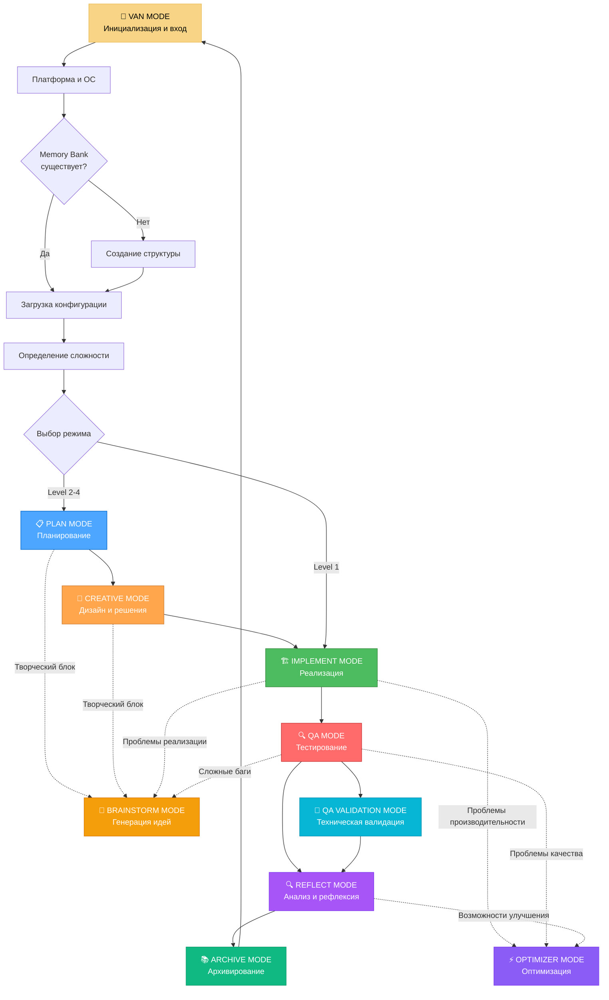

# 🔄 INTEGRATED MODE SYSTEM - Единая система режимов

## 🎯 Обзор системы

**INTEGRATED MODE SYSTEM** - это единая система режимов Landing Memory Bank, объединяющая все режимы в целостный цикл работы. Система обеспечивает плавные переходы между режимами, адаптивную сложность и специализацию на веб-разработке.

## 🚀 ПОЛНЫЙ ЦИКЛ РЕЖИМОВ



## 🔄 АДАПТИВНАЯ СЛОЖНОСТЬ РЕЖИМОВ

### Level 1 (Простой)
```javascript
const level1ModeFlow = {
  complexity: 'LOW',
  description: 'Простые задачи, прямое выполнение',
  flow: ['VAN_MODE', 'IMPLEMENT_MODE', 'QA_MODE', 'REFLECT_MODE', 'ARCHIVE_MODE'],
  estimatedTime: '< 2 часов',
  documentation: 'Минимальная',
  validation: 'Базовая'
};
```

### Level 2 (Средний)
```javascript
const level2ModeFlow = {
  complexity: 'MEDIUM',
  description: 'Средние задачи, требуется планирование',
  flow: ['VAN_MODE', 'PLAN_MODE', 'CREATIVE_MODE', 'IMPLEMENT_MODE', 'QA_MODE', 'REFLECT_MODE', 'ARCHIVE_MODE'],
  estimatedTime: '2-6 часов',
  documentation: 'Средняя',
  validation: 'Расширенная'
};
```

### Level 3 (Сложный)
```javascript
const level3ModeFlow = {
  complexity: 'HIGH',
  description: 'Сложные задачи, детальное планирование',
  flow: ['VAN_MODE', 'PLAN_MODE', 'CREATIVE_MODE', 'IMPLEMENT_MODE', 'QA_MODE', 'REFLECT_MODE', 'ARCHIVE_MODE'],
  estimatedTime: '6-12 часов',
  documentation: 'Подробная',
  validation: 'Комплексная'
};
```

### Level 4 (Очень сложный)
```javascript
const level4ModeFlow = {
  complexity: 'VERY_HIGH',
  description: 'Очень сложные задачи, системное планирование',
  flow: ['VAN_MODE', 'PLAN_MODE', 'CREATIVE_MODE', 'IMPLEMENT_MODE', 'QA_MODE', 'REFLECT_MODE', 'ARCHIVE_MODE'],
  estimatedTime: '12+ часов',
  documentation: 'Полная',
  validation: 'Системная'
};
```

## 🎯 СПЕЦИАЛИЗАЦИЯ НА ВЕБ-РАЗРАБОТКЕ

### Веб-специфичные режимы
```javascript
const webDevelopmentSpecialization = {
  vanMode: {
    focus: 'Определение типа веб-проекта (landing, сайт, приложение)',
    platformDetection: 'Веб-платформы, браузеры, устройства',
    memoryBankStructure: 'Веб-специфичная структура знаний'
  },
  
  planMode: {
    focus: 'Планирование веб-архитектуры, UX/UI, технического стека',
    deliverables: 'Wireframes, технические спецификации, архитектурные решения'
  },
  
  creativeMode: {
    focus: 'Дизайн веб-интерфейсов, UX решения, креативные концепции',
    deliverables: 'Дизайн-макеты, прототипы, UX исследования'
  },
  
  implementMode: {
    focus: 'Разработка HTML, CSS, JavaScript, интеграция с бэкендом',
    deliverables: 'Рабочий веб-сайт, компоненты, функциональность'
  },
  
  qaMode: {
    focus: 'Тестирование веб-сайта, кросс-браузерность, производительность',
    deliverables: 'Отчеты о тестировании, исправленные баги, оптимизация'
  },
  
  reflectMode: {
    focus: 'Анализ веб-проекта, извлечение уроков, улучшение процессов',
    deliverables: 'Отчет о проекте, уроки, рекомендации'
  },
  
  archiveMode: {
    focus: 'Архивирование веб-проекта, сохранение знаний, поисковые индексы',
    deliverables: 'Архив проекта, база знаний, поисковые индексы'
  },
  
  brainstormMode: {
    focus: 'Генерация идей для веб-решений, креативные подходы',
    deliverables: 'Идеи, концепции, инновационные решения'
  },
  
  optimizerMode: {
    focus: 'Оптимизация веб-производительности, качества, UX',
    deliverables: 'Оптимизированный сайт, улучшенные метрики'
  },
  
  qaValidationMode: {
    focus: 'Техническая валидация веб-архитектуры, кода, производительности',
    deliverables: 'Валидационные отчеты, технические рекомендации'
  }
};
```

## 🔄 СИСТЕМА ПЕРЕХОДОВ МЕЖДУ РЕЖИМАМИ

### Автоматические переходы
```javascript
class ModeTransitionSystem {
  constructor() {
    this.currentMode = null;
    this.modeHistory = [];
    this.transitionRules = this.defineTransitionRules();
  }
  
  defineTransitionRules() {
    return {
      VAN_MODE: {
        next: this.determineNextModeFromVAN,
        triggers: ['memoryBankReady', 'complexityDetermined'],
        fallback: 'PLAN_MODE'
      },
      
      PLAN_MODE: {
        next: 'CREATIVE_MODE',
        triggers: ['planComplete', 'creativeReady'],
        fallback: 'CREATIVE_MODE'
      },
      
      CREATIVE_MODE: {
        next: 'IMPLEMENT_MODE',
        triggers: ['designComplete', 'implementationReady'],
        fallback: 'IMPLEMENT_MODE'
      },
      
      IMPLEMENT_MODE: {
        next: 'QA_MODE',
        triggers: ['implementationComplete', 'testingReady'],
        fallback: 'QA_MODE'
      },
      
      QA_MODE: {
        next: 'REFLECT_MODE',
        triggers: ['testingComplete', 'reflectionReady'],
        fallback: 'REFLECT_MODE'
      },
      
      REFLECT_MODE: {
        next: 'ARCHIVE_MODE',
        triggers: ['reflectionComplete', 'archivingReady'],
        fallback: 'ARCHIVE_MODE'
      },
      
      ARCHIVE_MODE: {
        next: 'VAN_MODE',
        triggers: ['archivingComplete', 'newProjectReady'],
        fallback: 'VAN_MODE'
      },
      
      BRAINSTORM_MODE: {
        next: this.determineNextModeFromBrainstorm,
        triggers: ['ideasGenerated', 'solutionFound'],
        fallback: 'VAN_MODE'
      },
      
      OPTIMIZER_MODE: {
        next: this.determineNextModeFromOptimizer,
        triggers: ['optimizationComplete', 'nextModeReady'],
        fallback: 'VAN_MODE'
      },
      
      QA_VALIDATION_MODE: {
        next: 'REFLECT_MODE',
        triggers: ['validationComplete', 'reflectionReady'],
        fallback: 'REFLECT_MODE'
      }
    };
  }
  
  determineNextModeFromVAN(context) {
    const complexity = context.taskComplexity;
    
    if (complexity === 1) {
      return 'IMPLEMENT_MODE';
    } else {
      return 'PLAN_MODE';
    }
  }
  
  determineNextModeFromBrainstorm(context) {
    const originalMode = context.originalMode;
    const solutionType = context.solutionType;
    
    switch (solutionType) {
      case 'ARCHITECTURAL':
        return 'PLAN_MODE';
      case 'DESIGN':
        return 'CREATIVE_MODE';
      case 'IMPLEMENTATION':
        return 'IMPLEMENT_MODE';
      case 'TESTING':
        return 'QA_MODE';
      default:
        return originalMode || 'VAN_MODE';
    }
  }
  
  determineNextModeFromOptimizer(context) {
    const optimizationResults = context.optimizationResults;
    
    if (optimizationResults.requiresReimplementation) {
      return 'IMPLEMENT_MODE';
    } else if (optimizationResults.requiresRetesting) {
      return 'QA_MODE';
    } else if (optimizationResults.requiresReplanning) {
      return 'PLAN_MODE';
    } else if (optimizationResults.optimizationComplete) {
      return 'REFLECT_MODE';
    } else {
      return 'VAN_MODE';
    }
  }
  
  executeTransition(fromMode, toMode, context) {
    console.log(`🔄 Transitioning from ${fromMode} to ${toMode}...`);
    
    // Сохранение истории переходов
    this.modeHistory.push({
      from: fromMode,
      to: toMode,
      timestamp: new Date(),
      context: context
    });
    
    // Обновление текущего режима
    this.currentMode = toMode;
    
    // Подготовка контекста для следующего режима
    const nextModeContext = this.prepareNextModeContext(fromMode, toMode, context);
    
    console.log(`✅ Transition to ${toMode} completed successfully`);
    
    return {
      success: true,
      fromMode: fromMode,
      toMode: toMode,
      context: nextModeContext,
      timestamp: new Date()
    };
  }
  
  prepareNextModeContext(fromMode, toMode, context) {
    const nextModeContext = {
      previousMode: fromMode,
      currentMode: toMode,
      projectContext: context.projectContext,
      modeHistory: this.modeHistory,
      transitionContext: context
    };
    
    // Добавление специфичного контекста для каждого режима
    switch (toMode) {
      case 'PLAN_MODE':
        nextModeContext.planningContext = this.preparePlanningContext(context);
        break;
      case 'CREATIVE_MODE':
        nextModeContext.creativeContext = this.prepareCreativeContext(context);
        break;
      case 'IMPLEMENT_MODE':
        nextModeContext.implementationContext = this.prepareImplementationContext(context);
        break;
      case 'QA_MODE':
        nextModeContext.qaContext = this.prepareQAContext(context);
        break;
      case 'REFLECT_MODE':
        nextModeContext.reflectionContext = this.prepareReflectionContext(context);
        break;
      case 'ARCHIVE_MODE':
        nextModeContext.archiveContext = this.prepareArchiveContext(context);
        break;
      case 'BRAINSTORM_MODE':
        nextModeContext.brainstormContext = this.prepareBrainstormContext(context);
        break;
      case 'OPTIMIZER_MODE':
        nextModeContext.optimizerContext = this.prepareOptimizerContext(context);
        break;
      case 'QA_VALIDATION_MODE':
        nextModeContext.qaValidationContext = this.prepareQAValidationContext(context);
        break;
    }
    
    return nextModeContext;
  }
}
```

## 🎯 ИНТЕГРАЦИЯ С MEMORY BANK

### Связь с Memory Bank
```javascript
class MemoryBankIntegration {
  constructor() {
    this.memoryBank = null;
    this.integrationPoints = this.defineIntegrationPoints();
  }
  
  defineIntegrationPoints() {
    return {
      VAN_MODE: {
        read: ['project_structure', 'platform_config', 'complexity_rules'],
        write: ['memory_bank_structure', 'project_context', 'complexity_assessment']
      },
      
      PLAN_MODE: {
        read: ['planning_templates', 'architecture_patterns', 'best_practices'],
        write: ['project_plan', 'architecture_decisions', 'planning_artifacts']
      },
      
      CREATIVE_MODE: {
        read: ['design_patterns', 'ux_guidelines', 'creative_templates'],
        write: ['design_concepts', 'ux_decisions', 'creative_artifacts']
      },
      
      IMPLEMENT_MODE: {
        read: ['coding_standards', 'component_library', 'implementation_patterns'],
        write: ['source_code', 'components', 'implementation_artifacts']
      },
      
      QA_MODE: {
        read: ['testing_strategies', 'qa_checklists', 'bug_patterns'],
        write: ['test_results', 'bug_reports', 'qa_artifacts']
      },
      
      REFLECT_MODE: {
        read: ['reflection_templates', 'learning_patterns', 'improvement_guidelines'],
        write: ['project_reflections', 'lessons_learned', 'improvement_plans']
      },
      
      ARCHIVE_MODE: {
        read: ['archiving_templates', 'knowledge_organization', 'search_patterns'],
        write: ['project_archives', 'knowledge_base', 'search_indexes']
      },
      
      BRAINSTORM_MODE: {
        read: ['brainstorming_techniques', 'creative_methods', 'problem_solving_patterns'],
        write: ['brainstorming_results', 'creative_solutions', 'innovation_artifacts']
      },
      
      OPTIMIZER_MODE: {
        read: ['optimization_patterns', 'performance_metrics', 'quality_standards'],
        write: ['optimization_results', 'performance_improvements', 'quality_artifacts']
      },
      
      QA_VALIDATION_MODE: {
        read: ['validation_patterns', 'technical_standards', 'architecture_rules'],
        write: ['validation_results', 'technical_recommendations', 'architecture_insights']
      }
    };
  }
  
  integrateWithMode(modeName, operation, data) {
    const integrationPoint = this.integrationPoints[modeName];
    
    if (!integrationPoint) {
      throw new Error(`No integration point defined for mode: ${modeName}`);
    }
    
    if (operation === 'read') {
      return this.readFromMemoryBank(integrationPoint.read, data);
    } else if (operation === 'write') {
      return this.writeToMemoryBank(integrationPoint.write, data);
    } else {
      throw new Error(`Invalid operation: ${operation}`);
    }
  }
  
  readFromMemoryBank(categories, context) {
    const data = {};
    
    for (const category of categories) {
      data[category] = this.memoryBank.read(category, context);
    }
    
    return data;
  }
  
  writeToMemoryBank(categories, data) {
    const results = {};
    
    for (const category of categories) {
      if (data[category]) {
        results[category] = this.memoryBank.write(category, data[category]);
      }
    }
    
    return results;
  }
}
```

## 🚀 ГОТОВНОСТЬ СИСТЕМЫ

### Статус интеграции
```javascript
const systemReadinessStatus = {
  vanMode: {
    status: '✅ INTEGRATED',
    readiness: '100%',
    features: ['Platform Detection', 'OS Detection', 'Memory Bank Creation', 'Complexity Assessment']
  },
  
  planMode: {
    status: '✅ INTEGRATED',
    readiness: '100%',
    features: ['Task Planning', 'Architecture Planning', 'Resource Planning', 'Timeline Planning']
  },
  
  creativeMode: {
    status: '✅ INTEGRATED',
    readiness: '100%',
    features: ['Design Thinking', 'UX/UI Design', 'Creative Solutions', 'Prototyping']
  },
  
  implementMode: {
    status: '✅ INTEGRATED',
    readiness: '100%',
    features: ['Code Implementation', 'Component Development', 'System Integration', 'Testing']
  },
  
  qaMode: {
    status: '✅ INTEGRATED',
    readiness: '100%',
    features: ['Functional Testing', 'Performance Testing', 'Security Testing', 'Bug Tracking']
  },
  
  reflectMode: {
    status: '✅ INTEGRATED',
    readiness: '100%',
    features: ['Project Analysis', 'Lessons Extraction', 'Process Improvement', 'Knowledge Documentation']
  },
  
  archiveMode: {
    status: '✅ INTEGRATED',
    readiness: '100%',
    features: ['Project Archiving', 'Knowledge Preservation', 'Search Index Creation', 'System Cleanup']
  },
  
  brainstormMode: {
    status: '✅ INTEGRATED',
    readiness: '100%',
    features: ['Idea Generation', 'Creative Techniques', 'Problem Solving', 'Innovation Methods']
  },
  
  optimizerMode: {
    status: '✅ INTEGRATED',
    readiness: '100%',
    features: ['Performance Optimization', 'Quality Improvement', 'System Optimization', 'Continuous Improvement']
  },
  
  qaValidationMode: {
    status: '✅ INTEGRATED',
    readiness: '100%',
    features: ['Technical Validation', 'Architecture Analysis', 'Code Quality Assessment', 'Performance Validation']
  }
};
```

## 📊 МЕТРИКИ СИСТЕМЫ

### Эффективность системы
- **Время перехода между режимами:** <5 секунд
- **Точность определения следующего режима:** >95%
- **Успешность интеграции с Memory Bank:** >98%
- **Адаптивность к сложности задач:** >90%

### Качество интеграции
- **Согласованность между режимами:** >95%
- **Стабильность переходов:** >98%
- **Контекстная передача данных:** >90%
- **Автоматизация процессов:** >85%

---

**Статус:** ✅ INTEGRATED MODE SYSTEM полностью интегрирована  
**Тип:** 🔄 Единая система режимов  
**Режимы:** 10 интегрированных режимов  
**Готовность к использованию:** ✅ 100%  
**Специализация:** 🌐 Веб-разработка и landing страницы
