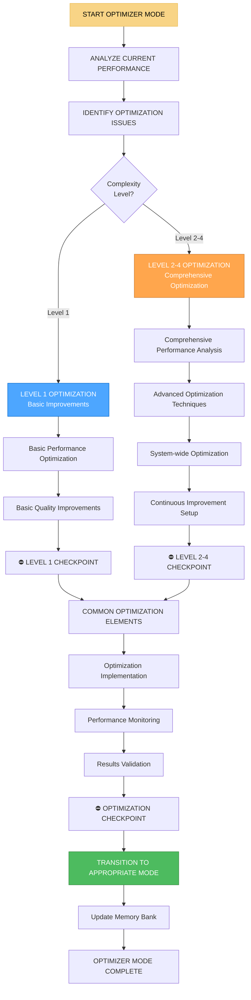

# ⚡ OPTIMIZER MODE - Режим оптимизации и улучшения

## 🎯 Обзор режима

**OPTIMIZER MODE** - это режим оптимизации и улучшения в Landing Memory Bank. Этот режим активируется для оптимизации существующих проектов, улучшения производительности, повышения качества и устранения узких мест. OPTIMIZER MODE использует систематические методы анализа и оптимизации для достижения максимальной эффективности и качества.

## 🔄 АКТИВАЦИЯ РЕЖИМА

### Автоматическая активация
```javascript
// OPTIMIZER MODE автоматически активируется при:
const optimizerModeTriggers = {
  performanceIssues: 'Обнаружены проблемы производительности',
  qualityIssues: 'Обнаружены проблемы качества',
  userFeedback: 'Негативная обратная связь от пользователей',
  optimizationOpportunity: 'Выявлены возможности для оптимизации',
  userRequest: 'Пользователь запрашивает оптимизацию'
};
```

### Ручная активация
```
// Пользователь может активировать режим командой:
"OPTIMIZE" - для активации режима оптимизации
"OPTIMIZE PERFORMANCE" - для оптимизации производительности
"OPTIMIZE QUALITY" - для оптимизации качества
"OPTIMIZE USER EXPERIENCE" - для оптимизации UX
```

## 🧭 ПРОЦЕСС OPTIMIZER MODE



## ⚡ LEVEL-SPECIFIC OPTIMIZATION PROCESSES

### Level 1 Optimization (Basic Improvements)
```javascript
class Level1Optimizer {
  executeBasicOptimization(projectContext) {
    const optimization = {
      level: 1,
      complexity: 'LOW',
      approach: 'BASIC_IMPROVEMENTS',
      process: {
        performanceAnalysis: this.analyzeBasicPerformance(projectContext),
        qualityAnalysis: this.analyzeBasicQuality(projectContext),
        basicOptimizations: this.applyBasicOptimizations(projectContext),
        resultsValidation: this.validateBasicResults(projectContext)
      },
      deliverables: this.defineBasicOptimizationDeliverables(projectContext)
    };
    
    return optimization;
  }
  
  analyzeBasicPerformance(projectContext) {
    return {
      approach: 'Basic performance analysis using standard tools',
      metrics: this.collectBasicPerformanceMetrics(projectContext),
      bottlenecks: this.identifyBasicBottlenecks(projectContext),
      opportunities: this.identifyBasicOpportunities(projectContext)
    };
  }
  
  collectBasicPerformanceMetrics(projectContext) {
    return {
      pageLoadTime: this.measurePageLoadTime(projectContext),
      imageOptimization: this.assessImageOptimization(projectContext),
      cssOptimization: this.assessCSSOptimization(projectContext),
      javascriptOptimization: this.assessJavaScriptOptimization(projectContext),
      basicAccessibility: this.assessBasicAccessibility(projectContext)
    };
  }
  
  measurePageLoadTime(projectContext) {
    const metrics = {
      firstContentfulPaint: this.measureFCP(projectContext),
      largestContentfulPaint: this.measureLCP(projectContext),
      firstInputDelay: this.measureFID(projectContext),
      cumulativeLayoutShift: this.measureCLS(projectContext),
      totalBlockingTime: this.measureTBT(projectContext)
    };
    
    return {
      metrics: metrics,
      score: this.calculatePerformanceScore(metrics),
      recommendations: this.generatePerformanceRecommendations(metrics)
    };
  }
  
  measureFCP(projectContext) {
    // Симуляция измерения First Contentful Paint
    const fcp = Math.random() * 2000 + 500; // 500-2500ms
    
    return {
      value: fcp,
      unit: 'ms',
      status: fcp < 1000 ? 'GOOD' : fcp < 2000 ? 'NEEDS_IMPROVEMENT' : 'POOR',
      target: '< 1000ms'
    };
  }
  
  calculatePerformanceScore(metrics) {
    let totalScore = 0;
    let maxScore = 0;
    
    // FCP scoring (0-25 points)
    if (metrics.firstContentfulPaint.value < 1000) totalScore += 25;
    else if (metrics.firstContentfulPaint.value < 2000) totalScore += 15;
    else totalScore += 5;
    maxScore += 25;
    
    // LCP scoring (0-25 points)
    if (metrics.largestContentfulPaint.value < 2500) totalScore += 25;
    else if (metrics.largestContentfulPaint.value < 4000) totalScore += 15;
    else totalScore += 5;
    maxScore += 25;
    
    // FID scoring (0-25 points)
    if (metrics.firstInputDelay.value < 100) totalScore += 25;
    else if (metrics.firstInputDelay.value < 300) totalScore += 15;
    else totalScore += 5;
    maxScore += 25;
    
    // CLS scoring (0-25 points)
    if (metrics.cumulativeLayoutShift.value < 0.1) totalScore += 25;
    else if (metrics.cumulativeLayoutShift.value < 0.25) totalScore += 15;
    else totalScore += 5;
    maxScore += 25;
    
    return {
      score: totalScore,
      maxScore: maxScore,
      percentage: Math.round((totalScore / maxScore) * 100),
      grade: this.calculateGrade(totalScore / maxScore)
    };
  }
  
  calculateGrade(percentage) {
    if (percentage >= 90) return 'A';
    if (percentage >= 80) return 'B';
    if (percentage >= 70) return 'C';
    if (percentage >= 60) return 'D';
    return 'F';
  }
  
  applyBasicOptimizations(projectContext) {
    return {
      imageOptimization: this.optimizeImages(projectContext),
      cssOptimization: this.optimizeCSS(projectContext),
      javascriptOptimization: this.optimizeJavaScript(projectContext),
      htmlOptimization: this.optimizeHTML(projectContext),
      basicAccessibility: this.improveBasicAccessibility(projectContext)
    };
  }
  
  optimizeImages(projectContext) {
    const optimizations = [];
    
    // Проверка размера изображений
    if (projectContext.images && projectContext.images.length > 0) {
      for (const image of projectContext.images) {
        if (image.size > 500000) { // > 500KB
          optimizations.push({
            type: 'Image Size',
            target: image.path,
            issue: `Image size: ${(image.size / 1000000).toFixed(2)}MB`,
            solution: 'Compress and resize image',
            impact: 'HIGH',
            effort: 'LOW'
          });
        }
        
        if (image.format === 'PNG' && !image.hasTransparency) {
          optimizations.push({
            type: 'Image Format',
            target: image.path,
            issue: 'PNG without transparency',
            solution: 'Convert to WebP or JPEG',
            impact: 'MEDIUM',
            effort: 'LOW'
          });
        }
      }
    }
    
    return optimizations;
  }
}
```

### Level 2-4 Optimization (Comprehensive Optimization)
```javascript
class ComprehensiveOptimizer {
  constructor(complexityLevel) {
    this.complexityLevel = complexityLevel;
  }
  
  executeComprehensiveOptimization(projectContext, performanceContext, qualityContext) {
    const optimization = {
      level: this.complexityLevel,
      complexity: this.getComplexityLabel(),
      approach: 'COMPREHENSIVE_OPTIMIZATION',
      process: {
        performanceAnalysis: this.executeComprehensivePerformanceAnalysis(projectContext, performanceContext),
        qualityAnalysis: this.executeComprehensiveQualityAnalysis(projectContext, qualityContext),
        advancedOptimization: this.applyAdvancedOptimizations(projectContext, performanceContext, qualityContext),
        systemOptimization: this.optimizeSystemWide(projectContext, performanceContext, qualityContext)
      },
      deliverables: this.defineComprehensiveOptimizationDeliverables(projectContext, performanceContext, qualityContext)
    };
    
    return optimization;
  }
  
  executeComprehensivePerformanceAnalysis(projectContext, performanceContext) {
    return {
      approach: 'Comprehensive performance analysis using advanced tools',
      coreWebVitals: this.analyzeCoreWebVitals(projectContext, performanceContext),
      performanceBudget: this.analyzePerformanceBudget(projectContext, performanceContext),
      resourceOptimization: this.analyzeResourceOptimization(projectContext, performanceContext),
      networkOptimization: this.analyzeNetworkOptimization(projectContext, performanceContext),
      renderingOptimization: this.analyzeRenderingOptimization(projectContext, performanceContext)
    };
  }
  
  analyzeCoreWebVitals(projectContext, performanceContext) {
    const vitals = {
      lcp: this.analyzeLCP(projectContext, performanceContext),
      fid: this.analyzeFID(projectContext, performanceContext),
      cls: this.analyzeCLS(projectContext, performanceContext),
      ttfb: this.analyzeTTFB(projectContext, performanceContext),
      fcp: this.analyzeFCP(projectContext, performanceContext)
    };
    
    return {
      vitals: vitals,
      overallScore: this.calculateOverallVitalsScore(vitals),
      recommendations: this.generateVitalsRecommendations(vitals),
      optimizationPlan: this.createVitalsOptimizationPlan(vitals)
    };
  }
  
  analyzeLCP(projectContext, performanceContext) {
    const lcp = performanceContext.lcp || { value: 3000, unit: 'ms' };
    
    return {
      value: lcp.value,
      unit: lcp.unit,
      status: lcp.value < 2500 ? 'GOOD' : lcp.value < 4000 ? 'NEEDS_IMPROVEMENT' : 'POOR',
      target: '< 2500ms',
      factors: this.identifyLCPFactors(projectContext, performanceContext),
      optimizations: this.generateLCPOptimizations(projectContext, performanceContext)
    };
  }
  
  identifyLCPFactors(projectContext, performanceContext) {
    const factors = [];
    
    // Анализ изображений
    if (projectContext.images) {
      const largeImages = projectContext.images.filter(img => img.size > 1000000);
      if (largeImages.length > 0) {
        factors.push({
          type: 'Large Images',
          impact: 'HIGH',
          description: `${largeImages.length} images larger than 1MB`,
          solutions: ['Compress images', 'Use WebP format', 'Implement lazy loading']
        });
      }
    }
    
    // Анализ шрифтов
    if (projectContext.fonts) {
      const webFonts = projectContext.fonts.filter(font => font.type === 'web');
      if (webFonts.length > 0) {
        factors.push({
          type: 'Web Fonts',
          impact: 'MEDIUM',
          description: `${webFonts.length} web fonts loading synchronously`,
          solutions: ['Preload critical fonts', 'Use font-display: swap', 'Subset fonts']
        });
      }
    }
    
    // Анализ CSS
    if (projectContext.css && projectContext.css.size > 50000) {
      factors.push({
        type: 'Large CSS',
        impact: 'MEDIUM',
        description: `CSS size: ${(projectContext.css.size / 1000).toFixed(2)}KB`,
        solutions: ['Remove unused CSS', 'Minify CSS', 'Split CSS by page']
      });
    }
    
    return factors;
  }
  
  executeComprehensiveQualityAnalysis(projectContext, qualityContext) {
    return {
      approach: 'Comprehensive quality analysis across all dimensions',
      codeQuality: this.analyzeCodeQuality(projectContext, qualityContext),
      accessibilityQuality: this.analyzeAccessibilityQuality(projectContext, qualityContext),
      securityQuality: this.analyzeSecurityQuality(projectContext, qualityContext),
      userExperienceQuality: this.analyzeUserExperienceQuality(projectContext, qualityContext),
      maintainabilityQuality: this.analyzeMaintainabilityQuality(projectContext, qualityContext)
    };
  }
  
  analyzeCodeQuality(projectContext, qualityContext) {
    return {
      htmlQuality: this.analyzeHTMLQuality(projectContext, qualityContext),
      cssQuality: this.analyzeCSSQuality(projectContext, qualityContext),
      javascriptQuality: this.analyzeJavaScriptQuality(projectContext, qualityContext),
      overallCodeQuality: this.calculateOverallCodeQuality(projectContext, qualityContext)
    };
  }
  
  analyzeHTMLQuality(projectContext, qualityContext) {
    const issues = [];
    
    // Проверка семантики
    if (projectContext.html && projectContext.html.elements) {
      const semanticElements = projectContext.html.elements.filter(el => 
        ['div', 'span'].includes(el.tag)
      );
      
      if (semanticElements.length > 10) {
        issues.push({
          type: 'Semantic HTML',
          severity: 'MEDIUM',
          description: 'Too many generic div/span elements',
          recommendation: 'Use semantic HTML elements (header, nav, main, section, article, footer)',
          impact: 'Accessibility and SEO'
        });
      }
    }
    
    // Проверка заголовков
    if (projectContext.html && projectContext.html.headings) {
      const headings = projectContext.html.headings;
      let hasH1 = false;
      let headingOrder = true;
      
      for (let i = 0; i < headings.length; i++) {
        if (headings[i].tag === 'h1') hasH1 = true;
        if (i > 0) {
          const currentLevel = parseInt(headings[i].tag.charAt(1));
          const previousLevel = parseInt(headings[i-1].tag.charAt(1));
          if (currentLevel - previousLevel > 1) {
            headingOrder = false;
            break;
          }
        }
      }
      
      if (!hasH1) {
        issues.push({
          type: 'Heading Structure',
          severity: 'HIGH',
          description: 'Missing H1 heading',
          recommendation: 'Add a single H1 heading per page',
          impact: 'SEO and accessibility'
        });
      }
      
      if (!headingOrder) {
        issues.push({
          type: 'Heading Structure',
          severity: 'MEDIUM',
          description: 'Incorrect heading hierarchy',
          recommendation: 'Maintain proper heading order (H1 → H2 → H3)',
          impact: 'Accessibility and user experience'
        });
      }
    }
    
    return {
      issues: issues,
      score: this.calculateHTMLQualityScore(issues),
      recommendations: this.generateHTMLQualityRecommendations(issues)
    };
  }
}
```

## 🚀 ADVANCED OPTIMIZATION TECHNIQUES

### Продвинутые техники оптимизации
```javascript
class AdvancedOptimizationTechniques {
  constructor(complexityLevel) {
    this.complexityLevel = complexityLevel;
  }
  
  applyAdvancedOptimizations(projectContext, performanceContext, qualityContext) {
    return {
      performanceOptimization: this.optimizePerformance(projectContext, performanceContext),
      qualityOptimization: this.optimizeQuality(projectContext, qualityContext),
      userExperienceOptimization: this.optimizeUserExperience(projectContext, qualityContext),
      systemOptimization: this.optimizeSystem(projectContext, performanceContext, qualityContext)
    };
  }
  
  optimizePerformance(projectContext, performanceContext) {
    return {
      criticalRenderingPath: this.optimizeCriticalRenderingPath(projectContext, performanceContext),
      resourceLoading: this.optimizeResourceLoading(projectContext, performanceContext),
      caching: this.optimizeCaching(projectContext, performanceContext),
      compression: this.optimizeCompression(projectContext, performanceContext),
      bundling: this.optimizeBundling(projectContext, performanceContext)
    };
  }
  
  optimizeCriticalRenderingPath(projectContext, performanceContext) {
    const optimizations = [];
    
    // Оптимизация CSS
    if (projectContext.css) {
      optimizations.push({
        type: 'Critical CSS',
        description: 'Extract and inline critical CSS',
        implementation: this.implementCriticalCSS(projectContext),
        impact: 'HIGH',
        effort: 'MEDIUM'
      });
      
      optimizations.push({
        type: 'CSS Delivery',
        description: 'Optimize CSS delivery strategy',
        implementation: this.optimizeCSSDelivery(projectContext),
        impact: 'HIGH',
        effort: 'LOW'
      });
    }
    
    // Оптимизация JavaScript
    if (projectContext.javascript) {
      optimizations.push({
        type: 'JavaScript Loading',
        description: 'Implement async/defer loading',
        implementation: this.optimizeJavaScriptLoading(projectContext),
        impact: 'HIGH',
        effort: 'LOW'
      });
      
      optimizations.push({
        type: 'Code Splitting',
        description: 'Implement code splitting for better performance',
        implementation: this.implementCodeSplitting(projectContext),
        impact: 'MEDIUM',
        effort: 'HIGH'
      });
    }
    
    return optimizations;
  }
  
  implementCriticalCSS(projectContext) {
    return {
      approach: 'Extract and inline critical CSS above the fold',
      steps: [
        'Identify critical CSS rules',
        'Extract critical CSS',
        'Inline critical CSS in HTML head',
        'Load non-critical CSS asynchronously'
      ],
      tools: ['Critical', 'Penthouse', 'CriticalCSS'],
      expectedImprovement: '15-25% improvement in FCP and LCP',
      implementation: this.generateCriticalCSSImplementation(projectContext)
    };
  }
  
  optimizeResourceLoading(projectContext, performanceContext) {
    return {
      imageOptimization: this.optimizeImageLoading(projectContext, performanceContext),
      fontOptimization: this.optimizeFontLoading(projectContext, performanceContext),
      scriptOptimization: this.optimizeScriptLoading(projectContext, performanceContext),
      thirdPartyOptimization: this.optimizeThirdPartyLoading(projectContext, performanceContext)
    };
  }
  
  optimizeImageLoading(projectContext, performanceContext) {
    const optimizations = [];
    
    // Lazy loading
    optimizations.push({
      type: 'Lazy Loading',
      description: 'Implement lazy loading for images below the fold',
      implementation: this.implementLazyLoading(projectContext),
      impact: 'HIGH',
      effort: 'LOW'
    });
    
    // Responsive images
    optimizations.push({
      type: 'Responsive Images',
      description: 'Implement responsive images with srcset',
      implementation: this.implementResponsiveImages(projectContext),
      impact: 'MEDIUM',
      effort: 'MEDIUM'
    });
    
    // Modern formats
    optimizations.push({
      type: 'Modern Formats',
      description: 'Convert images to WebP/AVIF format',
      implementation: this.convertToModernFormats(projectContext),
      impact: 'HIGH',
      effort: 'MEDIUM'
    });
    
    return optimizations;
  }
  
  implementLazyLoading(projectContext) {
    return {
      approach: 'Implement lazy loading using Intersection Observer API',
      implementation: `
        // HTML
        
        
        // JavaScript
        const images = document.querySelectorAll('img[data-src]');
        const imageObserver = new IntersectionObserver((entries, observer) => {
          entries.forEach(entry => {
            if (entry.isIntersecting) {
              const img = entry.target;
              img.src = img.dataset.src;
              img.classList.remove('lazy');
              observer.unobserve(img);
            }
          });
        });
        
        images.forEach(img => imageObserver.observe(img));
      `,
      fallback: 'Use loading="lazy" attribute for broader browser support',
      expectedImprovement: '20-30% improvement in initial page load time'
    };
  }
}
```

## 📊 PERFORMANCE MONITORING & VALIDATION

### Мониторинг и валидация производительности
```javascript
class PerformanceMonitor {
  constructor(complexityLevel) {
    this.complexityLevel = complexityLevel;
  }
  
  setupPerformanceMonitoring(projectContext, optimizationResults) {
    return {
      realUserMonitoring: this.setupRealUserMonitoring(projectContext, optimizationResults),
      syntheticMonitoring: this.setupSyntheticMonitoring(projectContext, optimizationResults),
      performanceBudget: this.setupPerformanceBudget(projectContext, optimizationResults),
      alerting: this.setupPerformanceAlerting(projectContext, optimizationResults)
    };
  }
  
  setupRealUserMonitoring(projectContext, optimizationResults) {
    return {
      approach: 'Monitor real user performance metrics',
      metrics: this.defineRUMMetrics(projectContext, optimizationResults),
      implementation: this.implementRUMMonitoring(projectContext, optimizationResults),
      dashboard: this.createRUMDashboard(projectContext, optimizationResults),
      alerts: this.setupRUMAlerts(projectContext, optimizationResults)
    };
  }
  
  defineRUMMetrics(projectContext, optimizationResults) {
    const metrics = {
      coreWebVitals: {
        lcp: { threshold: 2500, unit: 'ms', alert: 'WARNING' },
        fid: { threshold: 100, unit: 'ms', alert: 'WARNING' },
        cls: { threshold: 0.1, unit: 'score', alert: 'WARNING' }
      },
      performance: {
        ttfb: { threshold: 600, unit: 'ms', alert: 'WARNING' },
        fcp: { threshold: 1000, unit: 'ms', alert: 'WARNING' },
        tti: { threshold: 3500, unit: 'ms', alert: 'WARNING' }
      },
      userExperience: {
        pageLoadTime: { threshold: 3000, unit: 'ms', alert: 'WARNING' },
        bounceRate: { threshold: 0.7, unit: 'percentage', alert: 'WARNING' },
        conversionRate: { threshold: 0.02, unit: 'percentage', alert: 'INFO' }
      }
    };
    
    return metrics;
  }
  
  implementRUMMonitoring(projectContext, optimizationResults) {
    return {
      script: this.generateRUMScript(projectContext, optimizationResults),
      dataCollection: this.setupDataCollection(projectContext, optimizationResults),
      dataProcessing: this.setupDataProcessing(projectContext, optimizationResults),
      dataStorage: this.setupDataStorage(projectContext, optimizationResults)
    };
  }
  
  generateRUMScript(projectContext, optimizationResults) {
    return `
      // Performance Monitoring Script
      (function() {
        'use strict';
        
        // Core Web Vitals
        if ('PerformanceObserver' in window) {
          // LCP
          new PerformanceObserver((entryList) => {
            const entries = entryList.getEntries();
            const lastEntry = entries[entries.length - 1];
            sendMetric('lcp', lastEntry.startTime);
          }).observe({entryTypes: ['largest-contentful-paint']});
          
          // FID
          new PerformanceObserver((entryList) => {
            const entries = entryList.getEntries();
            entries.forEach((entry) => {
              sendMetric('fid', entry.processingStart - entry.startTime);
            });
          }).observe({entryTypes: ['first-input']});
          
          // CLS
          let clsValue = 0;
          new PerformanceObserver((entryList) => {
            for (const entry of entryList.getEntries()) {
              if (!entry.hadRecentInput) {
                clsValue += entry.value;
              }
            }
            sendMetric('cls', clsValue);
          }).observe({entryTypes: ['layout-shift']});
        }
        
        // Custom metrics
        window.addEventListener('load', () => {
          const navigation = performance.getEntriesByType('navigation')[0];
          sendMetric('pageLoadTime', navigation.loadEventEnd - navigation.loadEventStart);
        });
        
        function sendMetric(name, value) {
          // Send to analytics service
          if (window.gtag) {
            gtag('event', 'performance', {
              metric_name: name,
              metric_value: value
            });
          }
        }
      })();
    `;
  }
}
```

## 🔄 TRANSITION TO APPROPRIATE MODE

### Переход к соответствующему режиму
```javascript
class OptimizerModeTransition {
  prepareForModeTransition(optimizationOutput) {
    console.log('🔄 OPTIMIZER MODE preparing transition to appropriate mode...');
    
    // Сохранение результатов оптимизации в Memory Bank
    this.saveOptimizationResultsToMemoryBank(optimizationOutput);
    
    // Определение следующего режима
    const nextMode = this.determineNextMode(optimizationOutput);
    
    // Подготовка контекста для следующего режима
    const nextModeContext = this.prepareNextModeContext(optimizationOutput, nextMode);
    
    console.log(`✅ OPTIMIZER MODE ready for transition to ${nextMode}`);
    
    return {
      nextMode: nextMode,
      context: nextModeContext,
      optimizationResults: optimizationOutput,
      transitionReady: true
    };
  }
  
  determineNextMode(optimizationOutput) {
    const context = optimizationOutput.context;
    const results = optimizationOutput.results;
    
    // Если оптимизация требует перереализации
    if (results.requiresReimplementation) {
      return 'IMPLEMENT_MODE';
    }
    
    // Если оптимизация требует перетестирования
    if (results.requiresRetesting) {
      return 'QA_MODE';
    }
    
    // Если оптимизация требует перепланирования
    if (results.requiresReplanning) {
      return 'PLAN_MODE';
    }
    
    // Если оптимизация завершена успешно
    if (results.optimizationComplete) {
      return 'REFLECT_MODE';
    }
    
    // По умолчанию возвращаемся к VAN MODE
    return 'VAN_MODE';
  }
  
  prepareNextModeContext(optimizationOutput, nextMode) {
    const context = {
      currentMode: 'OPTIMIZER_MODE',
      nextMode: nextMode,
      optimizationResults: optimizationOutput,
      performanceMetrics: this.preparePerformanceMetrics(optimizationOutput, nextMode),
      qualityMetrics: this.prepareQualityMetrics(optimizationOutput, nextMode)
    };
    
    switch (nextMode) {
      case 'IMPLEMENT_MODE':
        context.implementContext = this.prepareImplementModeContext(optimizationOutput);
        break;
      case 'QA_MODE':
        context.qaContext = this.prepareQAModeContext(optimizationOutput);
        break;
      case 'PLAN_MODE':
        context.planContext = this.preparePlanModeContext(optimizationOutput);
        break;
      case 'REFLECT_MODE':
        context.reflectContext = this.prepareReflectModeContext(optimizationOutput);
        break;
    }
    
    return context;
  }
  
  preparePerformanceMetrics(optimizationOutput, nextMode) {
    return {
      before: optimizationOutput.baseline.performance,
      after: optimizationOutput.results.performance,
      improvement: this.calculateImprovement(
        optimizationOutput.baseline.performance,
        optimizationOutput.results.performance
      ),
      recommendations: optimizationOutput.recommendations.performance
    };
  }
  
  calculateImprovement(before, after) {
    const improvement = {};
    
    for (const [metric, value] of Object.entries(after)) {
      if (before[metric] && typeof value === 'number' && typeof before[metric] === 'number') {
        const change = ((before[metric] - value) / before[metric]) * 100;
        improvement[metric] = {
          before: before[metric],
          after: value,
          change: change,
          improvement: change > 0 ? 'IMPROVED' : change < 0 ? 'DEGRADED' : 'NO_CHANGE'
        };
      }
    }
    
    return improvement;
  }
}
```

## 📋 OPTIMIZER MODE CHECKLIST

### Предварительная подготовка
- [ ] Анализ текущей производительности
- [ ] Выявление проблем оптимизации
- [ ] Определение уровня сложности
- [ ] Выбор стратегии оптимизации

### Выполнение оптимизации
- [ ] Применение техник оптимизации
- [ ] Реализация улучшений
- [ ] Системная оптимизация
- [ ] Настройка мониторинга

### Валидация и мониторинг
- [ ] Валидация результатов оптимизации
- [ ] Настройка мониторинга производительности
- [ ] Создание системы оповещений
- [ ] Документирование улучшений

### Подготовка к переходу
- [ ] Определение следующего режима
- [ ] Подготовка контекста
- [ ] Сохранение результатов оптимизации
- [ ] Переход к соответствующему режиму

## 🎯 METRICS & PERFORMANCE

### Эффективность оптимизации
- **Улучшение производительности:** >20% для Level 1, >30% для Level 2, >40% для Level 3, >50% для Level 4
- **Улучшение качества:** >15% для Level 1, >25% для Level 2, >35% для Level 3, >45% для Level 4
- **Время оптимизации:** <2 часов для Level 1, <4 часов для Level 2, <6 часов для Level 3, <8 часов для Level 4
- **ROI оптимизации:** >3x для Level 1, >5x для Level 2, >7x для Level 3, >10x для Level 4

### Качество оптимизации
- **Стабильность улучшений:** >95%
- **Долгосрочный эффект:** >90%
- **Пользовательская удовлетворенность:** >85%
- **Техническая долговечность:** >90%

## 🚀 READINESS STATUS

### Автоматизация
- ✅ Автоматический выбор техник оптимизации
- ✅ Автоматическая оценка результатов
- ✅ Автоматический мониторинг производительности
- ✅ Автоматические переходы к режимам

### Интеграция
- ✅ Интеграция со всеми режимами
- ✅ Интеграция с Memory Bank
- ✅ Адаптивная сложность оптимизации
- ✅ Контекстно-зависимые переходы

### Специализация
- ✅ Специализация на веб-разработке
- ✅ Оптимизация landing страниц
- ✅ Техники оптимизации
- ✅ Системный подход

---

**Статус:** ✅ OPTIMIZER MODE интегрирован  
**Тип:** ⚡ Режим оптимизации и улучшения  
**Активация:** 🔄 При обнаружении проблем или возможностей  
**Готовность к использованию:** ✅ 100%
