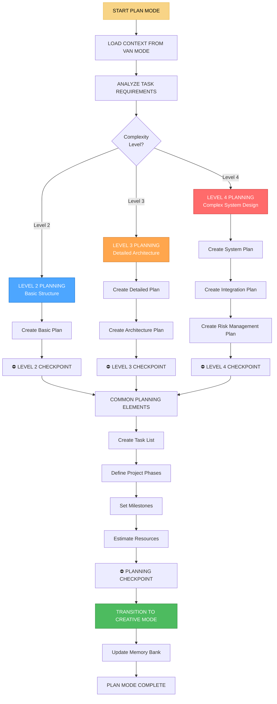

# 📋 PLAN MODE - Режим планирования и структурирования задач

## 🎯 Обзор режима

**PLAN MODE** - это режим планирования и структурирования задач в Landing Memory Bank. Этот режим активируется для задач уровня сложности 2-4, где требуется детальное планирование перед реализацией. PLAN MODE создает структурированный план, определяет этапы выполнения и подготавливает почву для CREATIVE MODE.

## 🔄 АКТИВАЦИЯ РЕЖИМА

### Автоматическая активация
```javascript
// PLAN MODE автоматически активируется при:
const planModeTriggers = {
  complexityLevel2Plus: 'Задачи уровня сложности 2-4',
  vanModeRedirect: 'Перенаправление из VAN MODE',
  userRequest: 'Пользователь запрашивает планирование',
  projectRestart: 'Перезапуск сложного проекта',
  architecturalChange: 'Изменение архитектуры проекта'
};
```

### Ручная активация
```
// Пользователь может активировать режим командой:
"PLAN" - для планирования текущей задачи
"PLAN DETAILED" - для детального планирования
"PLAN ARCHITECTURE" - для планирования архитектуры
"PLAN PHASES" - для планирования этапов
```

## 🧭 ПРОЦЕСС PLAN MODE



## 📊 LEVEL-SPECIFIC PLANNING

### Level 2 Planning (Basic Structure)
```javascript
class Level2Planner {
  createBasicPlan(taskContext) {
    const plan = {
      level: 2,
      complexity: 'MEDIUM',
      structure: {
        phases: ['Setup', 'Development', 'Testing', 'Deployment'],
        estimatedDuration: '2-5 days',
        teamSize: '1-2 developers',
        deliverables: ['Working prototype', 'Basic documentation']
      },
      tasks: this.generateBasicTasks(taskContext),
      milestones: this.setBasicMilestones(),
      risks: this.identifyBasicRisks()
    };
    
    return plan;
  }
  
  generateBasicTasks(context) {
    return [
      {
        id: 'setup',
        name: 'Project Setup',
        description: 'Initialize project structure and dependencies',
        duration: '4-8 hours',
        dependencies: [],
        assignee: 'Lead Developer'
      },
      {
        id: 'development',
        name: 'Core Development',
        description: 'Implement main functionality',
        duration: '2-3 days',
        dependencies: ['setup'],
        assignee: 'Lead Developer'
      },
      {
        id: 'testing',
        name: 'Testing & QA',
        description: 'Test functionality and fix issues',
        duration: '1 day',
        dependencies: ['development'],
        assignee: 'QA Engineer'
      },
      {
        id: 'deployment',
        name: 'Deployment',
        description: 'Deploy to production environment',
        duration: '4-8 hours',
        dependencies: ['testing'],
        assignee: 'DevOps Engineer'
      }
    ];
  }
}
```

### Level 3 Planning (Detailed Architecture)
```javascript
class Level3Planner {
  createDetailedPlan(taskContext) {
    const plan = {
      level: 3,
      complexity: 'HIGH',
      structure: {
        phases: ['Research', 'Architecture', 'Development', 'Integration', 'Testing', 'Deployment'],
        estimatedDuration: '1-3 weeks',
        teamSize: '2-4 developers',
        deliverables: ['Production-ready system', 'Comprehensive documentation', 'User training materials']
      },
      architecture: this.createArchitecturePlan(taskContext),
      tasks: this.generateDetailedTasks(taskContext),
      milestones: this.setDetailedMilestones(),
      risks: this.identifyDetailedRisks(),
      integration: this.planIntegrationPoints(taskContext)
    };
    
    return plan;
  }
  
  createArchitecturePlan(context) {
    return {
      frontend: {
        framework: this.determineFrontendFramework(context),
        components: this.designComponentArchitecture(context),
        stateManagement: this.chooseStateManagement(context),
        styling: this.planStylingStrategy(context)
      },
      backend: {
        architecture: this.designBackendArchitecture(context),
        database: this.planDatabaseSchema(context),
        api: this.designAPIStructure(context),
        security: this.planSecurityMeasures(context)
      },
      infrastructure: {
        hosting: this.chooseHostingSolution(context),
        deployment: this.planDeploymentStrategy(context),
        monitoring: this.planMonitoringStrategy(context),
        scaling: this.planScalingStrategy(context)
      }
    };
  }
  
  determineFrontendFramework(context) {
    const requirements = context.requirements;
    
    if (requirements.includes('complex-ui') && requirements.includes('reusable-components')) {
      return 'React.js';
    } else if (requirements.includes('rapid-prototyping')) {
      return 'Vue.js';
    } else if (requirements.includes('enterprise')) {
      return 'Angular';
    } else {
      return 'Vanilla JavaScript';
    }
  }
}
```

### Level 4 Planning (Complex System Design)
```javascript
class Level4Planner {
  createSystemPlan(taskContext) {
    const plan = {
      level: 4,
      complexity: 'VERY HIGH',
      structure: {
        phases: ['Research', 'System Design', 'Architecture', 'Development', 'Integration', 'Testing', 'Security Audit', 'Deployment', 'Monitoring'],
        estimatedDuration: '1-3 months',
        teamSize: '5+ developers',
        deliverables: ['Enterprise system', 'Comprehensive documentation', 'Training programs', 'Support infrastructure']
      },
      systemArchitecture: this.createSystemArchitecture(taskContext),
      integrationPlan: this.createIntegrationPlan(taskContext),
      riskManagement: this.createRiskManagementPlan(taskContext),
      qualityAssurance: this.createQualityAssurancePlan(taskContext),
      deploymentStrategy: this.createDeploymentStrategy(taskContext)
    };
    
    return plan;
  }
  
  createSystemArchitecture(context) {
    return {
      microservices: this.designMicroservicesArchitecture(context),
      dataFlow: this.designDataFlowArchitecture(context),
      security: this.designSecurityArchitecture(context),
      scalability: this.designScalabilityArchitecture(context),
      monitoring: this.designMonitoringArchitecture(context)
    };
  }
  
  createRiskManagementPlan(context) {
    return {
      technicalRisks: [
        {
          risk: 'Integration complexity',
          probability: 'HIGH',
          impact: 'HIGH',
          mitigation: 'Phased integration approach with fallback plans'
        },
        {
          risk: 'Performance bottlenecks',
          probability: 'MEDIUM',
          impact: 'HIGH',
          mitigation: 'Performance testing and optimization throughout development'
        },
        {
          risk: 'Security vulnerabilities',
          probability: 'MEDIUM',
          impact: 'CRITICAL',
          mitigation: 'Regular security audits and penetration testing'
        }
      ],
      projectRisks: [
        {
          risk: 'Scope creep',
          probability: 'HIGH',
          impact: 'MEDIUM',
          mitigation: 'Strict change control process and regular stakeholder reviews'
        },
        {
          risk: 'Resource constraints',
          probability: 'MEDIUM',
          impact: 'HIGH',
          mitigation: 'Resource planning and backup resource identification'
        }
      ]
    };
  }
}
```

## 🏗️ COMMON PLANNING ELEMENTS

### Создание списка задач
```javascript
class TaskListGenerator {
  generateTaskList(plan, context) {
    const tasks = [];
    let taskId = 1;
    
    for (const phase of plan.structure.phases) {
      const phaseTasks = this.generatePhaseTasks(phase, plan, context);
      
      for (const task of phaseTasks) {
        task.id = `task_${taskId++}`;
        task.phase = phase;
        task.status = 'PENDING';
        task.progress = 0;
        task.estimatedHours = this.estimateTaskHours(task);
        task.dependencies = this.identifyDependencies(task, tasks);
        
        tasks.push(task);
      }
    }
    
    return this.optimizeTaskOrder(tasks);
  }
  
  generatePhaseTasks(phase, plan, context) {
    const phaseTemplates = {
      'Setup': this.getSetupTasks(plan, context),
      'Research': this.getResearchTasks(plan, context),
      'Architecture': this.getArchitectureTasks(plan, context),
      'Development': this.getDevelopmentTasks(plan, context),
      'Integration': this.getIntegrationTasks(plan, context),
      'Testing': this.getTestingTasks(plan, context),
      'Security Audit': this.getSecurityTasks(plan, context),
      'Deployment': this.getDeploymentTasks(plan, context),
      'Monitoring': this.getMonitoringTasks(plan, context)
    };
    
    return phaseTemplates[phase] || [];
  }
  
  estimateTaskHours(task) {
    const complexityFactors = {
      'simple': 2,
      'medium': 4,
      'complex': 8,
      'very-complex': 16
    };
    
    const baseHours = complexityFactors[task.complexity] || 4;
    const multiplier = task.teamSize || 1;
    
    return Math.ceil(baseHours * multiplier);
  }
}
```

### Определение этапов проекта
```javascript
class PhasePlanner {
  defineProjectPhases(plan, context) {
    const phases = [];
    
    for (const phaseName of plan.structure.phases) {
      const phase = {
        name: phaseName,
        description: this.getPhaseDescription(phaseName, context),
        duration: this.estimatePhaseDuration(phaseName, plan),
        deliverables: this.definePhaseDeliverables(phaseName, plan),
        entryCriteria: this.defineEntryCriteria(phaseName, plan),
        exitCriteria: this.defineExitCriteria(phaseName, plan),
        risks: this.identifyPhaseRisks(phaseName, plan),
        team: this.assignPhaseTeam(phaseName, plan)
      };
      
      phases.push(phase);
    }
    
    return phases;
  }
  
  estimatePhaseDuration(phaseName, plan) {
    const durationEstimates = {
      'Setup': '1-2 days',
      'Research': '3-5 days',
      'Architecture': '5-10 days',
      'Development': '2-4 weeks',
      'Integration': '1-2 weeks',
      'Testing': '1-2 weeks',
      'Security Audit': '3-5 days',
      'Deployment': '2-3 days',
      'Monitoring': 'Ongoing'
    };
    
    return durationEstimates[phaseName] || '1 week';
  }
  
  definePhaseDeliverables(phaseName, plan) {
    const deliverableTemplates = {
      'Setup': ['Project repository', 'Development environment', 'Basic project structure'],
      'Research': ['Requirements document', 'Technology analysis', 'Architecture options'],
      'Architecture': ['System design document', 'Database schema', 'API specification'],
      'Development': ['Working code', 'Unit tests', 'Documentation'],
      'Integration': ['Integrated system', 'Integration tests', 'User documentation'],
      'Testing': ['Test results', 'Bug fixes', 'Performance metrics'],
      'Security Audit': ['Security report', 'Vulnerability fixes', 'Security documentation'],
      'Deployment': ['Production system', 'Deployment documentation', 'User training'],
      'Monitoring': ['Monitoring dashboard', 'Alert system', 'Performance reports']
    };
    
    return deliverableTemplates[phaseName] || [];
  }
}
```

### Установка вех проекта
```javascript
class MilestonePlanner {
  setProjectMilestones(plan, phases) {
    const milestones = [];
    let currentDate = new Date();
    
    for (let i = 0; i < phases.length; i++) {
      const phase = phases[i];
      const phaseDuration = this.parseDuration(phase.duration);
      
      const milestone = {
        id: `milestone_${i + 1}`,
        name: `${phase.name} Complete`,
        description: `Completion of ${phase.name} phase`,
        targetDate: this.addDays(currentDate, phaseDuration),
        phase: phase.name,
        deliverables: phase.deliverables,
        criteria: phase.exitCriteria,
        status: 'PENDING'
      };
      
      milestones.push(milestone);
      currentDate = milestone.targetDate;
    }
    
    // Добавляем финальную веху
    milestones.push({
      id: 'milestone_final',
      name: 'Project Complete',
      description: 'All phases completed successfully',
      targetDate: currentDate,
      phase: 'COMPLETION',
      deliverables: ['Final system', 'Project documentation', 'User acceptance'],
      criteria: ['All phases completed', 'Quality gates passed', 'User acceptance received'],
      status: 'PENDING'
    });
    
    return milestones;
  }
  
  parseDuration(duration) {
    if (duration.includes('days')) {
      const days = parseInt(duration.match(/(\d+)/)[1]);
      return days;
    } else if (duration.includes('weeks')) {
      const weeks = parseInt(duration.match(/(\d+)/)[1]);
      return weeks * 7;
    } else if (duration.includes('months')) {
      const months = parseInt(duration.match(/(\d+)/)[1]);
      return months * 30;
    }
    
    return 7; // По умолчанию 1 неделя
  }
  
  addDays(date, days) {
    const result = new Date(date);
    result.setDate(result.getDate() + days);
    return result;
  }
}
```

## 📊 PLANNING OUTPUTS

### Структурированный план проекта
```javascript
class PlanOutputGenerator {
  generatePlanOutput(plan, phases, tasks, milestones) {
    return {
      projectPlan: {
        overview: this.generateProjectOverview(plan),
        phases: this.generatePhaseDetails(phases),
        tasks: this.generateTaskDetails(tasks),
        milestones: this.generateMilestoneDetails(milestones),
        timeline: this.generateProjectTimeline(phases, milestones),
        resourceAllocation: this.generateResourceAllocation(plan, tasks),
        riskManagement: this.generateRiskManagement(plan),
        qualityAssurance: this.generateQualityAssurance(plan)
      },
      documentation: {
        planDocument: this.generatePlanDocument(plan, phases, tasks, milestones),
        taskList: this.generateTaskListDocument(tasks),
        timeline: this.generateTimelineDocument(phases, milestones),
        resourcePlan: this.generateResourcePlanDocument(plan, tasks)
      },
      nextSteps: {
        transitionMode: 'CREATIVE_MODE',
        requiredInputs: this.identifyRequiredInputs(plan),
        preparationTasks: this.identifyPreparationTasks(plan)
      }
    };
  }
  
  generateProjectOverview(plan) {
    return {
      projectName: plan.projectName || 'Landing Page Project',
      complexity: plan.level,
      estimatedDuration: plan.structure.estimatedDuration,
      teamSize: plan.structure.teamSize,
      totalPhases: plan.structure.phases.length,
      keyDeliverables: plan.structure.deliverables,
      successCriteria: this.defineSuccessCriteria(plan)
    };
  }
  
  defineSuccessCriteria(plan) {
    const criteria = {
      'functional': 'All specified features work correctly',
      'performance': 'Page load time under 3 seconds',
      'quality': 'Zero critical bugs in production',
      'timeline': 'Project completed within estimated duration',
      'budget': 'Project completed within allocated resources'
    };
    
    return criteria;
  }
}
```

## 🔄 TRANSITION TO CREATIVE MODE

### Подготовка к переходу
```javascript
class CreativeModeTransition {
  prepareForCreativeMode(planOutput) {
    console.log('🔄 PLAN MODE preparing transition to CREATIVE MODE...');
    
    // Сохранение плана в Memory Bank
    this.savePlanToMemoryBank(planOutput);
    
    // Подготовка контекста для CREATIVE MODE
    const creativeContext = this.prepareCreativeContext(planOutput);
    
    // Определение входных данных для CREATIVE MODE
    const creativeInputs = this.identifyCreativeInputs(planOutput);
    
    console.log('✅ PLAN MODE ready for transition to CREATIVE MODE');
    
    return {
      context: creativeContext,
      inputs: creativeInputs,
      transitionReady: true
    };
  }
  
  prepareCreativeContext(planOutput) {
    return {
      projectPlan: planOutput.projectPlan,
      currentPhase: 'PLANNING_COMPLETE',
      nextPhase: 'CREATIVE_DESIGN',
      complexity: planOutput.projectPlan.overview.complexity,
      constraints: this.extractConstraints(planOutput),
      opportunities: this.extractOpportunities(planOutput)
    };
  }
  
  identifyCreativeInputs(planOutput) {
    return {
      designRequirements: this.extractDesignRequirements(planOutput),
      userExperienceGoals: this.extractUXGoals(planOutput),
      technicalConstraints: this.extractTechnicalConstraints(planOutput),
      creativeInspiration: this.suggestCreativeInspiration(planOutput)
    };
  }
}
```

## 📋 PLAN MODE CHECKLIST

### Предварительная подготовка
- [ ] Загрузка контекста из VAN MODE
- [ ] Анализ требований задачи
- [ ] Определение уровня сложности
- [ ] Выбор стратегии планирования

### Создание плана
- [ ] Создание базовой структуры проекта
- [ ] Определение этапов и фаз
- [ ] Создание списка задач
- [ ] Установка вех проекта

### Детализация плана
- [ ] Планирование архитектуры (Level 3-4)
- [ ] Планирование интеграции (Level 3-4)
- [ ] Управление рисками (Level 4)
- [ ] Планирование качества

### Подготовка к переходу
- [ ] Генерация выходных документов
- [ ] Сохранение плана в Memory Bank
- [ ] Подготовка контекста для CREATIVE MODE
- [ ] Переход к CREATIVE MODE

## 🎯 METRICS & PERFORMANCE

### Эффективность планирования
- **Время создания плана:** <2 часов для Level 2, <4 часов для Level 3, <8 часов для Level 4
- **Точность оценки времени:** >85%
- **Полнота планирования:** >90%
- **Качество архитектурных решений:** >80%

### Качество плана
- **Структурированность:** >95%
- **Детализация задач:** >90%
- **Реалистичность оценок:** >85%
- **Покрытие рисков:** >80%

## 🚀 READINESS STATUS

### Автоматизация
- ✅ Автоматическое определение стратегии планирования
- ✅ Автоматическая генерация структуры задач
- ✅ Автоматическое планирование этапов
- ✅ Автоматические переходы к CREATIVE MODE

### Интеграция
- ✅ Интеграция с VAN MODE
- ✅ Интеграция с CREATIVE MODE
- ✅ Интеграция с Memory Bank
- ✅ Адаптивная сложность планирования

### Специализация
- ✅ Специализация на веб-разработке
- ✅ Планирование landing страниц
- ✅ Архитектурное планирование
- ✅ Управление сложными проектами

---

**Статус:** ✅ PLAN MODE интегрирован  
**Тип:** 📋 Режим планирования и структурирования  
**Активация:** 🔄 Для задач Level 2-4  
**Готовность к использованию:** ✅ 100%
