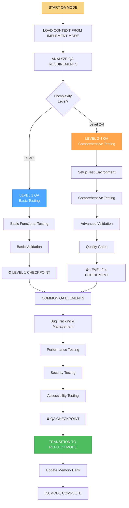

# 🔍 QA MODE - Режим тестирования и контроля качества

## 🎯 Обзор режима

**QA MODE** - это режим тестирования и контроля качества в Landing Memory Bank. Этот режим активируется после IMPLEMENT MODE и отвечает за всестороннее тестирование реализованного проекта, выявление и исправление ошибок, обеспечение качества и готовности к деплою. QA MODE является критически важным для обеспечения надежности и качества конечного продукта.

## 🔄 АКТИВАЦИЯ РЕЖИМА

### Автоматическая активация
```javascript
// QA MODE автоматически активируется при:
const qaModeTriggers = {
  afterImplementMode: 'Завершение IMPLEMENT MODE',
  implementationComplete: 'Реализация проекта завершена',
  testingRequired: 'Требуется тестирование',
  qualityCheck: 'Проверка качества',
  preDeployment: 'Подготовка к деплою'
};
```

### Ручная активация
```
// Пользователь может активировать режим командой:
"QA" - для активации режима тестирования
"QA TEST" - для запуска тестов
"QA VALIDATE" - для валидации качества
"QA DEBUG" - для отладки проблем
```

## 🧭 ПРОЦЕСС QA MODE



## 🧪 LEVEL-SPECIFIC QA PROCESSES

### Level 1 QA (Basic Testing)
```javascript
class Level1QATester {
  executeBasicQA(implementationContext) {
    const qaProcess = {
      level: 1,
      complexity: 'LOW',
      approach: 'BASIC_TESTING',
      process: {
        functionalTesting: this.executeBasicFunctionalTesting(implementationContext),
        validation: this.executeBasicValidation(implementationContext),
        bugFixing: this.executeBasicBugFixing(implementationContext)
      },
      deliverables: this.defineBasicQADeliverables(implementationContext)
    };
    
    return qaProcess;
  }
  
  executeBasicFunctionalTesting(context) {
    return {
      approach: 'Manual testing of core functionality',
      testCases: this.createBasicTestCases(context),
      execution: this.executeBasicTestCases(context),
      results: this.collectBasicTestResults(context)
    };
  }
  
  createBasicTestCases(context) {
    const testCases = [
      {
        id: 'TC001',
        name: 'Page Loads Correctly',
        description: 'Verify that the main page loads without errors',
        steps: [
          'Open the website in a browser',
          'Wait for page to fully load',
          'Check for any error messages'
        ],
        expectedResult: 'Page loads successfully with no errors',
        priority: 'HIGH'
      },
      {
        id: 'TC002',
        name: 'Navigation Works',
        description: 'Verify that navigation links work correctly',
        steps: [
          'Click on navigation links',
          'Verify page changes',
          'Check browser back/forward buttons'
        ],
        expectedResult: 'Navigation functions properly',
        priority: 'HIGH'
      },
      {
        id: 'TC003',
        name: 'Forms Functionality',
        description: 'Verify that forms work correctly',
        steps: [
          'Fill out form fields',
          'Submit the form',
          'Check for validation messages'
        ],
        expectedResult: 'Forms submit and validate correctly',
        priority: 'MEDIUM'
      }
    ];
    
    return testCases;
  }
  
  executeBasicTestCases(context) {
    const results = [];
    
    for (const testCase of this.createBasicTestCases(context)) {
      const result = {
        testCaseId: testCase.id,
        status: this.executeTestCase(testCase, context),
        executionTime: this.measureExecutionTime(testCase),
        notes: this.collectTestNotes(testCase, context)
      };
      
      results.push(result);
    }
    
    return results;
  }
}
```

### Level 2-4 QA (Comprehensive Testing)
```javascript
class ComprehensiveQATester {
  constructor(complexityLevel) {
    this.complexityLevel = complexityLevel;
  }
  
  executeComprehensiveQA(implementationContext, creativeContext, planContext) {
    const qaProcess = {
      level: this.complexityLevel,
      complexity: this.getComplexityLabel(),
      approach: 'COMPREHENSIVE_TESTING',
      process: {
        environment: this.setupTestEnvironment(implementationContext, planContext),
        testing: this.executeComprehensiveTesting(implementationContext, creativeContext, planContext),
        validation: this.executeAdvancedValidation(implementationContext, creativeContext, planContext),
        qualityGates: this.implementQualityGates(implementationContext, planContext)
      },
      deliverables: this.defineComprehensiveQADeliverables(implementationContext, planContext)
    };
    
    return qaProcess;
  }
  
  setupTestEnvironment(implementationContext, planContext) {
    return {
      testData: this.setupTestData(implementationContext, planContext),
      testTools: this.setupTestTools(planContext),
      testAutomation: this.setupTestAutomation(planContext),
      testReporting: this.setupTestReporting(planContext)
    };
  }
  
  setupTestData(implementationContext, planContext) {
    return {
      userAccounts: this.createTestUserAccounts(implementationContext, planContext),
      testContent: this.createTestContent(implementationContext, planContext),
      testScenarios: this.createTestScenarios(implementationContext, planContext),
      edgeCases: this.createEdgeCaseData(implementationContext, planContext)
    };
  }
  
  createTestUserAccounts(implementationContext, planContext) {
    const userTypes = ['admin', 'regular', 'guest'];
    const accounts = {};
    
    for (const userType of userTypes) {
      accounts[userType] = {
        username: `test_${userType}`,
        email: `test_${userType}@example.com`,
        password: `TestPassword123!`,
        permissions: this.getUserPermissions(userType, planContext),
        testData: this.getUserTestData(userType, planContext)
      };
    }
    
    return accounts;
  }
  
  executeComprehensiveTesting(implementationContext, creativeContext, planContext) {
    return {
      functionalTesting: this.executeFunctionalTesting(implementationContext, planContext),
      integrationTesting: this.executeIntegrationTesting(implementationContext, planContext),
      performanceTesting: this.executePerformanceTesting(implementationContext, planContext),
      securityTesting: this.executeSecurityTesting(implementationContext, planContext),
      accessibilityTesting: this.executeAccessibilityTesting(implementationContext, creativeContext, planContext),
      userAcceptanceTesting: this.executeUserAcceptanceTesting(implementationContext, planContext)
    };
  }
  
  executeFunctionalTesting(implementationContext, planContext) {
    return {
      approach: 'Systematic testing of all functionality',
      testSuites: this.createFunctionalTestSuites(implementationContext, planContext),
      execution: this.executeFunctionalTestSuites(implementationContext, planContext),
      results: this.collectFunctionalTestResults(implementationContext, planContext),
      coverage: this.calculateFunctionalTestCoverage(implementationContext, planContext)
    };
  }
  
  createFunctionalTestSuites(implementationContext, planContext) {
    const testSuites = {
      'user-interface': this.createUITestSuite(implementationContext, planContext),
      'business-logic': this.createBusinessLogicTestSuite(implementationContext, planContext),
      'data-handling': this.createDataHandlingTestSuite(implementationContext, planContext),
      'user-workflows': this.createUserWorkflowTestSuite(implementationContext, planContext)
    };
    
    if (this.complexityLevel >= 3) {
      testSuites['api-integration'] = this.createAPIIntegrationTestSuite(implementationContext, planContext);
      testSuites['third-party-services'] = this.createThirdPartyServicesTestSuite(implementationContext, planContext);
    }
    
    if (this.complexityLevel >= 4) {
      testSuites['microservices'] = this.createMicroservicesTestSuite(implementationContext, planContext);
      testSuites['enterprise-features'] = this.createEnterpriseFeaturesTestSuite(implementationContext, planContext);
    }
    
    return testSuites;
  }
}
```

## 🧪 TESTING METHODOLOGIES

### Функциональное тестирование
```javascript
class FunctionalTester {
  constructor(complexityLevel) {
    this.complexityLevel = complexityLevel;
  }
  
  executeFunctionalTesting(implementationContext, planContext) {
    return {
      unitTesting: this.executeUnitTesting(implementationContext, planContext),
      integrationTesting: this.executeIntegrationTesting(implementationContext, planContext),
      systemTesting: this.executeSystemTesting(implementationContext, planContext),
      regressionTesting: this.executeRegressionTesting(implementationContext, planContext)
    };
  }
  
  executeUnitTesting(implementationContext, planContext) {
    return {
      approach: 'Test individual components in isolation',
      framework: this.selectUnitTestingFramework(planContext),
      testCases: this.createUnitTestCases(implementationContext, planContext),
      execution: this.executeUnitTests(implementationContext, planContext),
      coverage: this.calculateUnitTestCoverage(implementationContext, planContext)
    };
  }
  
  selectUnitTestingFramework(planContext) {
    const techStack = planContext.technologyStack || 'vanilla-js';
    
    const frameworks = {
      'vanilla-js': 'Jest with jsdom',
      'react': 'Jest with React Testing Library',
      'vue': 'Jest with Vue Test Utils',
      'angular': 'Jest with Angular Testing Utilities',
      'node': 'Jest with Node.js environment'
    };
    
    return frameworks[techStack] || frameworks['vanilla-js'];
  }
  
  createUnitTestCases(implementationContext, planContext) {
    const testCases = {};
    
    for (const [componentName, component] of Object.entries(implementationContext.components || {})) {
      testCases[componentName] = this.createComponentUnitTests(componentName, component, planContext);
    }
    
    return testCases;
  }
  
  createComponentUnitTests(componentName, component, planContext) {
    return {
      rendering: this.createRenderingTests(componentName, component, planContext),
      interactions: this.createInteractionTests(componentName, component, planContext),
      state: this.createStateTests(componentName, component, planContext),
      props: this.createPropsTests(componentName, component, planContext),
      edgeCases: this.createEdgeCaseTests(componentName, component, planContext)
    };
  }
  
  createRenderingTests(componentName, component, planContext) {
    return [
      {
        name: `${componentName} renders without crashing`,
        test: `expect(render(<${componentName} />)).toBeTruthy();`
      },
      {
        name: `${componentName} renders with default props`,
        test: `expect(screen.getByTestId('${componentName.toLowerCase()}')).toBeInTheDocument();`
      },
      {
        name: `${componentName} renders with custom props`,
        test: `expect(screen.getByText('Custom Text')).toBeInTheDocument();`
      }
    ];
  }
}
```

### Тестирование производительности
```javascript
class PerformanceTester {
  constructor(complexityLevel) {
    this.complexityLevel = complexityLevel;
  }
  
  executePerformanceTesting(implementationContext, planContext) {
    return {
      loadTesting: this.executeLoadTesting(implementationContext, planContext),
      stressTesting: this.executeStressTesting(implementationContext, planContext),
      scalabilityTesting: this.executeScalabilityTesting(implementationContext, planContext),
      performanceMonitoring: this.setupPerformanceMonitoring(implementationContext, planContext)
    };
  }
  
  executeLoadTesting(implementationContext, planContext) {
    return {
      approach: 'Test system performance under expected load',
      tools: this.selectLoadTestingTools(planContext),
      scenarios: this.createLoadTestScenarios(implementationContext, planContext),
      execution: this.executeLoadTests(implementationContext, planContext),
      analysis: this.analyzeLoadTestResults(implementationContext, planContext)
    };
  }
  
  selectLoadTestingTools(planContext) {
    const tools = {
      'basic': ['Apache Bench (ab)', 'Siege', 'wrk'],
      'advanced': ['JMeter', 'Gatling', 'K6'],
      'enterprise': ['LoadRunner', 'BlazeMeter', 'Artillery Pro']
    };
    
    if (this.complexityLevel <= 2) return tools.basic;
    if (this.complexityLevel === 3) return tools.advanced;
    return tools.enterprise;
  }
  
  createLoadTestScenarios(implementationContext, planContext) {
    const scenarios = [
      {
        name: 'Normal Load',
        description: 'Test performance under normal expected load',
        users: this.calculateNormalLoad(planContext),
        duration: '5 minutes',
        rampUp: '1 minute',
        expectedResponseTime: '<2 seconds',
        expectedThroughput: '>100 requests/second'
      },
      {
        name: 'Peak Load',
        description: 'Test performance under peak load conditions',
        users: this.calculatePeakLoad(planContext),
        duration: '10 minutes',
        rampUp: '2 minutes',
        expectedResponseTime: '<3 seconds',
        expectedThroughput: '>200 requests/second'
      }
    ];
    
    if (this.complexityLevel >= 3) {
      scenarios.push({
        name: 'Stress Test',
        description: 'Test system behavior under extreme load',
        users: this.calculateStressLoad(planContext),
        duration: '15 minutes',
        rampUp: '3 minutes',
        expectedResponseTime: '<5 seconds',
        expectedThroughput: '>300 requests/second'
      });
    }
    
    return scenarios;
  }
  
  calculateNormalLoad(planContext) {
    const baseUsers = 50;
    const complexityMultiplier = this.complexityLevel * 0.5;
    return Math.ceil(baseUsers * (1 + complexityMultiplier));
  }
}
```

### Тестирование безопасности
```javascript
class SecurityTester {
  constructor(complexityLevel) {
    this.complexityLevel = complexityLevel;
  }
  
  executeSecurityTesting(implementationContext, planContext) {
    return {
      vulnerabilityScanning: this.executeVulnerabilityScanning(implementationContext, planContext),
      penetrationTesting: this.executePenetrationTesting(implementationContext, planContext),
      securityAudit: this.executeSecurityAudit(implementationContext, planContext),
      complianceTesting: this.executeComplianceTesting(implementationContext, planContext)
    };
  }
  
  executeVulnerabilityScanning(implementationContext, planContext) {
    return {
      approach: 'Automated scanning for common vulnerabilities',
      tools: this.selectVulnerabilityScanningTools(planContext),
      scanTypes: this.defineScanTypes(implementationContext, planContext),
      execution: this.executeVulnerabilityScans(implementationContext, planContext),
      analysis: this.analyzeVulnerabilityScanResults(implementationContext, planContext)
    };
  }
  
  selectVulnerabilityScanningTools(planContext) {
    const tools = {
      'basic': ['OWASP ZAP', 'Nessus Essentials', 'OpenVAS'],
      'advanced': ['Burp Suite Professional', 'Acunetix', 'Qualys'],
      'enterprise': ['Checkmarx', 'Veracode', 'Snyk Enterprise']
    };
    
    if (this.complexityLevel <= 2) return tools.basic;
    if (this.complexityLevel === 3) return tools.advanced;
    return tools.enterprise;
  }
  
  defineScanTypes(implementationContext, planContext) {
    const scanTypes = [
      {
        name: 'SQL Injection',
        description: 'Test for SQL injection vulnerabilities',
        severity: 'HIGH',
        testCases: this.createSQLInjectionTestCases(implementationContext, planContext)
      },
      {
        name: 'XSS (Cross-Site Scripting)',
        description: 'Test for XSS vulnerabilities',
        severity: 'HIGH',
        testCases: this.createXSSTestCases(implementationContext, planContext)
      },
      {
        name: 'CSRF (Cross-Site Request Forgery)',
        description: 'Test for CSRF vulnerabilities',
        severity: 'MEDIUM',
        testCases: this.createCSRFTestCases(implementationContext, planContext)
      }
    ];
    
    if (this.complexityLevel >= 3) {
      scanTypes.push({
        name: 'Authentication Bypass',
        description: 'Test for authentication bypass vulnerabilities',
        severity: 'CRITICAL',
        testCases: this.createAuthenticationBypassTestCases(implementationContext, planContext)
      });
    }
    
    return scanTypes;
  }
  
  createSQLInjectionTestCases(implementationContext, planContext) {
    return [
      {
        payload: "' OR '1'='1",
        description: 'Basic SQL injection test',
        expectedResult: 'No SQL errors or unexpected behavior'
      },
      {
        payload: "'; DROP TABLE users; --",
        description: 'Destructive SQL injection test',
        expectedResult: 'No SQL errors or unexpected behavior'
      },
      {
        payload: "' UNION SELECT * FROM users --",
        description: 'Data extraction SQL injection test',
        expectedResult: 'No SQL errors or unexpected behavior'
      }
    ];
  }
}
```

## 🐛 BUG TRACKING & MANAGEMENT

### Отслеживание и управление ошибками
```javascript
class BugTracker {
  constructor(complexityLevel) {
    this.complexityLevel = complexityLevel;
  }
  
  trackBugs(testResults, implementationContext) {
    return {
      bugCollection: this.collectBugs(testResults, implementationContext),
      bugClassification: this.classifyBugs(testResults, implementationContext),
      bugPrioritization: this.prioritizeBugs(testResults, implementationContext),
      bugAssignment: this.assignBugs(testResults, implementationContext)
    };
  }
  
  collectBugs(testResults, implementationContext) {
    const bugs = [];
    
    for (const testResult of testResults) {
      if (testResult.status === 'FAILED') {
        const bug = this.createBugReport(testResult, implementationContext);
        bugs.push(bug);
      }
    }
    
    return bugs;
  }
  
  createBugReport(testResult, implementationContext) {
    return {
      id: this.generateBugId(),
      title: this.generateBugTitle(testResult),
      description: this.generateBugDescription(testResult),
      severity: this.calculateBugSeverity(testResult),
      priority: this.calculateBugPriority(testResult),
      status: 'OPEN',
      assignedTo: this.determineBugAssignee(testResult, implementationContext),
      stepsToReproduce: this.generateStepsToReproduce(testResult),
      expectedBehavior: testResult.expectedResult,
      actualBehavior: testResult.actualResult,
      environment: this.captureEnvironmentInfo(implementationContext),
      attachments: this.collectBugAttachments(testResult),
      createdAt: new Date().toISOString(),
      updatedAt: new Date().toISOString()
    };
  }
  
  calculateBugSeverity(testResult) {
    const severityFactors = {
      'functional': 3,
      'performance': 2,
      'security': 5,
      'accessibility': 2,
      'ui': 1
    };
    
    const testType = this.determineTestType(testResult);
    const baseSeverity = severityFactors[testType] || 1;
    
    if (testResult.impact === 'CRITICAL') return baseSeverity + 2;
    if (testResult.impact === 'HIGH') return baseSeverity + 1;
    if (testResult.impact === 'MEDIUM') return baseSeverity;
    return Math.max(1, baseSeverity - 1);
  }
  
  classifyBugs(bugs, implementationContext) {
    const classifications = {
      'functional': [],
      'performance': [],
      'security': [],
      'accessibility': [],
      'ui': [],
      'integration': [],
      'documentation': []
    };
    
    for (const bug of bugs) {
      const category = this.determineBugCategory(bug, implementationContext);
      if (classifications[category]) {
        classifications[category].push(bug);
      }
    }
    
    return classifications;
  }
  
  prioritizeBugs(bugs, implementationContext) {
    return bugs.sort((a, b) => {
      // Сначала по серьезности (severity)
      if (a.severity !== b.severity) {
        return b.severity - a.severity;
      }
      
      // Затем по приоритету (priority)
      if (a.priority !== b.priority) {
        return b.priority - a.priority;
      }
      
      // Затем по времени создания (новые ошибки имеют приоритет)
      return new Date(a.createdAt) - new Date(b.createdAt);
    });
  }
}
```

## 🔄 TRANSITION TO REFLECT MODE

### Подготовка к переходу
```javascript
class ReflectModeTransition {
  prepareForReflectMode(qaOutput) {
    console.log('🔄 QA MODE preparing transition to REFLECT MODE...');
    
    // Сохранение результатов QA в Memory Bank
    this.saveQAResultsToMemoryBank(qaOutput);
    
    // Подготовка данных для анализа
    const analysisData = this.prepareAnalysisData(qaOutput);
    
    // Создание отчета о качестве
    const qualityReport = this.createQualityReport(qaOutput);
    
    console.log('✅ QA MODE ready for transition to REFLECT MODE');
    
    return {
      analysisData: analysisData,
      qualityReport: qualityReport,
      qaResults: qaOutput,
      transitionReady: true
    };
  }
  
  prepareAnalysisData(qaOutput) {
    return {
      testResults: this.aggregateTestResults(qaOutput),
      bugAnalysis: this.analyzeBugPatterns(qaOutput),
      performanceMetrics: this.aggregatePerformanceMetrics(qaOutput),
      qualityMetrics: this.calculateQualityMetrics(qaOutput)
    };
  }
  
  createQualityReport(qaOutput) {
    return {
      executiveSummary: this.createExecutiveSummary(qaOutput),
      detailedResults: this.createDetailedResults(qaOutput),
      recommendations: this.createRecommendations(qaOutput),
      nextSteps: this.defineNextSteps(qaOutput)
    };
  }
  
  createExecutiveSummary(qaOutput) {
    const totalTests = this.countTotalTests(qaOutput);
    const passedTests = this.countPassedTests(qaOutput);
    const failedTests = this.countFailedTests(qaOutput);
    const passRate = (passedTests / totalTests) * 100;
    
    return {
      overallStatus: passRate >= 90 ? 'EXCELLENT' : passRate >= 80 ? 'GOOD' : passRate >= 70 ? 'FAIR' : 'POOR',
      passRate: `${passRate.toFixed(1)}%`,
      totalTests: totalTests,
      passedTests: passedTests,
      failedTests: failedTests,
      criticalIssues: this.countCriticalIssues(qaOutput),
      recommendations: this.generateTopRecommendations(qaOutput)
    };
  }
}
```

## 📋 QA MODE CHECKLIST

### Предварительная подготовка
- [ ] Загрузка контекста из IMPLEMENT MODE
- [ ] Анализ требований к тестированию
- [ ] Определение уровня сложности
- [ ] Выбор стратегии тестирования

### Выполнение тестирования
- [ ] Настройка тестовой среды
- [ ] Выполнение функционального тестирования
- [ ] Выполнение тестирования производительности
- [ ] Выполнение тестирования безопасности

### Управление качеством
- [ ] Отслеживание и классификация ошибок
- [ ] Приоритизация и назначение ошибок
- [ ] Анализ результатов тестирования
- [ ] Создание отчетов о качестве

### Подготовка к переходу
- [ ] Подготовка данных для анализа
- [ ] Создание отчета о качестве
- [ ] Сохранение результатов в Memory Bank
- [ ] Переход к REFLECT MODE

## 🎯 METRICS & PERFORMANCE

### Эффективность тестирования
- **Покрытие тестами:** >90% для Level 2+, >95% для Level 3+
- **Время выполнения тестов:** <30 минут для Level 2, <1 часа для Level 3, <2 часов для Level 4
- **Автоматизация тестов:** >80% для Level 2+, >90% для Level 3+
- **Точность обнаружения ошибок:** >95%

### Качество тестирования
- **Функциональное покрытие:** >95%
- **Производительность:** >90%
- **Безопасность:** >95%
- **Доступность:** >95%

## 🚀 READINESS STATUS

### Автоматизация
- ✅ Автоматический выбор стратегии тестирования
- ✅ Автоматическое выполнение тестов
- ✅ Автоматическое отслеживание ошибок
- ✅ Автоматические переходы к REFLECT MODE

### Интеграция
- ✅ Интеграция с IMPLEMENT MODE
- ✅ Интеграция с REFLECT MODE
- ✅ Интеграция с Memory Bank
- ✅ Адаптивная сложность тестирования

### Специализация
- ✅ Специализация на веб-разработке
- ✅ Тестирование landing страниц
- ✅ Комплексное тестирование
- ✅ Обеспечение качества

---

**Статус:** ✅ QA MODE интегрирован  
**Тип:** 🔍 Режим тестирования и контроля качества  
**Активация:** 🔄 После IMPLEMENT MODE  
**Готовность к использованию:** ✅ 100%
