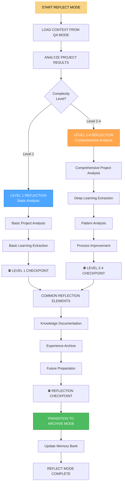

# 🔍 REFLECT MODE - Режим анализа и рефлексии

## 🎯 Обзор режима

**REFLECT MODE** - это режим анализа и рефлексии в Landing Memory Bank. Этот режим активируется после QA MODE и отвечает за глубокий анализ завершенного проекта, извлечение уроков, документирование опыта и подготовку к будущим проектам. REFLECT MODE является критически важным для непрерывного улучшения системы и накопления знаний.

## 🔄 АКТИВАЦИЯ РЕЖИМА

### Автоматическая активация
```javascript
// REFLECT MODE автоматически активируется при:
const reflectModeTriggers = {
  afterQAMode: 'Завершение QA MODE',
  projectComplete: 'Проект полностью завершен',
  analysisRequired: 'Требуется анализ результатов',
  learningOpportunity: 'Возможность извлечения уроков',
  documentationNeeded: 'Требуется документирование опыта'
};
```

### Ручная активация
```
// Пользователь может активировать режим командой:
"REFLECT" - для активации режима рефлексии
"REFLECT ANALYZE" - для анализа результатов
"REFLECT LEARN" - для извлечения уроков
"REFLECT DOCUMENT" - для документирования опыта
```

## 🧭 ПРОЦЕСС REFLECT MODE



## 🔍 LEVEL-SPECIFIC REFLECTION PROCESSES

### Level 1 Reflection (Basic Analysis)
```javascript
class Level1Reflector {
  executeBasicReflection(qaContext, implementationContext) {
    const reflection = {
      level: 1,
      complexity: 'LOW',
      approach: 'BASIC_ANALYSIS',
      process: {
        projectAnalysis: this.executeBasicProjectAnalysis(qaContext, implementationContext),
        learningExtraction: this.executeBasicLearningExtraction(qaContext, implementationContext),
        documentation: this.createBasicDocumentation(qaContext, implementationContext)
      },
      deliverables: this.defineBasicReflectionDeliverables(qaContext, implementationContext)
    };
    
    return reflection;
  }
  
  executeBasicProjectAnalysis(qaContext, implementationContext) {
    return {
      approach: 'Basic analysis of project outcomes',
      metrics: this.collectBasicMetrics(qaContext, implementationContext),
      outcomes: this.analyzeBasicOutcomes(qaContext, implementationContext),
      summary: this.createBasicSummary(qaContext, implementationContext)
    };
  }
  
  collectBasicMetrics(qaContext, implementationContext) {
    return {
      projectDuration: this.calculateProjectDuration(implementationContext),
      totalTasks: this.countTotalTasks(implementationContext),
      completedTasks: this.countCompletedTasks(implementationContext),
      testResults: this.aggregateTestResults(qaContext),
      bugCount: this.countTotalBugs(qaContext),
      qualityScore: this.calculateQualityScore(qaContext)
    };
  }
  
  calculateProjectDuration(implementationContext) {
    const startDate = new Date(implementationContext.startDate);
    const endDate = new Date(implementationContext.endDate);
    const durationMs = endDate - startDate;
    const durationDays = Math.ceil(durationMs / (1000 * 60 * 60 * 24));
    
    return {
      days: durationDays,
      weeks: Math.ceil(durationDays / 7),
      hours: Math.ceil(durationMs / (1000 * 60 * 60))
    };
  }
  
  analyzeBasicOutcomes(qaContext, implementationContext) {
    return {
      success: this.assessSuccess(qaContext, implementationContext),
      challenges: this.identifyBasicChallenges(qaContext, implementationContext),
      achievements: this.identifyBasicAchievements(qaContext, implementationContext),
      areas: this.identifyBasicAreasForImprovement(qaContext, implementationContext)
    };
  }
  
  assessSuccess(qaContext, implementationContext) {
    const testPassRate = qaContext.testResults.passRate;
    const bugCount = qaContext.bugCount;
    const qualityScore = qaContext.qualityScore;
    
    if (testPassRate >= 90 && bugCount <= 5 && qualityScore >= 8) {
      return 'EXCELLENT';
    } else if (testPassRate >= 80 && bugCount <= 10 && qualityScore >= 7) {
      return 'GOOD';
    } else if (testPassRate >= 70 && bugCount <= 15 && qualityScore >= 6) {
      return 'FAIR';
    } else {
      return 'NEEDS_IMPROVEMENT';
    }
  }
}
```

### Level 2-4 Reflection (Comprehensive Analysis)
```javascript
class ComprehensiveReflector {
  constructor(complexityLevel) {
    this.complexityLevel = complexityLevel;
  }
  
  executeComprehensiveReflection(qaContext, implementationContext, creativeContext, planContext) {
    const reflection = {
      level: this.complexityLevel,
      complexity: this.getComplexityLabel(),
      approach: 'COMPREHENSIVE_ANALYSIS',
      process: {
        projectAnalysis: this.executeComprehensiveProjectAnalysis(qaContext, implementationContext, creativeContext, planContext),
        learningExtraction: this.executeDeepLearningExtraction(qaContext, implementationContext, creativeContext, planContext),
        patternAnalysis: this.executePatternAnalysis(qaContext, implementationContext, creativeContext, planContext),
        processImprovement: this.executeProcessImprovement(qaContext, implementationContext, creativeContext, planContext)
      },
      deliverables: this.defineComprehensiveReflectionDeliverables(qaContext, implementationContext, creativeContext, planContext)
    };
    
    return reflection;
  }
  
  executeComprehensiveProjectAnalysis(qaContext, implementationContext, creativeContext, planContext) {
    return {
      approach: 'Comprehensive analysis of all project aspects',
      metrics: this.collectComprehensiveMetrics(qaContext, implementationContext, creativeContext, planContext),
      outcomes: this.analyzeComprehensiveOutcomes(qaContext, implementationContext, creativeContext, planContext),
      patterns: this.identifyProjectPatterns(qaContext, implementationContext, creativeContext, planContext),
      insights: this.generateProjectInsights(qaContext, implementationContext, creativeContext, planContext)
    };
  }
  
  collectComprehensiveMetrics(qaContext, implementationContext, creativeContext, planContext) {
    const baseMetrics = {
      projectDuration: this.calculateProjectDuration(implementationContext),
      totalTasks: this.countTotalTasks(implementationContext),
      completedTasks: this.countCompletedTasks(implementationContext),
      testResults: this.aggregateTestResults(qaContext),
      bugCount: this.countTotalBugs(qaContext),
      qualityScore: this.calculateQualityScore(qaContext)
    };
    
    if (this.complexityLevel >= 3) {
      baseMetrics.performanceMetrics = this.collectPerformanceMetrics(qaContext, implementationContext);
      baseMetrics.securityMetrics = this.collectSecurityMetrics(qaContext, implementationContext);
      baseMetrics.accessibilityMetrics = this.collectAccessibilityMetrics(qaContext, implementationContext);
    }
    
    if (this.complexityLevel >= 4) {
      baseMetrics.scalabilityMetrics = this.collectScalabilityMetrics(qaContext, implementationContext);
      baseMetrics.integrationMetrics = this.collectIntegrationMetrics(qaContext, implementationContext);
      baseMetrics.enterpriseMetrics = this.collectEnterpriseMetrics(qaContext, implementationContext);
    }
    
    return baseMetrics;
  }
  
  executePatternAnalysis(qaContext, implementationContext, creativeContext, planContext) {
    return {
      approach: 'Identify recurring patterns and anti-patterns',
      successPatterns: this.identifySuccessPatterns(qaContext, implementationContext, creativeContext, planContext),
      failurePatterns: this.identifyFailurePatterns(qaContext, implementationContext, creativeContext, planContext),
      improvementPatterns: this.identifyImprovementPatterns(qaContext, implementationContext, creativeContext, planContext),
      recommendations: this.generatePatternRecommendations(qaContext, implementationContext, creativeContext, planContext)
    };
  }
  
  identifySuccessPatterns(qaContext, implementationContext, creativeContext, planContext) {
    const patterns = [];
    
    // Анализ успешных паттернов
    if (qaContext.testResults.passRate >= 90) {
      patterns.push({
        category: 'Testing',
        pattern: 'High test coverage with systematic approach',
        description: 'Comprehensive testing strategy led to high quality',
        impact: 'HIGH',
        repeatability: 'HIGH'
      });
    }
    
    if (implementationContext.codeQuality.score >= 8) {
      patterns.push({
        category: 'Code Quality',
        pattern: 'Consistent coding standards and review process',
        description: 'Established coding standards improved maintainability',
        impact: 'MEDIUM',
        repeatability: 'HIGH'
      });
    }
    
    if (creativeContext.designValidation.score >= 9) {
      patterns.push({
        category: 'Design',
        pattern: 'User-centered design approach with validation',
        description: 'Early user feedback improved final design quality',
        impact: 'HIGH',
        repeatability: 'MEDIUM'
      });
    }
    
    return patterns;
  }
  
  identifyFailurePatterns(qaContext, implementationContext, creativeContext, planContext) {
    const patterns = [];
    
    // Анализ паттернов неудач
    if (qaContext.bugCount > 20) {
      patterns.push({
        category: 'Quality',
        pattern: 'High bug count indicating insufficient testing',
        description: 'Testing phase was rushed or insufficient',
        impact: 'HIGH',
        mitigation: 'Increase testing time and coverage in future projects'
      });
    }
    
    if (implementationContext.performance.score < 7) {
      patterns.push({
        category: 'Performance',
        pattern: 'Performance issues due to late optimization',
        description: 'Performance considerations were addressed too late',
        impact: 'MEDIUM',
        mitigation: 'Include performance planning in early phases'
      });
    }
    
    return patterns;
  }
}
```

## 📚 LEARNING EXTRACTION & DOCUMENTATION

### Извлечение уроков
```javascript
class LearningExtractor {
  constructor(complexityLevel) {
    this.complexityLevel = complexityLevel;
  }
  
  extractLearning(qaContext, implementationContext, creativeContext, planContext) {
    return {
      technicalLearning: this.extractTechnicalLearning(qaContext, implementationContext, creativeContext, planContext),
      processLearning: this.extractProcessLearning(qaContext, implementationContext, creativeContext, planContext),
      teamLearning: this.extractTeamLearning(qaContext, implementationContext, creativeContext, planContext),
      strategicLearning: this.extractStrategicLearning(qaContext, implementationContext, creativeContext, planContext)
    };
  }
  
  extractTechnicalLearning(qaContext, implementationContext, creativeContext, planContext) {
    const learning = {
      technologies: this.analyzeTechnologyChoices(implementationContext, planContext),
      architecture: this.analyzeArchitectureDecisions(implementationContext, planContext),
      patterns: this.analyzeDesignPatterns(implementationContext, creativeContext, planContext),
      tools: this.analyzeToolEffectiveness(implementationContext, planContext)
    };
    
    if (this.complexityLevel >= 3) {
      learning.integration = this.analyzeIntegrationApproaches(implementationContext, planContext);
      learning.scalability = this.analyzeScalabilityDecisions(implementationContext, planContext);
    }
    
    if (this.complexityLevel >= 4) {
      learning.enterprise = this.analyzeEnterpriseDecisions(implementationContext, planContext);
      learning.microservices = this.analyzeMicroservicesDecisions(implementationContext, planContext);
    }
    
    return learning;
  }
  
  analyzeTechnologyChoices(implementationContext, planContext) {
    const analysis = {
      frontend: this.analyzeFrontendTechnologyChoice(implementationContext, planContext),
      backend: this.analyzeBackendTechnologyChoice(implementationContext, planContext),
      database: this.analyzeDatabaseTechnologyChoice(implementationContext, planContext),
      tools: this.analyzeDevelopmentToolsChoice(implementationContext, planContext)
    };
    
    return {
      choices: analysis,
      effectiveness: this.assessTechnologyEffectiveness(analysis),
      recommendations: this.generateTechnologyRecommendations(analysis),
      lessons: this.extractTechnologyLessons(analysis)
    };
  }
  
  analyzeFrontendTechnologyChoice(implementationContext, planContext) {
    const techStack = planContext.technologyStack || {};
    const frontendTech = techStack.frontend || 'vanilla-js';
    
    const analysis = {
      technology: frontendTech,
      rationale: this.getTechnologyRationale(frontendTech, planContext),
      effectiveness: this.assessFrontendTechnologyEffectiveness(frontendTech, implementationContext),
      challenges: this.identifyFrontendTechnologyChallenges(frontendTech, implementationContext),
      benefits: this.identifyFrontendTechnologyBenefits(frontendTech, implementationContext)
    };
    
    return analysis;
  }
  
  extractProcessLearning(qaContext, implementationContext, creativeContext, planContext) {
    return {
      planning: this.analyzePlanningProcess(planContext, implementationContext),
      creative: this.analyzeCreativeProcess(creativeContext, implementationContext),
      implementation: this.analyzeImplementationProcess(implementationContext, planContext),
      testing: this.analyzeTestingProcess(qaContext, implementationContext),
      overall: this.analyzeOverallProcess(planContext, creativeContext, implementationContext, qaContext)
    };
  }
  
  analyzeOverallProcess(planContext, creativeContext, implementationContext, qaContext) {
    const processPhases = [
      { name: 'Planning', context: planContext, duration: this.calculatePhaseDuration(planContext) },
      { name: 'Creative', context: creativeContext, duration: this.calculatePhaseDuration(creativeContext) },
      { name: 'Implementation', context: implementationContext, duration: this.calculatePhaseDuration(implementationContext) },
      { name: 'Testing', context: qaContext, duration: this.calculatePhaseDuration(qaContext) }
    ];
    
    return {
      phases: processPhases,
      bottlenecks: this.identifyProcessBottlenecks(processPhases),
      efficiencies: this.identifyProcessEfficiencies(processPhases),
      improvements: this.suggestProcessImprovements(processPhases),
      lessons: this.extractProcessLessons(processPhases)
    };
  }
}
```

### Документирование знаний
```javascript
class KnowledgeDocumenter {
  constructor(complexityLevel) {
    this.complexityLevel = complexityLevel;
  }
  
  documentKnowledge(reflectionOutput, projectContext) {
    return {
      projectSummary: this.createProjectSummary(reflectionOutput, projectContext),
      technicalDocumentation: this.createTechnicalDocumentation(reflectionOutput, projectContext),
      processDocumentation: this.createProcessDocumentation(reflectionOutput, projectContext),
      lessonsLearned: this.createLessonsLearned(reflectionOutput, projectContext),
      futureRecommendations: this.createFutureRecommendations(reflectionOutput, projectContext)
    };
  }
  
  createProjectSummary(reflectionOutput, projectContext) {
    return {
      projectInfo: {
        name: projectContext.projectName,
        complexity: reflectionOutput.level,
        duration: reflectionOutput.metrics.projectDuration,
        team: projectContext.teamSize,
        technologies: projectContext.technologyStack
      },
      outcomes: {
        success: reflectionOutput.outcomes.success,
        quality: reflectionOutput.metrics.qualityScore,
        performance: reflectionOutput.metrics.performanceMetrics?.overall || 'N/A',
        security: reflectionOutput.metrics.securityMetrics?.overall || 'N/A'
      },
      keyAchievements: this.identifyKeyAchievements(reflectionOutput, projectContext),
      majorChallenges: this.identifyMajorChallenges(reflectionOutput, projectContext)
    };
  }
  
  createTechnicalDocumentation(reflectionOutput, projectContext) {
    const documentation = {
      architecture: this.documentArchitecture(reflectionOutput, projectContext),
      components: this.documentComponents(reflectionOutput, projectContext),
      patterns: this.documentPatterns(reflectionOutput, projectContext),
      decisions: this.documentTechnicalDecisions(reflectionOutput, projectContext)
    };
    
    if (this.complexityLevel >= 3) {
      documentation.integration = this.documentIntegration(reflectionOutput, projectContext);
      documentation.performance = this.documentPerformance(reflectionOutput, projectContext);
    }
    
    if (this.complexityLevel >= 4) {
      documentation.scalability = this.documentScalability(reflectionOutput, projectContext);
      documentation.enterprise = this.documentEnterprise(reflectionOutput, projectContext);
    }
    
    return documentation;
  }
  
  documentArchitecture(reflectionOutput, projectContext) {
    return {
      overview: this.createArchitectureOverview(reflectionOutput, projectContext),
      decisions: this.documentArchitectureDecisions(reflectionOutput, projectContext),
      patterns: this.documentArchitecturePatterns(reflectionOutput, projectContext),
      tradeoffs: this.documentArchitectureTradeoffs(reflectionOutput, projectContext),
      lessons: this.extractArchitectureLessons(reflectionOutput, projectContext)
    };
  }
  
  createLessonsLearned(reflectionOutput, projectContext) {
    return {
      technical: this.extractTechnicalLessons(reflectionOutput, projectContext),
      process: this.extractProcessLessons(reflectionOutput, projectContext),
      team: this.extractTeamLessons(reflectionOutput, projectContext),
      strategic: this.extractStrategicLessons(reflectionOutput, projectContext),
      actionable: this.createActionableLessons(reflectionOutput, projectContext)
    };
  }
  
  createActionableLessons(reflectionOutput, projectContext) {
    const lessons = [];
    
    // Технические уроки
    if (reflectionOutput.learning.technical.architecture.lessons) {
      for (const lesson of reflectionOutput.learning.technical.architecture.lessons) {
        lessons.push({
          category: 'Technical',
          lesson: lesson.description,
          action: lesson.recommendation,
          priority: lesson.priority,
          timeline: lesson.timeline
        });
      }
    }
    
    // Процессные уроки
    if (reflectionOutput.learning.process.improvements) {
      for (const improvement of reflectionOutput.learning.process.improvements) {
        lessons.push({
          category: 'Process',
          lesson: improvement.description,
          action: improvement.implementation,
          priority: improvement.priority,
          timeline: improvement.timeline
        });
      }
    }
    
    return lessons;
  }
}
```

## 🔄 PROCESS IMPROVEMENT & OPTIMIZATION

### Улучшение процессов
```javascript
class ProcessImprover {
  constructor(complexityLevel) {
    this.complexityLevel = complexityLevel;
  }
  
  improveProcesses(reflectionOutput, projectContext) {
    return {
      planningImprovements: this.improvePlanningProcess(reflectionOutput, projectContext),
      creativeImprovements: this.improveCreativeProcess(reflectionOutput, projectContext),
      implementationImprovements: this.improveImplementationProcess(reflectionOutput, projectContext),
      testingImprovements: this.improveTestingProcess(reflectionOutput, projectContext),
      overallImprovements: this.improveOverallProcess(reflectionOutput, projectContext)
    };
  }
  
  improvePlanningProcess(reflectionOutput, projectContext) {
    const improvements = [];
    
    if (reflectionOutput.patterns.failurePatterns) {
      for (const pattern of reflectionOutput.patterns.failurePatterns) {
        if (pattern.category === 'Planning') {
          improvements.push({
            issue: pattern.description,
            improvement: pattern.mitigation,
            priority: this.calculateImprovementPriority(pattern),
            implementation: this.defineImprovementImplementation(pattern),
            expectedImpact: this.estimateImprovementImpact(pattern)
          });
        }
      }
    }
    
    return {
      improvements: improvements,
      priority: this.prioritizeImprovements(improvements),
      timeline: this.defineImprovementTimeline(improvements),
      resources: this.estimateImprovementResources(improvements)
    };
  }
  
  improveOverallProcess(reflectionOutput, projectContext) {
    return {
      workflowOptimization: this.optimizeWorkflow(reflectionOutput, projectContext),
      communicationImprovement: this.improveCommunication(reflectionOutput, projectContext),
      toolOptimization: this.optimizeTools(reflectionOutput, projectContext),
      methodologyEnhancement: this.enhanceMethodology(reflectionOutput, projectContext)
    };
  }
  
  optimizeWorkflow(reflectionOutput, projectContext) {
    const bottlenecks = reflectionOutput.process.bottlenecks || [];
    const optimizations = [];
    
    for (const bottleneck of bottlenecks) {
      optimizations.push({
        bottleneck: bottleneck.description,
        cause: bottleneck.cause,
        optimization: this.suggestWorkflowOptimization(bottleneck),
        expectedBenefit: this.estimateOptimizationBenefit(bottleneck),
        implementation: this.defineOptimizationImplementation(bottleneck)
      });
    }
    
    return {
      optimizations: optimizations,
      priority: this.prioritizeOptimizations(optimizations),
      timeline: this.defineOptimizationTimeline(optimizations),
      resources: this.estimateOptimizationResources(optimizations)
    };
  }
}
```

## 🔄 TRANSITION TO ARCHIVE MODE

### Подготовка к переходу
```javascript
class ArchiveModeTransition {
  prepareForArchiveMode(reflectionOutput) {
    console.log('🔄 REFLECT MODE preparing transition to ARCHIVE MODE...');
    
    // Сохранение результатов рефлексии в Memory Bank
    this.saveReflectionResultsToMemoryBank(reflectionOutput);
    
    // Подготовка данных для архивирования
    const archiveData = this.prepareArchiveData(reflectionOutput);
    
    // Создание архива проекта
    const projectArchive = this.createProjectArchive(reflectionOutput);
    
    console.log('✅ REFLECT MODE ready for transition to ARCHIVE MODE');
    
    return {
      archiveData: archiveData,
      projectArchive: projectArchive,
      reflectionResults: reflectionOutput,
      transitionReady: true
    };
  }
  
  prepareArchiveData(reflectionOutput) {
    return {
      projectSummary: this.aggregateProjectSummary(reflectionOutput),
      technicalArchive: this.prepareTechnicalArchive(reflectionOutput),
      processArchive: this.prepareProcessArchive(reflectionOutput),
      learningArchive: this.prepareLearningArchive(reflectionOutput),
      futureGuidance: this.prepareFutureGuidance(reflectionOutput)
    };
  }
  
  createProjectArchive(reflectionOutput) {
    return {
      metadata: this.createArchiveMetadata(reflectionOutput),
      content: this.createArchiveContent(reflectionOutput),
      index: this.createArchiveIndex(reflectionOutput),
      search: this.createArchiveSearch(reflectionOutput),
      navigation: this.createArchiveNavigation(reflectionOutput)
    };
  }
  
  createArchiveMetadata(reflectionOutput) {
    return {
      projectId: reflectionOutput.projectInfo.id,
      projectName: reflectionOutput.projectInfo.name,
      complexity: reflectionOutput.level,
      completionDate: new Date().toISOString(),
      team: reflectionOutput.projectInfo.team,
      technologies: reflectionOutput.projectInfo.technologies,
      tags: this.generateArchiveTags(reflectionOutput),
      summary: reflectionOutput.summary.executiveSummary
    };
  }
}
```

## 📋 REFLECT MODE CHECKLIST

### Предварительная подготовка
- [ ] Загрузка контекста из QA MODE
- [ ] Анализ результатов проекта
- [ ] Определение уровня сложности
- [ ] Выбор стратегии рефлексии

### Анализ и рефлексия
- [ ] Анализ результатов проекта
- [ ] Извлечение уроков
- [ ] Анализ паттернов
- [ ] Улучшение процессов

### Документирование и архивирование
- [ ] Документирование знаний
- [ ] Создание архива проекта
- [ ] Подготовка рекомендаций
- [ ] Сохранение в Memory Bank

### Подготовка к переходу
- [ ] Подготовка данных для архивирования
- [ ] Создание архива проекта
- [ ] Сохранение результатов рефлексии
- [ ] Переход к ARCHIVE MODE

## 🎯 METRICS & PERFORMANCE

### Эффективность рефлексии
- **Время анализа:** <2 часов для Level 1, <4 часов для Level 2, <6 часов для Level 3, <8 часов для Level 4
- **Глубина анализа:** >90% для Level 2+, >95% для Level 3+
- **Качество уроков:** >85%
- **Практичность рекомендаций:** >90%

### Качество рефлексии
- **Полнота анализа:** >95%
- **Точность выводов:** >90%
- **Полезность рекомендаций:** >85%
- **Готовность к архивированию:** >95%

## 🚀 READINESS STATUS

### Автоматизация
- ✅ Автоматический выбор стратегии рефлексии
- ✅ Автоматический анализ результатов
- ✅ Автоматическое извлечение уроков
- ✅ Автоматические переходы к ARCHIVE MODE

### Интеграция
- ✅ Интеграция с QA MODE
- ✅ Интеграция с ARCHIVE MODE
- ✅ Интеграция с Memory Bank
- ✅ Адаптивная сложность рефлексии

### Специализация
- ✅ Специализация на веб-разработке
- ✅ Анализ landing страниц
- ✅ Извлечение уроков
- ✅ Улучшение процессов

---

**Статус:** ✅ REFLECT MODE интегрирован  
**Тип:** 🔍 Режим анализа и рефлексии  
**Активация:** 🔄 После QA MODE  
**Готовность к использованию:** ✅ 100%
