# 🚪 VAN MODE - Режим инициализации и входа в систему

## 🎯 Обзор режима

**VAN MODE** - это режим инициализации и входа в систему Landing Memory Bank. Это первый и обязательный режим, который активируется при начале работы с системой. VAN MODE определяет сложность задачи, создает Memory Bank структуру и направляет пользователя к следующему подходящему режиму.

## 🚨 КРИТИЧЕСКОЕ ПРАВИЛО

**СОЗДАНИЕ MEMORY BANK ОБЯЗАТЕЛЬНО ПЕРЕД ЛЮБОЙ ДРУГОЙ ОПЕРАЦИЕЙ**
Ни один процесс не может продолжиться без проверки существования Memory Bank структуры.

## 🧭 ПРОЦЕСС VAN MODE

```mermaid
graph TD
    Start["START VAN MODE"] --> PlatformDetect["PLATFORM DETECTION"]
    PlatformDetect --> DetectOS["Detect Operating System"]
    DetectOS --> CheckPath["Check Path Separator Format"]
    CheckPath --> AdaptCmds["Adapt Commands if Needed"]
    AdaptCmds --> PlatformCP["⛔ PLATFORM CHECKPOINT"]
    
    %% Critical Memory Bank Checkpoint
    PlatformCP --> MemoryBankCheck{"Memory Bank<br>Exists?"}
    MemoryBankCheck -->|"No"| CreateMemoryBank["CREATE MEMORY BANK<br>[CRITICAL STEP]"]
    MemoryBankCheck -->|"Yes"| BasicFileVerify["BASIC FILE VERIFICATION"]
    CreateMemoryBank --> MemoryBankCP["⛔ MEMORY BANK VERIFICATION [REQUIRED]"]
    MemoryBankCP --> BasicFileVerify
    
    %% Basic File Verification with checkpoint
    BasicFileVerify --> BatchCheck["Batch Check Essential Components"]
    BatchCheck --> BatchCreate["Batch Create Essential Structure"]
    BatchCreate --> BasicFileCP["⛔ BASIC FILE CHECKPOINT"]
    
    %% Early Complexity Determination
    BasicFileCP --> EarlyComplexity["EARLY COMPLEXITY DETERMINATION"]
    EarlyComplexity --> AnalyzeTask["Analyze Task Requirements"]
    AnalyzeTask --> EarlyLevelCheck{"Complexity Level?"}
    
    %% Level handling paths
    EarlyLevelCheck -->|"Level 1"| ComplexityCP["⛔ COMPLEXITY CHECKPOINT"]
    EarlyLevelCheck -->|"Level 2-4"| CRITICALGATE["🚫 CRITICAL GATE: FORCE MODE SWITCH"]
    CRITICALGATE --> ForceExit["Exit to PLAN mode"]
    
    %% Level 1 continues normally
    ComplexityCP --> InitSystem["INITIALIZE MEMORY BANK"]
    InitSystem --> Complete1["LEVEL 1 INITIALIZATION COMPLETE"]
    
    %% For Level 2+ tasks after PLAN and CREATIVE modes
    ForceExit -.-> OtherModes["PLAN → CREATIVE modes"]
    OtherModes -.-> VANQA["VAN QA MODE"]
    VANQA --> QAProcess["Technical Validation Process"]
    
    %% Final transitions
    Complete1 -->|"Continue to"| NextMode["Next Appropriate Mode"]
    QAProcess -->|"After QA"| NextMode
    
    style Start fill:#f8d486,stroke:#e8b84d,color:black
    style CreateMemoryBank fill:#ff6b6b,stroke:#c92a2a,color:white
    style CRITICALGATE fill:#ff6b6b,stroke:#c92a2a,color:white
    style VANQA fill:#4da6ff,stroke:#0066cc,color:white
```



## 🔄 АКТИВАЦИЯ РЕЖИМА

### Автоматическая активация
```javascript
// VAN MODE автоматически активируется при:
const vanModeTriggers = {
  systemStart: 'Запуск Landing Memory Bank',
  newProject: 'Новый проект или задача',
  modeReset: 'Сброс к базовому состоянию',
  criticalError: 'Критическая ошибка системы',
  memoryBankMissing: 'Отсутствует Memory Bank структура'
};
```

### Ручная активация
```
// Пользователь может активировать режим командой:
"VAN" - для инициализации системы
"VAN RESET" - для сброса и переинициализации
"VAN STATUS" - для проверки состояния системы
```

## 🖥️ PLATFORM DETECTION

### Определение операционной системы
```javascript
class PlatformDetector {
  detectOS() {
    const platform = process.platform;
    const pathSeparator = process.platform === 'win32' ? '\\' : '/';
    
    return {
      os: platform,
      pathSeparator: pathSeparator,
      commands: this.getPlatformCommands(platform)
    };
  }
  
  getPlatformCommands(platform) {
    switch (platform) {
      case 'win32':
        return {
          list: 'dir',
          create: 'mkdir',
          copy: 'copy',
          move: 'move',
          delete: 'del'
        };
      case 'darwin':
      case 'linux':
        return {
          list: 'ls -la',
          create: 'mkdir -p',
          copy: 'cp -r',
          move: 'mv',
          delete: 'rm -rf'
        };
      default:
        return {
          list: 'ls',
          create: 'mkdir',
          copy: 'cp',
          move: 'mv',
          delete: 'rm'
        };
    }
  }
}
```

### Адаптация команд
```javascript
class CommandAdapter {
  constructor(platformInfo) {
    this.platform = platformInfo;
  }
  
  adaptCommand(command) {
    const { commands } = this.platform;
    
    // Адаптация команд под платформу
    if (command.includes('ls -la') && this.platform.os === 'win32') {
      return command.replace('ls -la', 'dir');
    }
    
    if (command.includes('mkdir -p') && this.platform.os === 'win32') {
      return command.replace('mkdir -p', 'mkdir');
    }
    
    return command;
  }
}
```

## 🏗️ MEMORY BANK CREATION

### Создание базовой структуры
```javascript
class MemoryBankCreator {
  constructor(projectPath) {
    this.projectPath = projectPath;
    this.essentialFiles = [
      'tasks.md',
      'activeContext.md',
      'progress.md',
      'projectbrief.md'
    ];
  }
  
  async createMemoryBank() {
    console.log('🚨 CRITICAL: Creating Memory Bank structure...');
    
    // Создание базовой структуры
    await this.createEssentialFiles();
    await this.createDirectoryStructure();
    await this.initializeContext();
    
    console.log('✅ Memory Bank structure created successfully');
    return true;
  }
  
  async createEssentialFiles() {
    for (const file of this.essentialFiles) {
      const filePath = path.join(this.projectPath, file);
      if (!fs.existsSync(filePath)) {
        await this.createFile(file, this.getDefaultContent(file));
      }
    }
  }
  
  getDefaultContent(filename) {
    const templates = {
      'tasks.md': this.getTasksTemplate(),
      'activeContext.md': this.getActiveContextTemplate(),
      'progress.md': this.getProgressTemplate(),
      'projectbrief.md': this.getProjectBriefTemplate()
    };
    
    return templates[filename] || '';
  }
  
  getTasksTemplate() {
    return `# 📋 TASKS - Source of Truth

## 🎯 Current Tasks
- [ ] Task 1: Description
- [ ] Task 2: Description

## ✅ Completed Tasks
- [x] Initial setup completed

## 🔄 In Progress
- None

---
*Last updated: ${new Date().toISOString()}*
`;
  }
}
```

## 📊 COMPLEXITY DETERMINATION

### Анализ сложности задачи
```javascript
class ComplexityAnalyzer {
  analyzeTask(taskDescription) {
    const complexityFactors = {
      fileCount: this.estimateFileCount(taskDescription),
      technologyStack: this.analyzeTechnologyStack(taskDescription),
      integrationPoints: this.countIntegrationPoints(taskDescription),
      userInteractions: this.analyzeUserInteractions(taskDescription)
    };
    
    return this.calculateComplexityLevel(complexityFactors);
  }
  
  calculateComplexityLevel(factors) {
    let score = 0;
    
    // Подсчет баллов сложности
    if (factors.fileCount <= 5) score += 1;
    else if (factors.fileCount <= 15) score += 2;
    else if (factors.fileCount <= 30) score += 3;
    else score += 4;
    
    if (factors.technologyStack.length <= 2) score += 1;
    else if (factors.technologyStack.length <= 4) score += 2;
    else score += 3;
    
    if (factors.integrationPoints <= 2) score += 1;
    else if (factors.integrationPoints <= 5) score += 2;
    else score += 3;
    
    if (factors.userInteractions <= 3) score += 1;
    else if (factors.userInteractions <= 8) score += 2;
    else score += 3;
    
    // Определение уровня сложности
    const averageScore = score / 4;
    
    if (averageScore <= 1.5) return 1;
    if (averageScore <= 2.5) return 2;
    if (averageScore <= 3.5) return 3;
    return 4;
  }
  
  estimateFileCount(description) {
    // Простая эвристика для оценки количества файлов
    const keywords = {
      'landing page': 5,
      'simple website': 8,
      'e-commerce': 15,
      'web application': 25,
      'complex system': 40
    };
    
    for (const [key, count] of Object.entries(keywords)) {
      if (description.toLowerCase().includes(key)) {
        return count;
      }
    }
    
    return 10; // По умолчанию
  }
}
```

## 🚫 CRITICAL GATE SYSTEM

### Система критических ворот
```javascript
class CriticalGateSystem {
  constructor(complexityLevel) {
    this.complexityLevel = complexityLevel;
  }
  
  checkCriticalGate() {
    if (this.complexityLevel >= 2) {
      console.log('🚫 CRITICAL GATE: Task complexity requires PLAN mode');
      console.log('🚫 VAN MODE cannot proceed for Level 2+ tasks');
      console.log('🚫 Redirecting to PLAN mode...');
      
      return {
        canProceed: false,
        requiredMode: 'PLAN_MODE',
        reason: `Level ${this.complexityLevel} tasks require planning phase`
      };
    }
    
    return {
      canProceed: true,
      requiredMode: null,
      reason: 'Task complexity allows direct VAN processing'
    };
  }
  
  forceModeSwitch() {
    const gateResult = this.checkCriticalGate();
    
    if (!gateResult.canProceed) {
      console.log(`🔄 FORCING MODE SWITCH to ${gateResult.requiredMode}`);
      console.log(`📋 Reason: ${gateResult.reason}`);
      
      // Сохранение состояния для передачи в PLAN mode
      this.saveStateForTransition(gateResult.requiredMode);
      
      return gateResult.requiredMode;
    }
    
    return null;
  }
}
```

## 🔄 MODE TRANSITIONS

### Автоматические переходы
```javascript
class VanModeTransitionManager {
  determineNextMode(complexityLevel, validationResults) {
    if (complexityLevel >= 2) {
      return 'PLAN_MODE'; // Обязательный переход к планированию
    }
    
    // Для Level 1 задач - прямой переход к следующему режиму
    if (validationResults && validationResults.overallStatus === 'EXCELLENT') {
      return 'BUILD_MODE'; // Прямо к сборке
    } else if (validationResults && validationResults.overallStatus === 'GOOD') {
      return 'CREATIVE_MODE'; // К творческому режиму
    } else {
      return 'QA_VALIDATION_MODE'; // К валидации
    }
  }
  
  async transitionToMode(targetMode, context) {
    console.log(`🔄 VAN MODE transitioning to ${targetMode}`);
    
    // Сохранение состояния VAN MODE
    await this.saveVanModeState(context);
    
    // Переключение на целевой режим
    await this.activateMode(targetMode, context);
    
    // Логирование перехода
    this.logModeTransition('VAN_MODE', targetMode, context);
    
    console.log(`✅ Successfully transitioned to ${targetMode}`);
  }
}
```

## 📋 VAN MODE CHECKLIST

### Предварительная подготовка
- [ ] Определение платформы и адаптация команд
- [ ] Проверка существования Memory Bank структуры
- [ ] Создание Memory Bank если отсутствует
- [ ] Проверка базовых файлов и компонентов

### Анализ сложности
- [ ] Анализ требований задачи
- [ ] Определение уровня сложности (1-4)
- [ ] Проверка критических ворот
- [ ] Принятие решения о переходе

### Инициализация системы
- [ ] Создание/обновление Memory Bank файлов
- [ ] Инициализация контекста проекта
- [ ] Настройка базовой структуры
- [ ] Подготовка к следующему режиму

### Переход к следующему режиму
- [ ] Определение целевого режима
- [ ] Сохранение состояния VAN MODE
- [ ] Переключение на целевой режим
- [ ] Логирование перехода

## 🎯 METRICS & PERFORMANCE

### Эффективность инициализации
- **Время инициализации:** <30 секунд
- **Точность определения сложности:** >95%
- **Успешность создания Memory Bank:** 100%
- **Автоматические переходы:** >90%

### Качество анализа
- **Платформенная адаптация:** 100%
- **Определение сложности:** >90%
- **Предотвращение ошибок:** >85%
- **Скорость перехода:** <5 секунд

## 🚀 READINESS STATUS

### Автоматизация
- ✅ Автоматическое определение платформы
- ✅ Автоматическое создание Memory Bank
- ✅ Автоматический анализ сложности
- ✅ Автоматические переходы между режимами

### Интеграция
- ✅ Интеграция с cursor-memory-bank
- ✅ Интеграция с Landing Memory Bank
- ✅ Система критических ворот
- ✅ Адаптивная сложность

### Специализация
- ✅ Специализация на веб-разработке
- ✅ Адаптация под разные платформы
- ✅ Предотвращение архитектурных ошибок
- ✅ Обязательная инициализация системы

---

**Статус:** ✅ VAN MODE интегрирован  
**Тип:** 🚪 Режим инициализации и входа  
**Критичность:** 🚨 ОБЯЗАТЕЛЬНЫЙ первый режим  
**Готовность к использованию:** ✅ 100%
