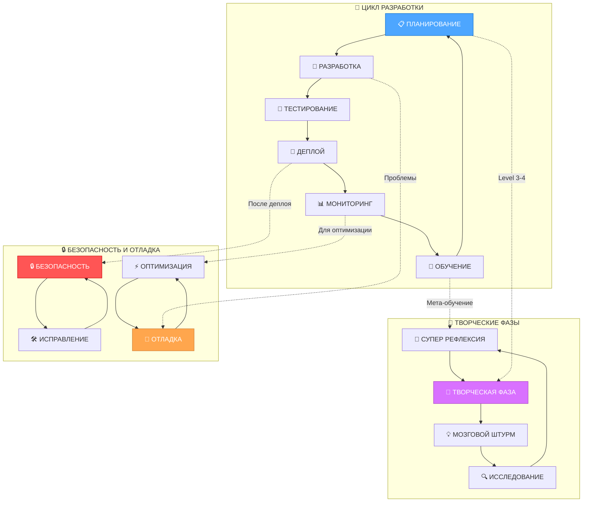
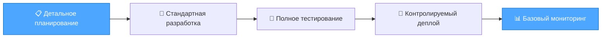
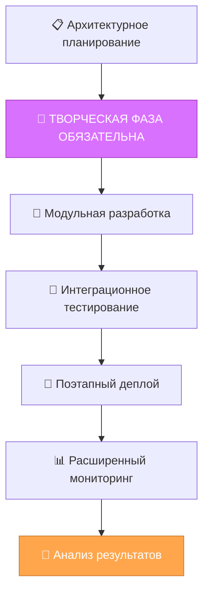
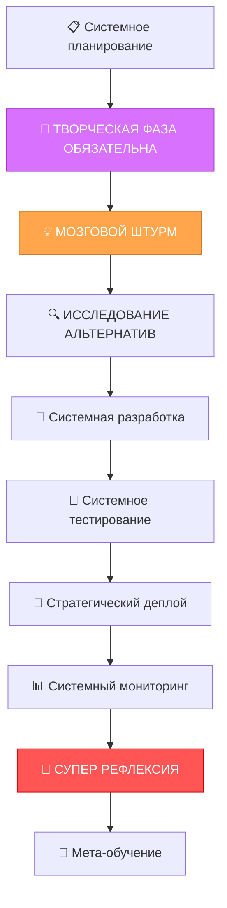
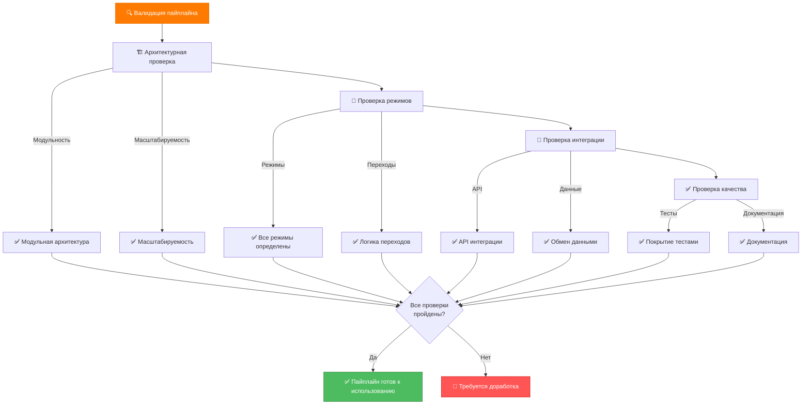

# 🚀 ИНТЕГРИРОВАННЫЙ ПАЙПЛАЙН РАЗРАБОТКИ LANDING MEMORY BANK

> **TL;DR:** Модульный пайплайн объединяет методологии cursor-memory-bank с архитектурными принципами MemoryBank для систематического развития и масштабирования системы.

## 🎯 ОБЗОР ПАЙПЛАЙНА

### Архитектура пайплайна


## 🏗️ МОДУЛЬНАЯ АРХИТЕКТУРА ПАЙПЛАЙНА

### 1. Модуль планирования и стратегии
```javascript
class PlanningModule {
  constructor() {
    this.strategies = {
      incremental: new IncrementalStrategy(),
      revolutionary: new RevolutionaryStrategy(),
      adaptive: new AdaptiveStrategy()
    };
    this.complexityAnalyzer = new ComplexityAnalyzer();
  }
  
  async createDevelopmentPlan(requirements, constraints) {
    const complexity = await this.complexityAnalyzer.analyze(requirements);
    const strategy = this.selectStrategy(complexity, constraints);
    
    return {
      strategy: strategy.name,
      phases: await strategy.generatePhases(requirements),
      milestones: strategy.defineMilestones(),
      resources: strategy.estimateResources(),
      timeline: strategy.calculateTimeline()
    };
  }
  
  selectStrategy(complexity, constraints) {
    if (complexity.level <= 2) return this.strategies.incremental;
    if (complexity.level === 3) return this.strategies.adaptive;
    return this.strategies.revolutionary;
  }
}
```

### 2. Модуль творческой фазы
```javascript
class CreativePhaseModule {
  constructor() {
    this.creativeMethods = {
      brainstorming: new BrainstormingMethod(),
      designThinking: new DesignThinkingMethod(),
      systematicInnovation: new SystematicInnovationMethod()
    };
    this.phaseEnforcer = new CreativePhaseEnforcer();
  }
  
  async executeCreativePhase(component, requirements) {
    // Принудительная творческая фаза для Level 3-4
    if (!this.phaseEnforcer.isCreativePhaseRequired(component)) {
      throw new Error('Творческая фаза обязательна для сложных компонентов');
    }
    
    const method = this.selectCreativeMethod(component.type);
    const creativeProcess = await method.execute(component, requirements);
    
    return {
      type: 'creative_phase_completed',
      component: component.name,
      options: creativeProcess.options,
      selectedOption: creativeProcess.selectedOption,
      justification: creativeProcess.justification,
      implementationGuidelines: creativeProcess.guidelines
    };
  }
  
  selectCreativeMethod(componentType) {
    switch (componentType) {
      case 'architecture':
        return this.creativeMethods.systematicInnovation;
      case 'uiux':
        return this.creativeMethods.designThinking;
      default:
        return this.creativeMethods.brainstorming;
    }
  }
}
```

### 3. Модуль разработки и реализации
```javascript
class DevelopmentModule {
  constructor() {
    this.implementers = {
      html: new HTMLImplementer(),
      css: new CSSImplementer(),
      javascript: new JavaScriptImplementer(),
      architecture: new ArchitectureImplementer()
    };
    this.qualityGates = new QualityGates();
  }
  
  async implementComponent(component, specifications) {
    const implementer = this.implementers[component.type];
    const implementation = await implementer.implement(component, specifications);
    
    // Прохождение quality gates
    const qualityCheck = await this.qualityGates.validate(implementation);
    if (!qualityCheck.passed) {
      return {
        type: 'implementation_failed_quality_gates',
        component: component.name,
        issues: qualityCheck.issues,
        recommendations: qualityCheck.recommendations
      };
    }
    
    return {
      type: 'implementation_completed',
      component: component.name,
      code: implementation.code,
      tests: implementation.tests,
      documentation: implementation.documentation
    };
  }
}
```

### 4. Модуль тестирования и валидации
```javascript
class TestingModule {
  constructor() {
    this.testTypes = {
      unit: new UnitTester(),
      integration: new IntegrationTester(),
      e2e: new E2ETester(),
      performance: new PerformanceTester(),
      accessibility: new AccessibilityTester()
    };
    this.testOrchestrator = new TestOrchestrator();
  }
  
  async executeTestSuite(component, testLevel) {
    const testPlan = this.testOrchestrator.createTestPlan(component, testLevel);
    const results = await this.testOrchestrator.executeTests(testPlan);
    
    if (results.overallResult === 'FAILED') {
      return {
        type: 'tests_failed',
        component: component.name,
        failedTests: results.failedTests,
        nextMode: 'DEBUG',
        message: 'Требуется режим отладки для исправления ошибок'
      };
    }
    
    return {
      type: 'tests_passed',
      component: component.name,
      testResults: results,
      nextMode: 'DEPLOY',
      message: 'Компонент готов к деплою'
    };
  }
}
```

### 5. Модуль деплоя и мониторинга
```javascript
class DeploymentModule {
  constructor() {
    this.deploymentStrategies = {
      blueGreen: new BlueGreenDeployment(),
      canary: new CanaryDeployment(),
      rolling: new RollingDeployment()
    };
    this.monitoringSystem = new MonitoringSystem();
  }
  
  async deployComponent(component, environment) {
    const strategy = this.selectDeploymentStrategy(component, environment);
    const deployment = await strategy.deploy(component);
    
    // Активация мониторинга
    await this.monitoringSystem.activate(component, deployment);
    
    return {
      type: 'deployment_completed',
      component: component.name,
      deployment: deployment,
      monitoring: await this.monitoringSystem.getStatus(component),
      nextMode: 'MONITOR'
    };
  }
  
  selectDeploymentStrategy(component, environment) {
    if (component.criticality === 'high') return this.deploymentStrategies.blueGreen;
    if (component.hasRollbackPlan) return this.deploymentStrategies.canary;
    return this.deploymentStrategies.rolling;
  }
}
```

## 🔄 АДАПТИВНАЯ МОДЕЛЬ СЛОЖНОСТИ

### Level 1: Простые улучшения
**Характеристики:**
- Bug fixes
- Мелкие изменения
- Стандартные улучшения

**Пайплайн:**


### Level 2: Базовые улучшения
**Характеристики:**
- Новые компоненты
- Улучшения существующих функций
- Стандартные паттерны

**Пайплайн:**


### Level 3: Сложные улучшения
**Характеристики:**
- Архитектурные изменения
- Новые модули
- Интеграции

**Пайплайн:**


### Level 4: Системные изменения
**Характеристики:**
- Перепроектирование системы
- Новые платформы
- Масштабные изменения

**Пайплайн:**


## 🎨 ТВОРЧЕСКИЕ МЕТОДЫ

### 1. Систематическая инновация
```javascript
class SystematicInnovationMethod {
  async execute(component, requirements) {
    const innovationProcess = {
      phase1: 'Проблема и возможности',
      phase2: 'Принципы решения',
      phase3: 'Генерация концепций',
      phase4: 'Оценка и выбор',
      phase5: 'Детализация решения'
    };
    
    const options = await this.generateInnovativeOptions(component, requirements);
    const selectedOption = await this.evaluateAndSelect(options, requirements);
    
    return {
      type: 'systematic_innovation',
      process: innovationProcess,
      options: options,
      selectedOption: selectedOption,
      justification: this.justifySelection(selectedOption, options),
      implementationGuidelines: this.createGuidelines(selectedOption)
    };
  }
  
  async generateInnovativeOptions(component, requirements) {
    const options = [];
    
    // Применение принципов систематической инновации
    options.push(await this.applyPrinciple('Разделение', component, requirements));
    options.push(await this.applyPrinciple('Объединение', component, requirements));
    options.push(await this.applyPrinciple('Универсальность', component, requirements));
    options.push(await this.applyPrinciple('Адаптивность', component, requirements));
    
    return options;
  }
}
```

### 2. Дизайн-мышление
```javascript
class DesignThinkingMethod {
  async execute(component, requirements) {
    const designProcess = {
      empathize: 'Понимание пользователей',
      define: 'Определение проблем',
      ideate: 'Генерация идей',
      prototype: 'Создание прототипов',
      test: 'Тестирование решений'
    };
    
    const userInsights = await this.empathize(component, requirements);
    const problemDefinition = await this.define(userInsights);
    const ideas = await this.ideate(problemDefinition);
    const prototypes = await this.prototype(ideas);
    const selectedSolution = await this.test(prototypes);
    
    return {
      type: 'design_thinking',
      process: designProcess,
      userInsights: userInsights,
      problemDefinition: problemDefinition,
      ideas: ideas,
      prototypes: prototypes,
      selectedSolution: selectedSolution,
      implementationGuidelines: this.createGuidelines(selectedSolution)
    };
  }
}
```

### 3. Мозговой штурм
```javascript
class BrainstormingMethod {
  async execute(component, requirements) {
    const brainstormingSession = {
      preparation: 'Подготовка и настройка',
      generation: 'Генерация идей',
      evaluation: 'Оценка и фильтрация',
      selection: 'Выбор лучших идей',
      development: 'Развитие выбранных идей'
    };
    
    const ideas = await this.generateIdeas(component, requirements);
    const evaluatedIdeas = await this.evaluateIdeas(ideas, requirements);
    const selectedIdeas = await this.selectBestIdeas(evaluatedIdeas);
    const developedIdeas = await this.developIdeas(selectedIdeas);
    
    return {
      type: 'brainstorming',
      process: brainstormingSession,
      ideas: ideas,
      evaluatedIdeas: evaluatedIdeas,
      selectedIdeas: selectedIdeas,
      developedIdeas: developedIdeas,
      finalSolution: this.combineIdeas(developedIdeas),
      implementationGuidelines: this.createGuidelines(this.combineIdeas(developedIdeas))
    };
  }
}
```

## 🔒 БЕЗОПАСНОСТЬ И ОТЛАДКА

### Модуль безопасности
```javascript
class SecurityModule {
  constructor() {
    this.securityScanners = {
      static: new StaticSecurityScanner(),
      dynamic: new DynamicSecurityScanner(),
      dependency: new DependencySecurityScanner()
    };
    this.remediationEngine = new SecurityRemediationEngine();
  }
  
  async performSecurityAudit(component) {
    const auditResults = await Promise.all([
      this.securityScanners.static.scan(component),
      this.securityScanners.dynamic.scan(component),
      this.securityScanners.dependency.scan(component)
    ]);
    
    const vulnerabilities = this.consolidateVulnerabilities(auditResults);
    
    if (vulnerabilities.length > 0) {
      const remediationPlan = await this.remediationEngine.createPlan(vulnerabilities);
      
      return {
        type: 'security_audit_failed',
        component: component.name,
        vulnerabilities: vulnerabilities,
        remediationPlan: remediationPlan,
        nextMode: 'REMEDIATE',
        severity: this.calculateSeverity(vulnerabilities)
      };
    }
    
    return {
      type: 'security_audit_passed',
      component: component.name,
      nextMode: 'DEPLOY'
    };
  }
}
```

### Модуль отладки
```javascript
class DebugModule {
  constructor() {
    this.debugTools = {
      logging: new LoggingTool(),
      profiling: new ProfilingTool(),
      tracing: new TracingTool()
    };
    this.issueAnalyzer = new IssueAnalyzer();
  }
  
  async debugComponent(component, issues) {
    // Активация инструментов отладки
    await this.debugTools.logging.activate(component);
    await this.debugTools.profiling.activate(component);
    await this.debugTools.tracing.activate(component);
    
    // Анализ проблем
    const analysis = await this.issueAnalyzer.analyze(component, issues);
    const solutions = await this.issueAnalyzer.generateSolutions(analysis);
    
    return {
      type: 'debug_analysis_completed',
      component: component.name,
      analysis: analysis,
      solutions: solutions,
      recommendedSolution: this.selectBestSolution(solutions),
      nextMode: 'DEVELOP',
      message: 'Готово к исправлению проблем'
    };
  }
}
```

## 📊 МОНИТОРИНГ И ОПТИМИЗАЦИЯ

### Модуль мониторинга
```javascript
class MonitoringModule {
  constructor() {
    this.metrics = {
      performance: new PerformanceMetrics(),
      userExperience: new UserExperienceMetrics(),
      business: new BusinessMetrics()
    };
    this.alerting = new AlertingSystem();
  }
  
  async monitorComponent(component) {
    const metrics = await Promise.all([
      this.metrics.performance.collect(component),
      this.metrics.userExperience.collect(component),
      this.metrics.business.collect(component)
    ]);
    
    const consolidatedMetrics = this.consolidateMetrics(metrics);
    const alerts = await this.alerting.checkAlerts(consolidatedMetrics);
    
    if (alerts.length > 0) {
      return {
        type: 'monitoring_alerts',
        component: component.name,
        alerts: alerts,
        metrics: consolidatedMetrics,
        nextMode: 'OPTIMIZE',
        priority: this.calculatePriority(alerts)
      };
    }
    
    return {
      type: 'monitoring_normal',
      component: component.name,
      metrics: consolidatedMetrics,
      nextMode: 'LEARN'
    };
  }
}
```

### Модуль оптимизации
```javascript
class OptimizationModule {
  constructor() {
    this.optimizers = {
      performance: new PerformanceOptimizer(),
      userExperience: new UserExperienceOptimizer(),
      business: new BusinessOptimizer()
    };
    this.optimizationAnalyzer = new OptimizationAnalyzer();
  }
  
  async optimizeComponent(component, metrics) {
    const optimizationOpportunities = await this.optimizationAnalyzer.identify(component, metrics);
    
    if (optimizationOpportunities.length === 0) {
      return {
        type: 'no_optimization_needed',
        component: component.name,
        message: 'Компонент уже оптимизирован'
      };
    }
    
    const optimizationPlan = await this.createOptimizationPlan(optimizationOpportunities);
    
    return {
      type: 'optimization_plan_created',
      component: component.name,
      opportunities: optimizationOpportunities,
      plan: optimizationPlan,
      nextMode: 'DEVELOP',
      estimatedImpact: this.estimateImpact(optimizationPlan)
    };
  }
}
```

## 🧠 ОБУЧЕНИЕ И МЕТА-ОБУЧЕНИЕ

### Модуль обучения
```javascript
class LearningModule {
  constructor() {
    this.learningMethods = {
      patternRecognition: new PatternRecognition(),
      knowledgeExtraction: new KnowledgeExtraction(),
      bestPracticeAnalysis: new BestPracticeAnalysis()
    };
    this.knowledgeBase = new KnowledgeBase();
  }
  
  async learnFromExperience(component, results) {
    const patterns = await this.learningMethods.patternRecognition.identify(results);
    const knowledge = await this.learningMethods.knowledgeExtraction.extract(results);
    const bestPractices = await this.learningMethods.bestPracticeAnalysis.analyze(results);
    
    // Сохранение в базу знаний
    await this.knowledgeBase.store({
      component: component.name,
      patterns: patterns,
      knowledge: knowledge,
      bestPractices: bestPractices,
      timestamp: new Date(),
      context: this.extractContext(component, results)
    });
    
    return {
      type: 'learning_completed',
      component: component.name,
      patterns: patterns,
      knowledge: knowledge,
      bestPractices: bestPractices,
      nextMode: 'PLAN',
      message: 'Знания интегрированы в систему'
    };
  }
}
```

### Модуль супер-рефлексии
```javascript
class SuperReflectionModule {
  constructor() {
    this.reflectionMethods = {
      metaLearning: new MetaLearning(),
      systemAdaptation: new SystemAdaptation(),
      processOptimization: new ProcessOptimization()
    };
  }
  
  async performSuperReflection(systemState, performance) {
    const metaLearning = await this.reflectionMethods.metaLearning.analyze(systemState, performance);
    const systemAdaptation = await this.reflectionMethods.systemAdaptation.plan(systemState, performance);
    const processOptimization = await this.reflectionMethods.processOptimization.optimize(systemState, performance);
    
    return {
      type: 'super_reflection_completed',
      metaLearning: metaLearning,
      systemAdaptation: systemAdaptation,
      processOptimization: processOptimization,
      nextMode: 'PLAN',
      message: 'Система адаптирована на основе мета-обучения'
    };
  }
}
```

## 🔄 ИНТЕГРАЦИЯ С РЕЖИМАМИ

### Менеджер переходов между режимами
```javascript
class ModeTransitionManager {
  constructor() {
    this.pipeline = new IntegratedDevelopmentPipeline();
    this.modeHandlers = {
      VAN: new VANModeHandler(),
      CREATIVE: new CreativeModeHandler(),
      PLAN: new PlanModeHandler(),
      DEVELOP: new DevelopModeHandler(),
      TEST: new TestModeHandler(),
      DEPLOY: new DeployModeHandler(),
      MONITOR: new MonitorModeHandler(),
      LEARN: new LearnModeHandler(),
      DEBUG: new DebugModeHandler(),
      SECURITY: new SecurityModeHandler(),
      OPTIMIZE: new OptimizeModeHandler(),
      SUPER_REFLECT: new SuperReflectModeHandler()
    };
  }
  
  async transitionToMode(currentMode, targetMode, context) {
    // Завершение текущего режима
    await this.modeHandlers[currentMode].complete(context);
    
    // Инициализация целевого режима
    const newContext = await this.modeHandlers[targetMode].initialize(context);
    
    return {
      type: 'mode_transition_completed',
      from: currentMode,
      to: targetMode,
      context: newContext,
      nextActions: await this.modeHandlers[targetMode].getNextActions(newContext)
    };
  }
  
  async determineNextMode(currentMode, results) {
    const modeLogic = this.pipeline.getModeLogic(currentMode);
    return await modeLogic.determineNextMode(results);
  }
}
```

## 📋 ПРОВЕРКА ПАЙПЛАЙНА

### Чек-лист валидации пайплайна


---

**Следующий шаг:** Интеграция пайплайна с существующими режимами и создание специализированных модулей для лендингов.
