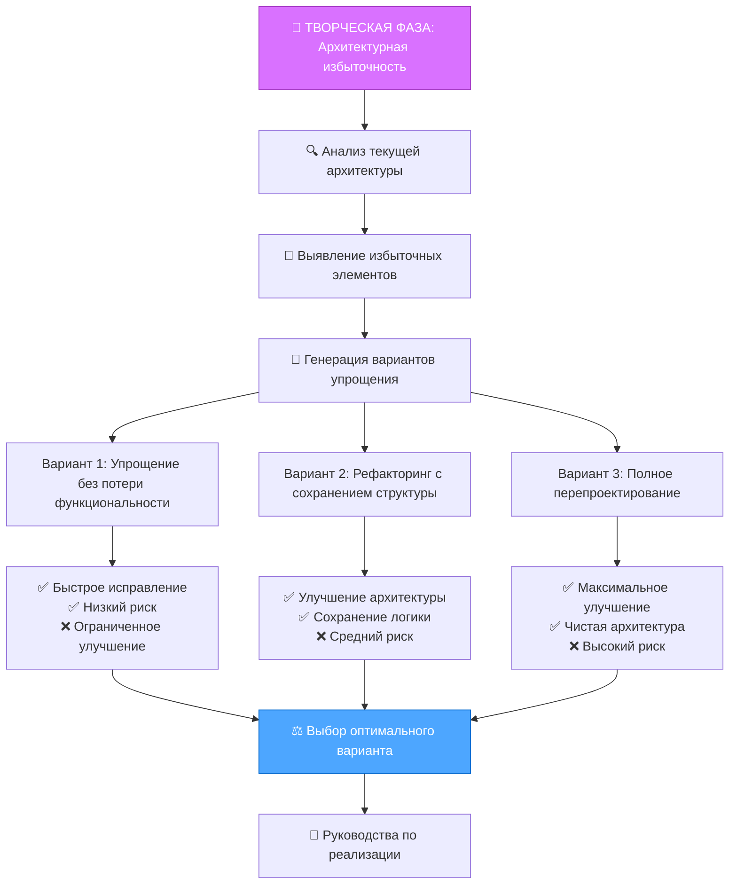
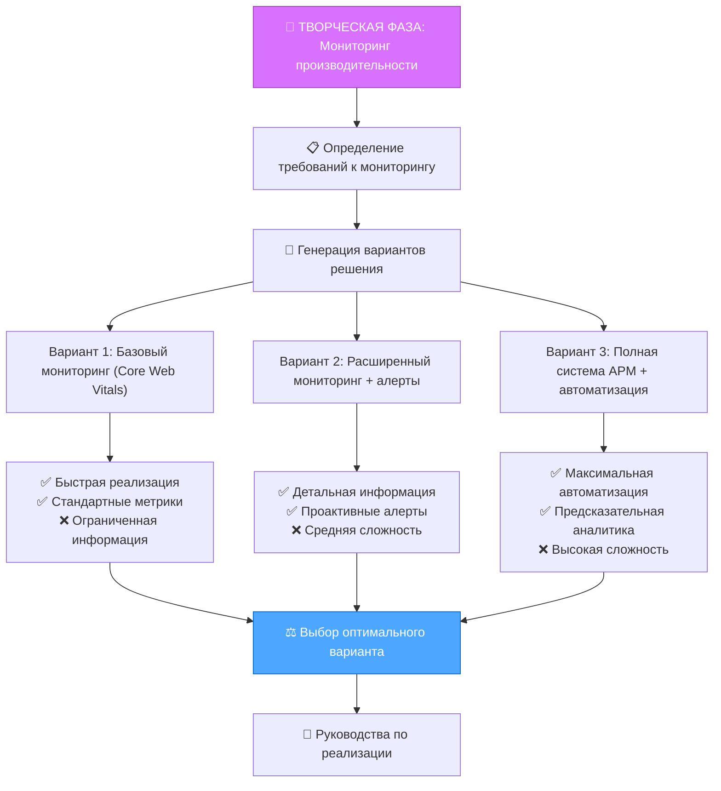
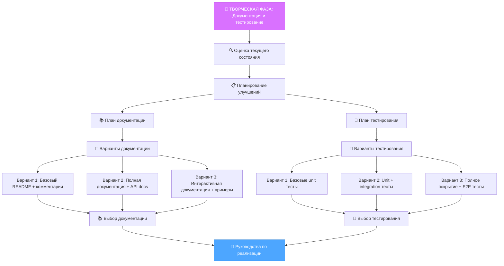
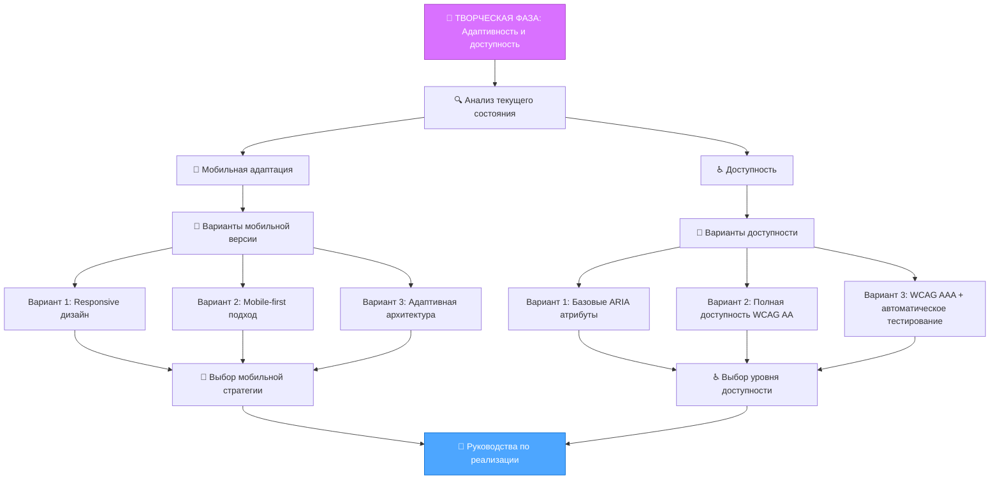

# 🚨 ИНТЕГРИРОВАННЫЕ ПАТТЕРНЫ ОШИБОК LANDING MEMORY BANK

> **TL;DR:** База данных ошибок объединяет опыт MemoryBank с систематическими подходами cursor-memory-bank для автоматического выявления, классификации и исправления проблем в веб-разработке.

## 🎯 КЛАССИФИКАЦИЯ ОШИБОК ПО УРОВНЯМ СЛОЖНОСТИ

### Level 1: Простые ошибки (Автоматическое исправление)
**Характеристики:** Очевидные проблемы, стандартные решения, быстрое исправление

### Level 2: Базовые ошибки (Полуавтоматическое исправление)
**Характеристики:** Требуют анализа контекста, частично автоматизированы

### Level 3: Сложные ошибки (Требуют творческой фазы)
**Характеристики:** Архитектурные решения, множественные варианты, обязательная творческая фаза

### Level 4: Системные ошибки (Полный цикл разработки)
**Характеристики:** Системные проблемы, требующие перепроектирования

## 🏗️ АРХИТЕКТУРНЫЕ НАРУШЕНИЯ

### RULE_001: Нарушение принципа "Простота = Эффективность"

#### Level 1: Избыточная сложность CSS
```css
/* ❌ НАРУШЕНИЕ: Избыточная сложность */
.navbar .container .row .col .nav-item .nav-link:hover {
  color: #007bff;
  text-decoration: underline;
}

/* ✅ ИСПРАВЛЕНИЕ: Упрощенный селектор */
.nav-link:hover {
  color: var(--color-primary);
  text-decoration: underline;
}
```

**Автоматическое исправление:**
```javascript
class SimplicityFixer {
  async fixCSSComplexity(cssContent) {
    // Анализ специфичности селекторов
    const selectors = this.parseSelectors(cssContent);
    const complexSelectors = selectors.filter(s => s.specificity > 0.7);
    
    for (const selector of complexSelectors) {
      const simplified = this.simplifySelector(selector);
      cssContent = cssContent.replace(selector.original, simplified);
    }
    
    return cssContent;
  }
  
  simplifySelector(selector) {
    // Удаление избыточных вложений
    const parts = selector.original.split(' ');
    if (parts.length > 3) {
      return parts[parts.length - 1]; // Берем последний элемент
    }
    return selector.original;
  }
}
```

#### Level 2: Сложная структура папок
**Симптомы:**
- Глубина вложенности > 5 уровней
- Множественные папки с похожими названиями
- Отсутствие логической группировки

**Автоматическое исправление:**
```javascript
class FolderStructureFixer {
  async analyzeAndFix(projectPath) {
    const structure = await this.analyzeFolderStructure(projectPath);
    
    if (structure.maxDepth > 5) {
      const flattened = await this.flattenStructure(projectPath);
      return {
        type: 'folder_structure_flattened',
        changes: `Структура упрощена с ${structure.maxDepth} до ${flattened.maxDepth} уровней`,
        recommendations: [
          'Группировать файлы по функциональности, а не по типам',
          'Использовать плоскую структуру для небольших проектов'
        ]
      };
    }
    
    return { type: 'no_changes_needed' };
  }
}
```

#### Level 3: Архитектурная избыточность
**Симптомы:**
- Множественные абстракции для простых задач
- Over-engineering простых компонентов
- Неоправданное использование паттернов

**Требует творческой фазы:**


### RULE_002: Нарушение принципа "Предотвращение = Лечение"

#### Level 1: Отсутствие валидации форм
```html
<!-- ❌ НАРУШЕНИЕ: Отсутствие валидации -->
<form>
  <input type="email" name="email">
  <button type="submit">Отправить</button>
</form>

<!-- ✅ ИСПРАВЛЕНИЕ: Валидация на стороне клиента -->
<form novalidate>
  <input type="email" name="email" required 
         pattern="[a-z0-9._%+-]+@[a-z0-9.-]+\.[a-z]{2,}$">
  <div class="error-message" id="email-error"></div>
  <button type="submit">Отправить</button>
</form>
```

**Автоматическое исправление:**
```javascript
class FormValidationFixer {
  async fixFormValidation(htmlContent) {
    const forms = this.findForms(htmlContent);
    
    for (const form of forms) {
      // Добавление атрибутов валидации
      form = this.addValidationAttributes(form);
      // Добавление сообщений об ошибках
      form = this.addErrorMessages(form);
      // Добавление JavaScript валидации
      form = this.addJSValidation(form);
    }
    
    return htmlContent;
  }
  
  addValidationAttributes(form) {
    const inputs = form.querySelectorAll('input, textarea, select');
    
    inputs.forEach(input => {
      if (input.type === 'email') {
        input.setAttribute('pattern', '[a-z0-9._%+-]+@[a-z0-9.-]+\\.[a-z]{2,}$');
        input.setAttribute('required', '');
      }
      if (input.type === 'tel') {
        input.setAttribute('pattern', '[0-9\\+\\-\\s\\(\\)]{10,}');
      }
    });
    
    return form;
  }
}
```

#### Level 2: Отсутствие обработки ошибок
**Симптомы:**
- Нет try-catch блоков в критическом коде
- Отсутствие fallback механизмов
- Нет логирования ошибок

**Автоматическое исправление:**
```javascript
class ErrorHandlingFixer {
  async fixErrorHandling(jsContent) {
    // Поиск критических функций
    const criticalFunctions = this.findCriticalFunctions(jsContent);
    
    for (const func of criticalFunctions) {
      // Добавление try-catch блоков
      jsContent = this.wrapWithTryCatch(jsContent, func);
      // Добавление логирования
      jsContent = this.addErrorLogging(jsContent, func);
      // Добавление fallback механизмов
      jsContent = this.addFallbacks(jsContent, func);
    }
    
    return jsContent;
  }
}
```

#### Level 3: Отсутствие мониторинга производительности
**Симптомы:**
- Нет метрик производительности
- Отсутствие предупреждений о проблемах
- Нет автоматического масштабирования

**Требует творческой фазы:**


### RULE_003: Нарушение принципа "Обучение = Улучшение"

#### Level 1: Дублирование кода
```css
/* ❌ НАРУШЕНИЕ: Дублирование стилей */
.button-primary {
  background: #007bff;
  color: white;
  padding: 10px 20px;
  border-radius: 5px;
}

.button-secondary {
  background: #6c757d;
  color: white;
  padding: 10px 20px;
  border-radius: 5px;
}

/* ✅ ИСПРАВЛЕНИЕ: Использование переменных и миксинов */
:root {
  --button-padding: 10px 20px;
  --button-radius: 5px;
}

.button-base {
  padding: var(--button-padding);
  border-radius: var(--button-radius);
  color: white;
}

.button-primary {
  @extend .button-base;
  background: var(--color-primary);
}

.button-secondary {
  @extend .button-base;
  background: var(--color-secondary);
}
```

**Автоматическое исправление:**
```javascript
class DuplicationFixer {
  async fixCSSDuplication(cssContent) {
    // Поиск дублирующихся стили
    const duplicates = this.findDuplicateStyles(cssContent);
    
    for (const duplicate of duplicates) {
      // Создание CSS переменных
      const variables = this.createCSSVariables(duplicate);
      // Замена дублирующихся значений
      cssContent = this.replaceWithVariables(cssContent, duplicate, variables);
    }
    
    return cssContent;
  }
  
  findDuplicateStyles(cssContent) {
    const styles = this.parseCSS(cssContent);
    const duplicates = [];
    
    for (let i = 0; i < styles.length; i++) {
      for (let j = i + 1; j < styles.length; j++) {
        if (this.areStylesSimilar(styles[i], styles[j])) {
          duplicates.push({
            style1: styles[i],
            style2: styles[j],
            similarity: this.calculateSimilarity(styles[i], styles[j])
          });
        }
      }
    }
    
    return duplicates.filter(d => d.similarity > 0.7);
  }
}
```

#### Level 2: Неиспользуемый код
**Симптомы:**
- Dead code в JavaScript
- Неиспользуемые CSS классы
- Отсутствующие импорты

**Автоматическое исправление:**
```javascript
class DeadCodeFixer {
  async removeDeadCode(projectPath) {
    const results = {
      removed: [],
      warnings: []
    };
    
    // Поиск неиспользуемых JavaScript функций
    const unusedJS = await this.findUnusedJavaScript(projectPath);
    for (const func of unusedJS) {
      if (this.isSafeToRemove(func)) {
        await this.removeFunction(func);
        results.removed.push(`JavaScript: ${func.name}`);
      } else {
        results.warnings.push(`JavaScript: ${func.name} - требует ручной проверки`);
      }
    }
    
    // Поиск неиспользуемых CSS классов
    const unusedCSS = await this.findUnusedCSS(projectPath);
    for (const cssClass of unusedCSS) {
      if (this.isSafeToRemove(cssClass)) {
        await this.removeCSSClass(cssClass);
        results.removed.push(`CSS: ${cssClass.name}`);
      }
    }
    
    return results;
  }
}
```

#### Level 3: Отсутствие документации и тестов
**Симптомы:**
- Нет README файлов
- Отсутствие комментариев в коде
- Нет unit тестов

**Требует творческой фазы:**


### RULE_004: Нарушение принципа "Лендинг = Специализация"

#### Level 1: Отсутствие конверсионной оптимизации
**Симптомы:**
- Нет призывов к действию (CTA)
- Отсутствие A/B тестирования
- Нет аналитики конверсий

**Автоматическое исправление:**
```javascript
class ConversionOptimizer {
  async optimizeLandingPage(htmlContent) {
    // Поиск потенциальных CTA мест
    const ctaLocations = this.findCTALocations(htmlContent);
    
    for (const location of ctaLocations) {
      // Добавление CTA кнопок
      htmlContent = this.addCTAButton(htmlContent, location);
      // Добавление tracking атрибутов
      htmlContent = this.addTrackingAttributes(htmlContent, location);
    }
    
    // Добавление A/B тестирования
    htmlContent = this.addABTesting(htmlContent);
    
    return htmlContent;
  }
  
  findCTALocations(htmlContent) {
    const locations = [];
    
    // После заголовков
    const headings = htmlContent.querySelectorAll('h1, h2, h3');
    headings.forEach(heading => {
      if (this.isConversionRelevant(heading)) {
        locations.push({
          type: 'after_heading',
          element: heading,
          priority: this.calculateCTAPriority(heading)
        });
      }
    });
    
    // В конце секций
    const sections = htmlContent.querySelectorAll('section');
    sections.forEach(section => {
      if (this.isConversionSection(section)) {
        locations.push({
          type: 'section_end',
          element: section,
          priority: 'high'
        });
      }
    });
    
    return locations.sort((a, b) => b.priority - a.priority);
  }
}
```

#### Level 2: Проблемы с производительностью лендинга
**Симптомы:**
- Медленная загрузка
- Неоптимизированные изображения
- Отсутствие lazy loading

**Автоматическое исправление:**
```javascript
class PerformanceOptimizer {
  async optimizePerformance(projectPath) {
    const results = [];
    
    // Оптимизация изображений
    const imageOptimization = await this.optimizeImages(projectPath);
    results.push(imageOptimization);
    
    // Добавление lazy loading
    const lazyLoading = await this.addLazyLoading(projectPath);
    results.push(lazyLoading);
    
    // Минификация ресурсов
    const minification = await this.minifyResources(projectPath);
    results.push(minification);
    
    return results;
  }
  
  async optimizeImages(projectPath) {
    const images = await this.findImages(projectPath);
    let optimized = 0;
    
    for (const image of images) {
      if (await this.canOptimize(image)) {
        await this.optimizeImage(image);
        optimized++;
      }
    }
    
    return {
      type: 'image_optimization',
      optimized,
      total: images.length,
      savings: await this.calculateSavings(projectPath)
    };
  }
}
```

#### Level 3: Отсутствие адаптивности и доступности
**Симптомы:**
- Нет мобильной версии
- Отсутствие ARIA атрибутов
- Проблемы с навигацией

**Требует творческой фазы:**


## 🔄 АВТОМАТИЧЕСКИЕ ИСПРАВЛЕНИЯ ПО УРОВНЯМ

### Level 1: Полностью автоматизированные исправления
```javascript
class Level1AutoFixer {
  async autoFixAll(violations) {
    const results = {
      fixed: [],
      failed: [],
      recommendations: []
    };
    
    for (const violation of violations) {
      try {
        const fix = await this.fixViolation(violation);
        results.fixed.push(fix);
      } catch (error) {
        results.failed.push({
          violation,
          error: error.message
        });
      }
    }
    
    return results;
  }
  
  async fixViolation(violation) {
    switch (violation.rule) {
      case 'RULE_001':
        return await this.fixSimplicity(violation);
      case 'RULE_002':
        return await this.fixPrevention(violation);
      case 'RULE_003':
        return await this.fixLearning(violation);
      case 'RULE_004':
        return await this.fixLandingSpecialization(violation);
      default:
        throw new Error(`Unknown rule: ${violation.rule}`);
    }
  }
}
```

### Level 2: Полуавтоматические исправления
```javascript
class Level2AutoFixer {
  async semiAutoFix(violations) {
    const results = {
      autoFixed: [],
      requiresReview: [],
      manualFixes: []
    };
    
    for (const violation of violations) {
      if (this.canAutoFix(violation)) {
        const fix = await this.autoFix(violation);
        results.autoFixed.push(fix);
      } else if (this.canSuggestFix(violation)) {
        const suggestion = await this.suggestFix(violation);
        results.requiresReview.push(suggestion);
      } else {
        results.manualFixes.push(violation);
      }
    }
    
    return results;
  }
}
```

### Level 3-4: Требуют творческой фазы
```javascript
class CreativePhaseManager {
  async handleComplexViolations(violations) {
    const creativeTasks = [];
    
    for (const violation of violations) {
      if (this.requiresCreativePhase(violation)) {
        const creativeTask = await this.createCreativeTask(violation);
        creativeTasks.push(creativeTask);
      }
    }
    
    return {
      type: 'creative_phase_required',
      tasks: creativeTasks,
      nextMode: 'CREATIVE',
      message: 'Требуется творческая фаза для решения сложных проблем'
    };
  }
  
  requiresCreativePhase(violation) {
    return violation.complexity >= 3 || 
           violation.requiresArchitectureDecision ||
           violation.hasMultipleSolutions;
  }
}
```

## 📊 МЕТРИКИ ИСПРАВЛЕНИЯ ОШИБОК

### Система отслеживания исправлений
```javascript
class ErrorFixTracker {
  constructor() {
    this.metrics = {
      totalViolations: 0,
      autoFixed: 0,
      semiAutoFixed: 0,
      creativePhaseRequired: 0,
      manualFixes: 0,
      averageFixTime: 0
    };
  }
  
  async trackFix(violation, fixResult) {
    this.metrics.totalViolations++;
    
    switch (fixResult.type) {
      case 'auto_fixed':
        this.metrics.autoFixed++;
        break;
      case 'semi_auto_fixed':
        this.metrics.semiAutoFixed++;
        break;
      case 'creative_phase_required':
        this.metrics.creativePhaseRequired++;
        break;
      case 'manual_fix':
        this.metrics.manualFixes++;
        break;
    }
    
    await this.updateMetrics();
    return this.generateReport();
  }
  
  generateReport() {
    const autoFixRate = (this.metrics.autoFixed / this.metrics.totalViolations) * 100;
    const efficiency = this.calculateEfficiency();
    
    return {
      summary: {
        totalViolations: this.metrics.totalViolations,
        autoFixRate: `${autoFixRate.toFixed(1)}%`,
        efficiency: efficiency
      },
      recommendations: this.generateRecommendations(),
      trends: await this.analyzeTrends()
    };
  }
}
```

---

**Следующий шаг:** Создание специализированных правил для лендингов и интеграция с системой режимов.
