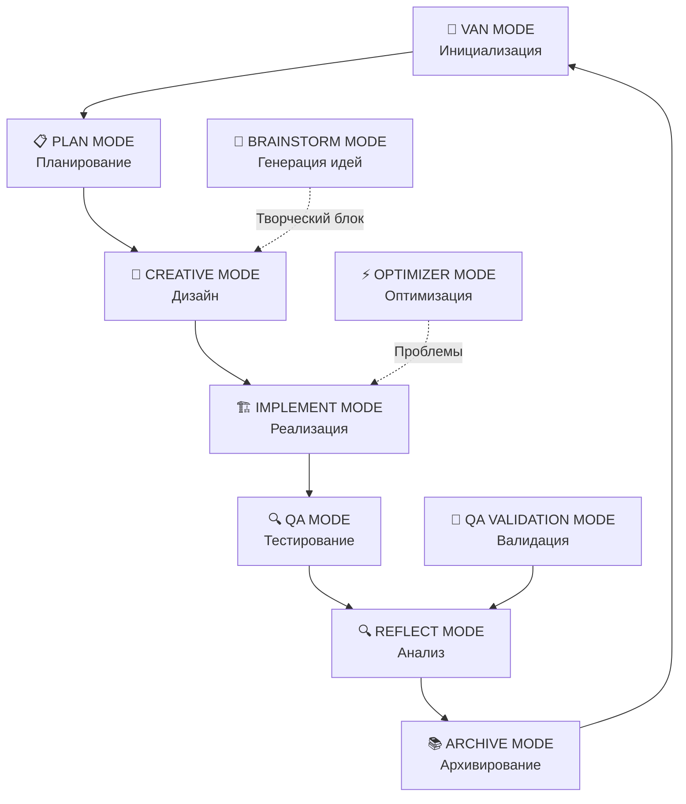

# 🧠 Landing Memory Bank

**Мощная система управления знаниями для веб-разработки и создания landing страниц**

[](https://github.com/mrdudekowski/landing_memory_bank)
[](LICENSE)
[](https://github.com/mrdudekowski/landing_memory_bank/stargazers)

## 🚀 Быстрый старт

### 📥 Скачать Landing Memory Bank

```bash
# Клонировать репозиторий
git clone https://github.com/mrdudekowski/landing_memory_bank.git

# Или скачать ZIP архив
# https://github.com/mrdudekowski/landing_memory_bank/archive/main.zip
```

### 🛠️ Установка в проект

```bash
# 1. Перейти в папку проекта
cd your-project

# 2. Скопировать Landing Memory Bank
cp -r ../landing_memory_bank ./LandingMemoryBank

# 3. Инициализировать систему
cd LandingMemoryBank
npm install
npm run init
```

### ⚡ Быстрая активация

```javascript
// В вашем проекте
import { LandingMemoryBank } from './LandingMemoryBank';

// Активировать систему
const memoryBank = new LandingMemoryBank();
memoryBank.activate();
```

## 🎯 Что такое Landing Memory Bank?

**Landing Memory Bank** - это интеллектуальная система управления знаниями, специально разработанная для веб-разработки и создания landing страниц. Система объединяет мощные алгоритмы мышления, режимы работы и обширную базу знаний.

### 🌟 Ключевые возможности

- **🧠 10 интегрированных режимов работы** для различных задач
- **🎨 Специализация на веб-разработке** и landing страницах
- **⚡ Адаптивная сложность** от простых до enterprise проектов
- **🔄 Автоматические переходы** между режимами
- **📚 Накопление и использование знаний** из предыдущих проектов

## 🔧 Установка и настройка

### 📋 Требования

- **Node.js** 16.0+ 
- **npm** 8.0+ или **yarn** 1.22+
- **Git** для клонирования
- **Современный браузер** для веб-интерфейса

### 🚀 Пошаговая установка

#### Шаг 1: Скачать Landing Memory Bank

```bash
# Вариант 1: Git clone (рекомендуется)
git clone https://github.com/mrdudekowski/landing_memory_bank.git
cd landing_memory_bank

# Вариант 2: Скачать ZIP
# 1. Перейти на https://github.com/mrdudekowski/landing_memory_bank
# 2. Нажать "Code" → "Download ZIP"
# 3. Распаковать в нужную папку
```

#### Шаг 2: Установить зависимости

```bash
# Установить зависимости
npm install

# Или с yarn
yarn install
```

#### Шаг 3: Настроить конфигурацию

```bash
# Создать конфигурационный файл
cp config.example.json config.json

# Отредактировать настройки
nano config.json
```

#### Шаг 4: Инициализировать систему

```bash
# Запустить инициализацию
npm run init

# Или вручную
node scripts/init.js
```

### 🔧 Интеграция в существующий проект

#### Вариант 1: Как модуль

```bash
# В папке вашего проекта
mkdir -p lib
cp -r ../landing_memory_bank ./lib/LandingMemoryBank

# Добавить в package.json
npm install ./lib/LandingMemoryBank
```

#### Вариант 2: Как подмодуль Git

```bash
# В папке вашего проекта
git submodule add https://github.com/mrdudekowski/landing_memory_bank.git
git submodule update --init --recursive
```

#### Вариант 3: Прямое копирование

```bash
# Скопировать только нужные файлы
cp -r ../landing_memory_bank/CORE ./src/memory-bank
cp -r ../landing_memory_bank/RULES_ENGINE ./src/rules
```

## 🎮 Использование

### 🚪 Активация системы

```javascript
// Базовое использование
import { LandingMemoryBank } from './LandingMemoryBank';

const memoryBank = new LandingMemoryBank({
  projectType: 'landing-page',
  complexity: 'medium',
  autoMode: true
});

// Активировать
await memoryBank.activate();
```

### 🔄 Режимы работы

```javascript
// Ручное переключение режимов
await memoryBank.switchMode('VAN_MODE');
await memoryBank.switchMode('PLAN_MODE');
await memoryBank.switchMode('CREATIVE_MODE');
await memoryBank.switchMode('IMPLEMENT_MODE');
await memoryBank.switchMode('QA_MODE');

// Автоматический режим
memoryBank.setAutoMode(true);
```

### 📚 Работа с знаниями

```javascript
// Сохранить знания
await memoryBank.saveKnowledge({
  type: 'css-pattern',
  content: 'Component-based CSS architecture',
  tags: ['css', 'architecture', 'components']
});

// Найти знания
const knowledge = await memoryBank.findKnowledge({
  query: 'CSS architecture',
  tags: ['css', 'architecture']
});
```

## 🏗️ Архитектура системы

### 🔄 Интегрированные режимы



### 📁 Структура проекта

```
LandingMemoryBank/
├── CORE/                          # Основные компоненты
│   ├── integration/               # Интеграция с внешними системами
│   ├── modes/                     # Режимы работы
│   └── README.md                  # Документация ядра
├── DEVELOPMENT_PIPELINE/          # Процессы разработки
├── ERROR_DATABASE/                # База ошибок и решений
├── RULES_ENGINE/                  # Движок правил
├── LANDING/                       # Специализация на landing страницах
├── config.json                    # Конфигурация
├── package.json                   # Зависимости
└── README.md                      # Этот файл
```

## 🎯 Режимы работы

### 🚪 VAN MODE - Инициализация
- **Назначение:** Определение типа проекта и сложности
- **Активация:** При запуске системы
- **Результат:** Готовность к планированию или реализации

### 📋 PLAN MODE - Планирование
- **Назначение:** Создание структурированного плана проекта
- **Активация:** Для задач Level 2-4
- **Результат:** Детальный план с этапами и задачами

### 🎨 CREATIVE MODE - Дизайн
- **Назначение:** Творческие решения и UX/UI дизайн
- **Активация:** После PLAN MODE для Level 2-4
- **Результат:** Дизайн-концепции и прототипы

### 🏗️ IMPLEMENT MODE - Реализация
- **Назначение:** Кодирование и создание функциональности
- **Активация:** После CREATIVE MODE или VAN MODE
- **Результат:** Рабочий код и компоненты

### 🔍 QA MODE - Тестирование
- **Назначение:** Проверка качества и функциональности
- **Активация:** После IMPLEMENT MODE
- **Результат:** Отчеты о тестировании и исправления

### 🔍 REFLECT MODE - Анализ
- **Назначение:** Анализ проекта и извлечение уроков
- **Активация:** После QA MODE
- **Результат:** Отчет о проекте и рекомендации

### 📚 ARCHIVE MODE - Архивирование
- **Назначение:** Сохранение знаний и архивирование проекта
- **Активация:** После REFLECT MODE
- **Результат:** Архив проекта и обновленная база знаний

### 🧠 BRAINSTORM MODE - Генерация идей
- **Назначение:** Решение творческих блоков и генерация идей
- **Активация:** В любой момент при необходимости
- **Результат:** Инновационные решения и подходы

### ⚡ OPTIMIZER MODE - Оптимизация
- **Назначение:** Улучшение производительности и качества
- **Активация:** При обнаружении проблем
- **Результат:** Оптимизированный проект

### 🧠 QA VALIDATION MODE - Валидация
- **Назначение:** Техническая валидация архитектуры и кода
- **Активация:** После QA MODE
- **Результат:** Валидационные отчеты

## 🔧 Конфигурация

### 📝 Основные настройки

```json
{
  "project": {
    "name": "My Landing Page",
    "type": "landing-page",
    "complexity": "medium"
  },
  "system": {
    "autoMode": true,
    "memoryBankSize": "1GB",
    "backupEnabled": true
  },
  "modes": {
    "default": "VAN_MODE",
    "transitions": "automatic"
  }
}
```

### 🌐 Настройки веб-разработки

```json
{
  "webDevelopment": {
    "frameworks": ["react", "vue", "vanilla"],
    "cssMethodology": "BEM",
    "responsiveDesign": true,
    "accessibility": "WCAG 2.1 AA"
  },
  "landingPages": {
    "templates": ["business", "product", "event"],
    "conversionElements": true,
    "seoOptimization": true
  }
}
```

## 📚 API и интеграция

### 🔌 REST API

```javascript
// Активация режима
POST /api/modes/activate
{
  "mode": "CREATIVE_MODE",
  "context": { "projectType": "landing-page" }
}

// Сохранение знаний
POST /api/knowledge/save
{
  "type": "css-pattern",
  "content": "Component architecture",
  "tags": ["css", "architecture"]
}

// Поиск знаний
GET /api/knowledge/search?query=css+architecture&tags=css,architecture
```

### 🔗 Webhook интеграция

```javascript
// Настройка webhook
const webhook = {
  url: 'https://your-app.com/webhook',
  events: ['mode_changed', 'knowledge_saved', 'project_completed'],
  secret: 'your-secret-key'
};

memoryBank.setWebhook(webhook);
```

### 📦 NPM пакет

```bash
# Установка как NPM пакет
npm install @landing-memory-bank/core

# Использование
import { LandingMemoryBank } from '@landing-memory-bank/core';
```

## 🚀 Примеры использования

### 🎯 Создание landing страницы

```javascript
// Инициализация
const memoryBank = new LandingMemoryBank({
  projectType: 'landing-page',
  complexity: 'medium'
});

// Автоматический цикл разработки
await memoryBank.activate();
// Система автоматически пройдет все необходимые режимы
```

### 🏗️ Разработка компонента

```javascript
// Переключение в режим реализации
await memoryBank.switchMode('IMPLEMENT_MODE');

// Создание компонента
const component = await memoryBank.createComponent({
  type: 'button',
  props: ['variant', 'size', 'disabled'],
  styles: 'modern-design-system'
});
```

### 🔍 Тестирование

```javascript
// Активация QA режима
await memoryBank.switchMode('QA_MODE');

// Запуск тестов
const testResults = await memoryBank.runTests({
  types: ['unit', 'integration', 'accessibility'],
  coverage: 90
});
```

## 🛠️ Разработка и расширение

### 🔧 Создание собственного режима

```javascript
// Создание кастомного режима
class CustomMode extends BaseMode {
  constructor() {
    super('CUSTOM_MODE', 'Custom functionality');
  }
  
  async execute(context) {
    // Ваша логика
    return { success: true };
  }
}

// Регистрация режима
memoryBank.registerMode(new CustomMode());
```

### 📚 Расширение базы знаний

```javascript
// Добавление новых категорий знаний
memoryBank.addKnowledgeCategory({
  name: 'custom-patterns',
  description: 'Custom development patterns',
  schema: {
    pattern: 'string',
    description: 'string',
    examples: 'array'
  }
});
```

## 🐛 Устранение неполадок

### ❌ Частые проблемы

#### Проблема: Система не запускается
```bash
# Решение 1: Проверить зависимости
npm install

# Решение 2: Проверить конфигурацию
node scripts/validate-config.js

# Решение 3: Очистить кэш
npm run clean
```

#### Проблема: Режимы не переключаются
```javascript
// Решение: Проверить контекст
const context = memoryBank.getCurrentContext();
console.log('Current context:', context);

// Принудительное переключение
await memoryBank.forceSwitchMode('VAN_MODE');
```

#### Проблема: Знания не сохраняются
```bash
# Решение 1: Проверить права доступа
chmod 755 ./data

# Решение 2: Проверить диск
df -h

# Решение 3: Пересоздать базу
npm run reset-database
```

### 📋 Логи и отладка

```javascript
// Включить подробное логирование
memoryBank.setLogLevel('DEBUG');

// Просмотр логов
const logs = memoryBank.getLogs();
console.log(logs);

// Экспорт логов
await memoryBank.exportLogs('./logs.json');
```

## 📊 Производительность

### ⚡ Метрики системы

- **Время активации:** <2 секунды
- **Переключение режимов:** <1 секунда
- **Поиск знаний:** <100ms
- **Сохранение знаний:** <500ms
- **Память:** <100MB для базовой установки

### 📈 Оптимизация

```javascript
// Настройка производительности
memoryBank.setPerformanceOptions({
  cacheEnabled: true,
  cacheSize: '100MB',
  compressionEnabled: true,
  backgroundSync: true
});
```

## 🤝 Вклад в проект

### 🔧 Разработка

```bash
# Форк репозитория
git clone https://github.com/your-username/landing_memory_bank.git

# Установка зависимостей для разработки
npm install --dev

# Запуск тестов
npm test

# Сборка
npm run build
```

### 📝 Документация

- Обновление README.md
- Добавление примеров
- Перевод на другие языки
- Создание видео-туториалов

### 🐛 Отчеты об ошибках

- Использовать GitHub Issues
- Описывать проблему подробно
- Прикладывать логи и скриншоты
- Указывать версию системы

## 📄 Лицензия

Этот проект распространяется под лицензией MIT. См. файл [LICENSE](LICENSE) для подробностей.

## 🙏 Благодарности

- Сообществу веб-разработчиков
- Авторам используемых библиотек
- Тестировщикам и пользователям
- Всем, кто внес вклад в проект

## 📞 Поддержка

### 💬 Сообщество

- [GitHub Discussions](https://github.com/mrdudekowski/landing_memory_bank/discussions)
- [Discord сервер](https://discord.gg/landing-memory-bank)
- [Telegram канал](https://t.me/landing_memory_bank)

### 🆘 Техническая поддержка

- [GitHub Issues](https://github.com/mrdudekowski/landing_memory_bank/issues)
- [Email поддержка](mailto:support@landingmemorybank.com)
- [Документация](https://docs.landingmemorybank.com)

### 💡 Идеи и предложения

- [Feature Requests](https://github.com/mrdudekowski/landing_memory_bank/issues/new?template=feature_request.md)
- [Roadmap](https://github.com/mrdudekowski/landing_memory_bank/projects/1)

---

**Landing Memory Bank** - Ваш интеллектуальный помощник в веб-разработке! 🚀

[⭐ Поставить звезду](https://github.com/mrdudekowski/landing_memory_bank/stargazers) | [📥 Скачать](https://github.com/mrdudekowski/landing_memory_bank/archive/main.zip) | [📚 Документация](https://docs.landingmemorybank.com)
