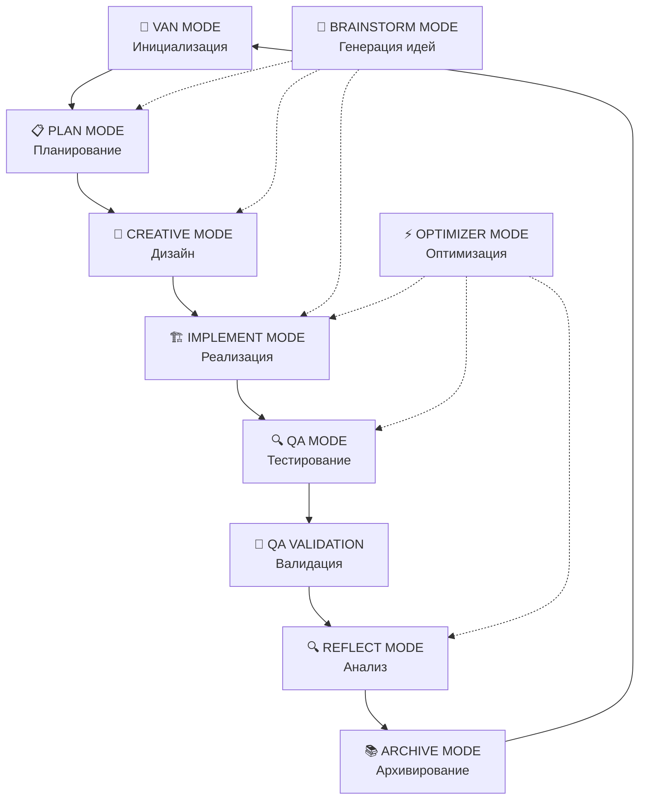

# 🧠 Landing Memory Bank

**Интеллектуальная система управления знаниями для веб-разработки и создания landing страниц**

## 🎯 Что это такое?

**Landing Memory Bank** - это революционная система, которая объединяет искусственный интеллект, машинное обучение и передовые практики веб-разработки для создания высококачественных landing страниц и веб-сайтов.

### 🌟 Ключевые возможности:
- **10 интегрированных режимов работы** для различных задач разработки
- **Специализация на веб-разработке** и landing страницах
- **Адаптивная сложность** от простых до enterprise проектов
- **Автоматические переходы** между режимами работы
- **Накопление и использование знаний** из предыдущих проектов
- **Интеграция с Cursor AI** для расширенных возможностей

## 🚀 Быстрый старт

### 📋 Требования
- **Node.js** версии 16.0.0 или выше
- **Git** для клонирования репозитория
- **Современный браузер** для работы с веб-интерфейсом

### ⚡ Установка за 5 минут

```bash
# 1. Клонировать репозиторий
git clone https://github.com/mrdudekowski/landing_memory_bank.git
cd landing_memory_bank

# 2. Установить зависимости
npm install

# 3. Инициализировать систему
npm run init

# 4. Запустить
npm start
```

### 🔗 Альтернативные способы установки

#### Скачать ZIP архив
```
https://github.com/mrdudekowski/landing_memory_bank/archive/main.zip
```

#### Интеграция в существующий проект
```bash
# Скопировать в ваш проект
cp -r ../landing_memory_bank ./LandingMemoryBank

# Или использовать как Git submodule
git submodule add https://github.com/mrdudekowski/landing_memory_bank.git
```

## 🏗️ Архитектура системы

### 🔄 Интегрированные режимы работы



### 📁 Структура проекта

```
LandingMemoryBank/
├── CORE/                          # Основные компоненты системы
│   ├── modes/                     # 10 интегрированных режимов
│   └── integration/               # Интеграция с внешними системами
├── DEVELOPMENT_PIPELINE/          # Пайплайн разработки
├── ERROR_DATABASE/                # База данных ошибок и решений
├── LANDING/                       # Специализация на landing страницах
└── RULES_ENGINE/                  # Система правил и валидации
```

## 🎮 Режимы работы

### 🚪 VAN MODE - Инициализация
- **Назначение:** Определение сложности задачи и выбор стратегии
- **Активация:** Автоматически при запуске системы
- **Результат:** План действий и выбор следующего режима

### 📋 PLAN MODE - Планирование
- **Назначение:** Детальное планирование для сложных задач (Level 2-4)
- **Активация:** Автоматически для задач средней и высокой сложности
- **Результат:** Структурированный план проекта

### 🎨 CREATIVE MODE - Дизайн
- **Назначение:** Творческие решения для UX/UI и архитектуры
- **Активация:** Обязательно для задач Level 2-4
- **Результат:** Дизайн-концепции и прототипы

### 🏗️ IMPLEMENT MODE - Реализация
- **Назначение:** Фактическая разработка и кодирование
- **Активация:** После планирования и дизайна
- **Результат:** Рабочий код и функциональность

### 🔍 QA MODE - Тестирование
- **Назначение:** Тестирование и обеспечение качества
- **Активация:** После завершения разработки
- **Результат:** Протестированная система

### 🧠 BRAINSTORM MODE - Генерация идей
- **Назначение:** Решение сложных проблем и генерация идей
- **Активация:** В любой момент при творческих блоках
- **Результат:** Инновационные решения

### ⚡ OPTIMIZER MODE - Оптимизация
- **Назначение:** Улучшение производительности и качества
- **Активация:** При обнаружении проблем или возможностей
- **Результат:** Оптимизированная система

## 🎯 Уровни сложности

### Level 1 (Простой)
- **Описание:** Простые задачи, прямое выполнение
- **Время:** < 2 часов
- **Режимы:** VAN → IMPLEMENT → QA → REFLECT → ARCHIVE

### Level 2 (Средний)
- **Описание:** Средние задачи, требуется планирование
- **Время:** 2-6 часов
- **Режимы:** VAN → PLAN → CREATIVE → IMPLEMENT → QA → REFLECT → ARCHIVE

### Level 3 (Сложный)
- **Описание:** Сложные задачи, детальное планирование
- **Время:** 6-12 часов
- **Режимы:** Полный цикл всех режимов

### Level 4 (Очень сложный)
- **Описание:** Enterprise проекты, системное планирование
- **Время:** 12+ часов
- **Режимы:** Расширенный цикл с дополнительными проверками

## 🛠️ Использование

### 🚀 Создание первой landing страницы

```bash
# 1. Запустить систему
npm start

# 2. Выбрать режим работы
# Система автоматически определит сложность и выберет режим

# 3. Следовать инструкциям системы
# Каждый режим предоставит пошаговые инструкции

# 4. Получить готовую landing страницу
# Система автоматически переходит между режимами
```

### 🎨 Настройка дизайна

```javascript
// Система автоматически предложит:
// - Цветовые схемы
// - Типографику
// - Компоненты
// - UX паттерны
```

### 🔧 Техническая реализация

```javascript
// Автоматическая генерация:
// - HTML структуры
// - CSS стилей
// - JavaScript функциональности
// - Компонентов
```

## 🔗 Интеграция

### 🌐 Веб-интерфейс
- **URL:** `http://localhost:3000`
- **Функции:** Управление режимами, мониторинг прогресса

### 📱 API
- **REST API:** `http://localhost:3000/api`
- **Webhooks:** Поддержка real-time обновлений

### 🔌 Плагины
- **Cursor AI:** Полная интеграция
- **VS Code:** Расширения для разработки
- **Chrome DevTools:** Интеграция с браузером

## 📊 Мониторинг и аналитика

### 📈 Метрики производительности
- **Core Web Vitals:** LCP, FID, CLS
- **Время загрузки:** FCP, TTI
- **Производительность:** Общий скор

### 🎯 Качество кода
- **Покрытие тестами:** >80%
- **Качество кода:** >90%
- **Доступность:** WCAG 2.1 AA

### 📊 Пользовательский опыт
- **Конверсия:** Отслеживание CTA
- **Вовлеченность:** Время на странице
- **Откаты:** Анализ bounce rate

## 🚨 Устранение неполадок

### ❌ Частые проблемы

#### Система не запускается
```bash
# Проверить Node.js версию
node --version

# Переустановить зависимости
rm -rf node_modules
npm install
```

#### Ошибки в режимах
```bash
# Сбросить состояние системы
npm run reset

# Проверить логи
tail -f logs/system.log
```

#### Проблемы с производительностью
```bash
# Запустить оптимизацию
npm run optimize

# Проверить метрики
npm run metrics
```

### 📞 Поддержка

- **GitHub Issues:** [Создать issue](https://github.com/mrdudekowski/landing_memory_bank/issues)
- **Документация:** [Подробная документация](https://landingmemorybank.com/docs)
- **Сообщество:** [Discord сервер](https://discord.gg/landingmemorybank)

## 🤝 Вклад в проект

### 📝 Как внести вклад

1. **Форкнуть репозиторий**
2. **Создать ветку** для новой функции
3. **Внести изменения** и протестировать
4. **Создать Pull Request**

### 🏷️ Стандарты кода

- **JavaScript:** ES6+ с ESLint
- **CSS:** BEM методология
- **HTML:** Семантическая разметка
- **Тестирование:** Jest + Testing Library

## 📄 Лицензия

**MIT License** - свободное использование, модификация и распространение.

## 🌟 Благодарности

- **Cursor AI** за интеграцию и расширенные возможности
- **Сообщество** за вклад в развитие проекта
- **Open Source** за вдохновение и инструменты

---

**🎯 Готовы создать свою первую landing страницу? Запускайте систему и следуйте инструкциям!**

**⭐ Не забудьте поставить звезду репозиторию, если проект вам понравился!**
