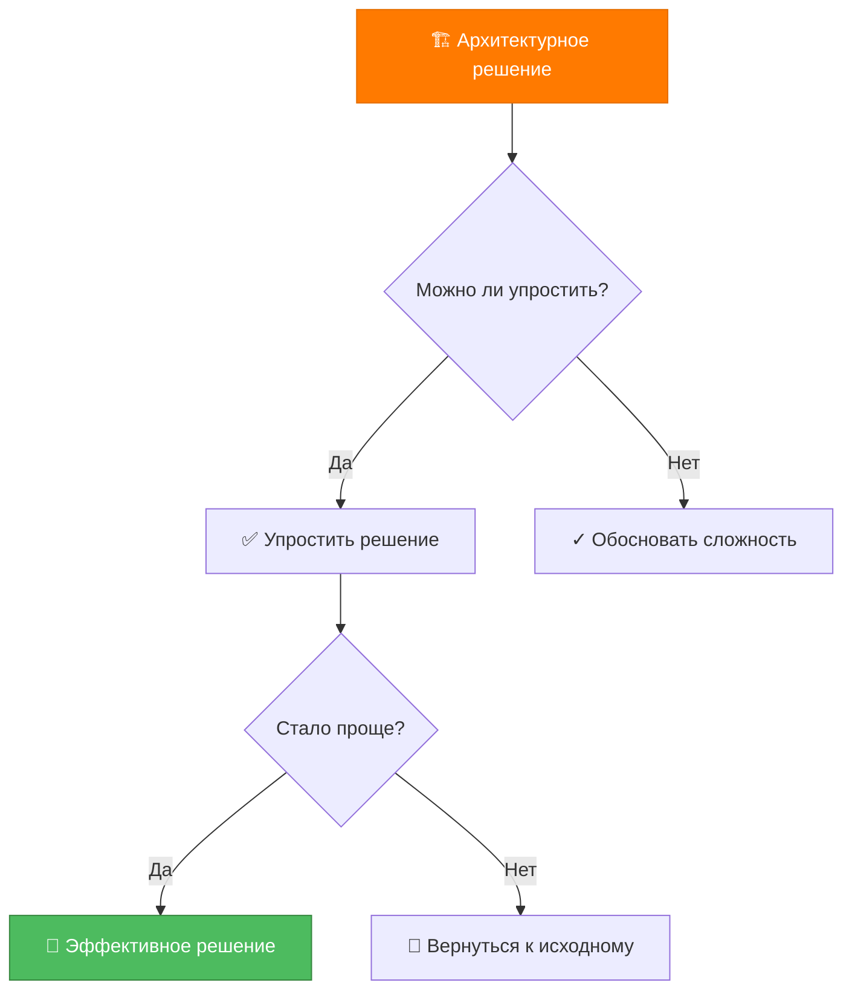
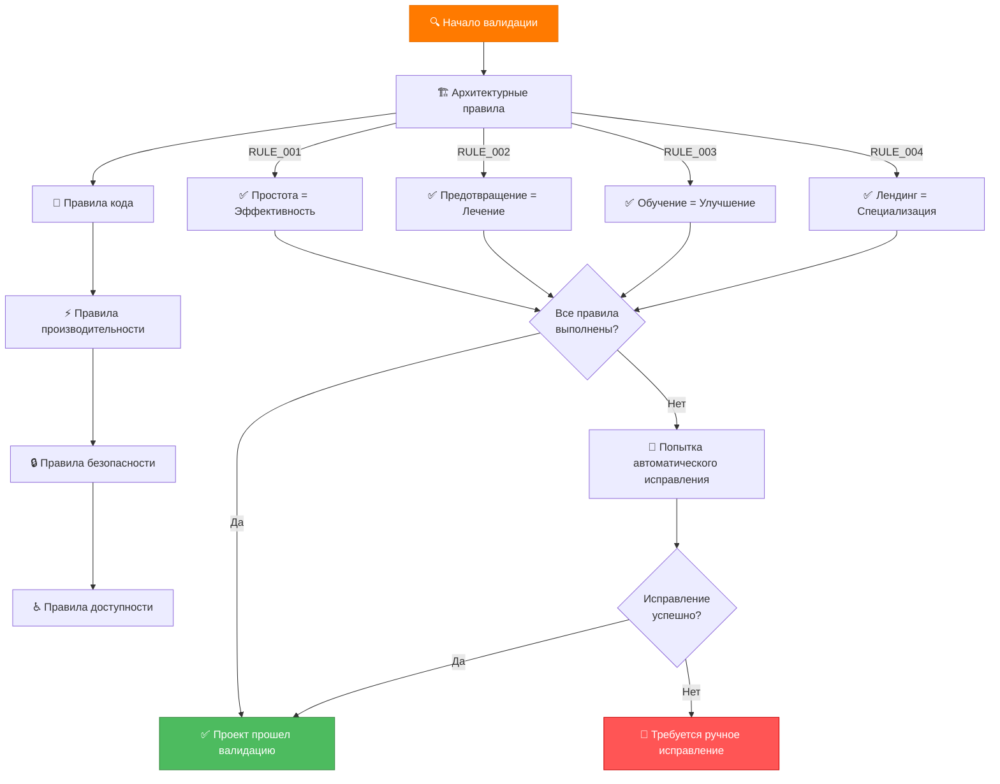

# 🏗️ ИНТЕГРИРОВАННАЯ СИСТЕМА ПРАВИЛ LANDING MEMORY BANK

> **TL;DR:** Система правил объединяет архитектурные принципы MemoryBank с изоляционной архитектурой cursor-memory-bank, создавая мощный движок для автоматической валидации и исправления проблем в веб-разработке.

## 🎯 АРХИТЕКТУРНЫЕ ПРИНЦИПЫ

### 1. SIMPLE = EFFECTIVE (RULE_001)
**Принцип:** Простота всегда эффективнее сложности
**Источник:** cursor-memory-bank optimization journey



**Применение:**
- Избегать избыточных абстракций
- Предпочитать прямые решения
- Документировать обоснование сложности

### 2. PREVENT = CURE (RULE_002)
**Принцип:** Предотвращение проблем лучше их исправления
**Источник:** cursor-memory-bank security and debug modes

**Стратегии:**
- Автоматические проверки в процессе разработки
- Предварительная валидация архитектуры
- Проактивное выявление потенциальных проблем

### 3. LEARN = IMPROVE (RULE_003)
**Принцип:** Постоянное обучение на основе опыта
**Источник:** cursor-memory-bank optimization journey

**Механизмы:**
- Анализ успешных паттернов
- Документирование уроков
- Автоматическое применение лучших практик

### 4. LANDING = SPECIALIZED (RULE_004)
**Принцип:** Специализация на лендингах требует особых подходов
**Источник:** MemoryBank landing focus

**Специфика:**
- Конверсионная оптимизация
- UX-паттерны для лендингов
- Производительность как приоритет

## 🔍 АВТОМАТИЧЕСКАЯ ВАЛИДАЦИЯ ПРАВИЛ

### Архитектурный валидатор
```javascript
class ArchitectureValidator {
  constructor() {
    this.rules = {
      RULE_001: this.checkSimplicity,
      RULE_002: this.checkPrevention,
      RULE_003: this.checkLearning,
      RULE_004: this.checkLandingSpecialization
    };
  }
  
  async validateProject(projectPath) {
    const results = {
      violations: [],
      recommendations: [],
      score: 100
    };
    
    for (const [ruleName, ruleFunction] of Object.entries(this.rules)) {
      const ruleResult = await ruleFunction(projectPath);
      if (ruleResult.violations.length > 0) {
        results.violations.push(...ruleResult.violations);
        results.score -= ruleResult.penalty || 10;
      }
      results.recommendations.push(...ruleResult.recommendations);
    }
    
    return results;
  }
  
  async checkSimplicity(projectPath) {
    // Проверка на избыточную сложность
    const violations = [];
    const recommendations = [];
    
    // Анализ структуры файлов
    const fileStructure = await this.analyzeFileStructure(projectPath);
    if (fileStructure.complexity > 7) {
      violations.push({
        rule: 'RULE_001',
        severity: 'HIGH',
        message: 'Структура проекта слишком сложна',
        suggestion: 'Упростить иерархию папок'
      });
    }
    
    return { violations, recommendations, penalty: violations.length * 5 };
  }
}
```

### Валидатор сложности
```javascript
class ComplexityValidator {
  constructor() {
    this.complexityLevels = {
      1: { maxFiles: 10, maxDepth: 3, maxDependencies: 5 },
      2: { maxFiles: 25, maxDepth: 4, maxDependencies: 15 },
      3: { maxFiles: 50, maxDepth: 5, maxDependencies: 30 },
      4: { maxFiles: 100, maxDepth: 6, maxDependencies: 50 }
    };
  }
  
  async determineComplexityLevel(projectPath) {
    const metrics = await this.calculateProjectMetrics(projectPath);
    
    for (let level = 4; level >= 1; level--) {
      const limits = this.complexityLevels[level];
      if (this.meetsComplexityLevel(metrics, limits)) {
        return level;
      }
    }
    
    return 1; // Fallback to simplest level
  }
  
  async calculateProjectMetrics(projectPath) {
    return {
      fileCount: await this.countFiles(projectPath),
      maxDepth: await this.calculateMaxDepth(projectPath),
      dependencies: await this.analyzeDependencies(projectPath)
    };
  }
}
```

### Валидатор разделения ответственности
```javascript
class SeparationValidator {
  async validateSeparationOfConcerns(projectPath) {
    const violations = [];
    
    // Проверка CSS архитектуры
    const cssViolations = await this.validateCSSArchitecture(projectPath);
    violations.push(...cssViolations);
    
    // Проверка JavaScript модульности
    const jsViolations = await this.validateJSModularity(projectPath);
    violations.push(...jsViolations);
    
    // Проверка HTML семантики
    const htmlViolations = await this.validateHTMLSemantics(projectPath);
    violations.push(...htmlViolations);
    
    return violations;
  }
  
  async validateCSSArchitecture(projectPath) {
    const violations = [];
    
    // Проверка на спагетти CSS
    const cssFiles = await this.findCSSFiles(projectPath);
    for (const cssFile of cssFiles) {
      const analysis = await this.analyzeCSSFile(cssFile);
      
      if (analysis.specificityScore > 0.8) {
        violations.push({
          rule: 'RULE_003',
          severity: 'MEDIUM',
          message: 'Высокая специфичность CSS - риск спагетти кода',
          file: cssFile,
          suggestion: 'Использовать BEM методологию'
        });
      }
      
      if (analysis.duplicationRate > 0.3) {
        violations.push({
          rule: 'RULE_003',
          severity: 'HIGH',
          message: 'Высокий уровень дублирования CSS',
          file: cssFile,
          suggestion: 'Создать систему дизайна с переменными'
        });
      }
    }
    
    return violations;
  }
}
```

## 🚀 АВТОМАТИЧЕСКИЕ ИСПРАВЛЕНИЯ

### Движок автоматических исправлений
```javascript
class AutoFixEngine {
  constructor() {
    this.fixers = {
      css: new CSSAutoFixer(),
      javascript: new JavaScriptAutoFixer(),
      html: new HTMLAutoFixer(),
      architecture: new ArchitectureAutoFixer()
    };
  }
  
  async autoFix(violations) {
    const fixes = [];
    
    for (const violation of violations) {
      const fixer = this.getFixerForViolation(violation);
      if (fixer && fixer.canAutoFix(violation)) {
        try {
          const fix = await fixer.autoFix(violation);
          fixes.push(fix);
        } catch (error) {
          console.warn(`Auto-fix failed for ${violation.rule}:`, error);
        }
      }
    }
    
    return fixes;
  }
  
  getFixerForViolation(violation) {
    if (violation.file?.endsWith('.css')) return this.fixers.css;
    if (violation.file?.endsWith('.js')) return this.fixers.javascript;
    if (violation.file?.endsWith('.html')) return this.fixers.html;
    return this.fixers.architecture;
  }
}
```

### CSS автоматические исправления
```javascript
class CSSAutoFixer {
  async autoFix(violation) {
    switch (violation.rule) {
      case 'RULE_003':
        if (violation.message.includes('дублирование CSS')) {
          return await this.fixCSSDuplication(violation);
        }
        if (violation.message.includes('специфичность CSS')) {
          return await this.fixCSSSpecificity(violation);
        }
        break;
    }
    
    throw new Error(`No auto-fix available for ${violation.rule}`);
  }
  
  async fixCSSDuplication(violation) {
    const cssContent = await this.readFile(violation.file);
    const variables = this.extractCommonValues(cssContent);
    
    const fixedCSS = this.createCSSVariables(variables) + 
                    this.replaceValuesWithVariables(cssContent, variables);
    
    await this.writeFile(violation.file, fixedCSS);
    
    return {
      type: 'css_duplication_fix',
      file: violation.file,
      changes: `Создано ${Object.keys(variables).length} CSS переменных`,
      before: cssContent.length,
      after: fixedCSS.length
    };
  }
}
```

## 📊 МЕТРИКИ КАЧЕСТВА

### Система оценки проекта
```javascript
class ProjectQualityMetrics {
  constructor() {
    this.metrics = {
      architecture: 0,
      codeQuality: 0,
      performance: 0,
      security: 0,
      accessibility: 0
    };
  }
  
  async calculateProjectScore(projectPath) {
    const results = await Promise.all([
      this.assessArchitecture(projectPath),
      this.assessCodeQuality(projectPath),
      this.assessPerformance(projectPath),
      this.assessSecurity(projectPath),
      this.assessAccessibility(projectPath)
    ]);
    
    this.metrics.architecture = results[0];
    this.metrics.codeQuality = results[1];
    this.metrics.performance = results[2];
    this.metrics.security = results[3];
    this.metrics.accessibility = results[4];
    
    return {
      overall: this.calculateOverallScore(),
      details: this.metrics,
      recommendations: this.generateRecommendations()
    };
  }
  
  calculateOverallScore() {
    const weights = {
      architecture: 0.25,
      codeQuality: 0.25,
      performance: 0.20,
      security: 0.20,
      accessibility: 0.10
    };
    
    return Object.entries(this.metrics).reduce((score, [key, value]) => {
      return score + (value * weights[key]);
    }, 0);
  }
}
```

## 🔄 ИНТЕГРАЦИЯ С РЕЖИМАМИ

### Автоматическое применение правил
```javascript
class RuleIntegrationManager {
  constructor() {
    this.validators = {
      architecture: new ArchitectureValidator(),
      complexity: new ComplexityValidator(),
      separation: new SeparationValidator()
    };
    this.autoFixer = new AutoFixEngine();
    this.metrics = new ProjectQualityMetrics();
  }
  
  async integrateWithMode(mode, projectPath) {
    switch (mode) {
      case 'VAN':
        return await this.runVANValidation(projectPath);
      case 'CREATIVE':
        return await this.runCreativeValidation(projectPath);
      case 'BUILD':
        return await this.runBuildValidation(projectPath);
      case 'DEBUG':
        return await this.runDebugValidation(projectPath);
      case 'SECURITY':
        return await this.runSecurityValidation(projectPath);
      default:
        throw new Error(`Unknown mode: ${mode}`);
    }
  }
  
  async runVANValidation(projectPath) {
    const results = await Promise.all([
      this.validators.architecture.validateProject(projectPath),
      this.validators.complexity.determineComplexityLevel(projectPath),
      this.validators.separation.validateSeparationOfConcerns(projectPath)
    ]);
    
    return {
      architecture: results[0],
      complexityLevel: results[1],
      separation: results[2],
      nextMode: this.determineNextMode(results)
    };
  }
}
```

## 📋 ПРОВЕРКА ПРАВИЛ

### Чек-лист валидации


---

**Следующий шаг:** Интеграция с базой данных ошибок и создание специализированных правил для лендингов.
